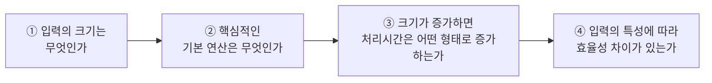

> [!abstract] 이 장의 무게 중심은 슬라이드가 아니라 필기에 있다
> 이 강의자료는 32쪽 중 **네 쪽이 백지에 손으로 쓴 증명**이다(14·16·21·22쪽). 슬라이드는 정의만 던지고, 그 정의를 **실제로 쓰는 법**은 필기에만 남았다. 그래서 이 정리는 필기 네 장을 본문으로 끔어올리고, 슬라이드는 그 주변을 두르는 방식으로 구성했다.
>
> 또 하나 — **원본 13쪽과 15쪽의 설명이 서로 바뀜 있다.** 아래 3절에서 짚는다.

---

## 1. 시계로 재면 왜 안 되는가

가장 소박한 방법은 코드를 돌려보고 초를 재는 것이다. 원본 4쪽은 파이썬으로 실행시간을 측정하는 코드를 보이고 곳바로 네 가지 문제를 지적한다.

| 원본의 물음 | 무엇이 걸리는가 |
| --- | --- |
| **반드시 구현?** | 시간을 재려면 먼저 만들어야 한다. 설계 단계에서 후보를 고를 때는 쓸 수 없다 |
| **같은 조건의 실행시간?** | 같은 코드도 CPU·메모리·백그라운드 프로세스에 따라 값이 달라진다 |
| **소프트웨어 환경, 사용한 언어?** | C로 진 느린 알고리즘이 파이썬으로 진 빠른 알고리즘보다 빨라 보일 수 있다 |
| **모든 데이터에 대해?** | 측정은 시험한 입력에 대해서만 유효하다. 1장의 *모든 유효한 입력* 요구와 정면으로 충돌한다 |

그래서 원본은 화살표 하나로 결론을 낸다 — *절대적인 시간 측정 → 이론적인 복잡도 분석*. 이 화살표가 2장 전체의 제목이다.

단, 버리는 것과 남기는 것을 구분해야 한다. 원본 3쪽은 좋은 알고리즘의 기준을 **시간 효율성**과 **공간 효율성** 둘로 둔다. 이 장은 주로 시간을 다루지만, 둘은 서로 거래 관계에 있으며 그 거래를 적극적으로 이용하는 것이 [6장](./06.%20%EA%B3%B5%EA%B0%84%EC%9C%BC%EB%A1%9C%20%EC%8B%9C%EA%B0%84%20%EB%B2%8C%EA%B8%B0.md)이다.

### 분석 전에 답해야 할 네 가지 질문

원본 5쪽은 복잡도 분석을 네 개의 질문으로 분해한다. 이후 모든 분석 예제가 이 순서를 따른다.

**① 입력의 크기**는 문제마다 다르며, 무엇인지 먼저 **명확히 결정**해야 한다(6쪽). 원본이 든 예가 그 다양성을 보여준다.

| 문제 | 입력의 크기 |
| --- | --- |
| 리스트에서 어떤 값을 찾는 문제 | 리스트의 길이 |
| $x$의 $n$ 거듭제곱 | 지수 $n$ |
| 다항식의 연산 | 차수 |
| Row × Col 행렬 연산 | 행과 열의 수 — **두 개** |
| 그래프 연산 | 정점 수와 간선 수 — 그리고 **표현 방식에 따라 달라짐** (인접 행렬 / 인접 리스트) |

마지막 두 항목이 중요하다. 입력 크기가 **하나가 아닐 수 있고**, 심지어 **자료구조 선택에 따라 바뀜다**. 같은 그래프라도 인접 행렬이면 $V^2$에, 인접 리스트면 $V + E$에 비례하는 비용이 든다.

**② 기본 연산**(basic operation)은 *알고리즘에서 가장 중요한 연산*으로, 이것의 실행 횟수**만**을 센다. 원본이 달아둔 실전 규칙은 간결하다 — *다중 루프의 경우 가장 안쪽 루프에 있는 연산*(7쪽). 나머지 연산을 무시해도 되는 근거는 다음 절의 최고차항 지배에 있다.

**④ 입력의 특성**은 하나의 알고리즘에 세 가지 얼굴을 준다(9~10쪽). 순차 탐색을 보면 — 찾는 값이 **첫 번째**면 1회 비교(최선), **없거나 마지막**이면 $n$회(최악), 평균은 그 사이다. 단 원본은 평균에 대해 *가정이 필요*하다고 단서를 달았다 — 찾는 값이 있을 확률, 각 위치에 균등하게 분포할 확률 같은 확률 모델 없이는 평균이 정의되지 않는다.
