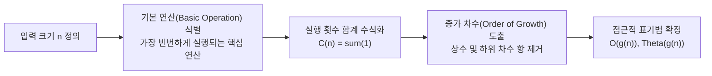
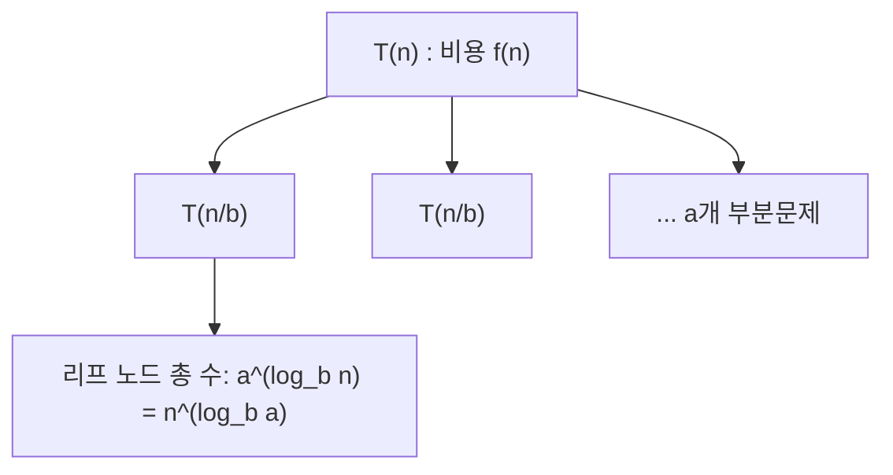

> [!abstract] 핵심 요약
> 알고리즘의 효율성은 하드웨어 성능이나 프로그래밍 언어의 벤치마크 시간이 아닌, **입력 크기 $n$에 대한 기본 연산 횟수의 증가율(Order of Growth)**로 측정된다.
> **점근적 표기법($O, \Omega, \Theta$)**의 엄밀한 수학적 정의를 이해하고, 재귀적 점화식을 해석하는 **마스터 정리($T(n) = aT(n/b) + f(n)$)**를 활용하여 복잡도를 즉각 유도하는 분석 역량을 완성한다.

---

## 1. 알고리즘 효율성 분석의 기본 프레임워크

알고리즘의 효율성은 주로 **시간 복잡도(Time Complexity)**와 **공간 복잡도(Space Complexity)**로 평가된다.



---

## 2. 점근적 표기법(Asymptotic Notations)의 5대 수학적 정의

| 표기법 | 명칭 | 수학적 정의 ($n \ge n_0$) | 직관적 의미 |
| :-- | :-- | :-- | :-- |
| **$O(g(n))$** | Big-O | $\exists c > 0, n_0 > 0 \text{ s.t. } 0 \le f(n) \le c \cdot g(n)$ | **점근적 상한 (Asymptotic Upper Bound)**: 아무리 느려도 $c \cdot g(n)$ 이하 |
| **$\Omega(g(n))$** | Big-Omega | $\exists c > 0, n_0 > 0 \text{ s.t. } 0 \le c \cdot g(n) \le f(n)$ | **점근적 하한 (Asymptotic Lower Bound)**: 아무리 빨라도 $c \cdot g(n)$ 이상 |
| **$\Theta(g(n))$** | Big-Theta | $\exists c_1, c_2 > 0, n_0 > 0 \text{ s.t. } c_1 g(n) \le f(n) \le c_2 g(n)$ | **점근적 밀착 상하한 (Tight Bound)**: $f(n)$과 $g(n)$의 증가율이 동등 |
| **$o(g(n))$** | Little-o | $\forall c > 0, \exists n_0 > 0 \text{ s.t. } 0 \le f(n) < c \cdot g(n)$ | **엄격한 상한**: $g(n)$보다 절대적으로 느리게 증가 ($\lim \frac{f(n)}{g(n)} = 0$) |
| **$\omega(g(n))$** | Little-omega | $\forall c > 0, \exists n_0 > 0 \text{ s.t. } 0 \le c \cdot g(n) < f(n)$ | **엄격한 하한**: $g(n)$보다 절대적으로 빠르게 증가 ($\lim \frac{f(n)}{g(n)} = \infty$) |

---

## 3. 극한(Limit)을 이용한 두 함수의 차수 비교

$$\lim_{n \to \infty} \frac{f(n)}{g(n)} = L$$

1. **$L = 0$** $\implies$ $f(n) \in O(g(n))$ 이며 $f(n) \in o(g(n))$ ($g(n)$이 더 높은 차수)
2. **$L = c > 0$ (상수)** $\implies$ $f(n) \in \Theta(g(n))$ ($f(n)$과 $g(n)$이 동등한 차수)
3. **$L = \infty$** $\implies$ $f(n) \in \Omega(g(n))$ 이며 $f(n) \in \omega(g(n))$ ($f(n)$이 더 높은 차수)
4. **극한이 진동(발산)** $\implies$ 극한 비교법 사용 불가, 정의를 통한 증명 필요.

> [!tip] 로피탈 정리 (L'Hôpital's Rule)
> $\lim_{n \to \infty} \frac{f(n)}{g(n)} = \frac{\infty}{\infty}$ 꼴일 때, 도함수를 활용하여 $\lim_{n \to \infty} \frac{f'(n)}{g'(n)}$으로 극한을 계산한다.
> 예: $\lim_{n \to \infty} \frac{\ln n}{n} = \lim_{n \to \infty} \frac{1/n}{1} = 0 \implies \ln n \in o(n)$

---

## 4. 재귀 점화식 분석과 마스터 정리 (Master Theorem)

분할 정복 형태의 점화식 $T(n) = aT(n/b) + f(n)$ ($a \ge 1, b > 1$)에 대한 해법을 제시한다.



### 4.1. 마스터 정리 3대 케이스 분류

기준 임계값 $c_{\text{crit}} = \log_b a$와 $f(n) = \Theta(n^d)$의 비교:

| Case | 조건 | 점근적 복잡도 $T(n)$ | 직관적 의미 |
| :-- | :-- | :--: | :-- |
| **Case 1** | $f(n) = O(n^{\log_b a - \epsilon})$ ($\epsilon > 0$) $\iff d < \log_b a$ | **$\Theta(n^{\log_b a})$** | **리프 노드의 연산량이 지배적** (하향 분할 오버헤드가 작음) |
| **Case 2** | $f(n) = \Theta(n^{\log_b a} \log^k n)$ ($k \ge 0$) $\iff d = \log_b a$ | **$\Theta(n^{\log_b a} \log^{k+1} n)$** | **모든 트리 레벨의 연산량이 균등** (대표: 합병 정렬 $k=0$) |
| **Case 3** | $f(n) = \Omega(n^{\log_b a + \epsilon})$ 및 정규성 조건 $a f(n/b) \le c f(n)$ | **$\Theta(f(n))$** | **루트 노드의 분할/병합 연산이 지배적** |

---

## 5. 실시간 마스터 정리(Master Theorem) 복잡도 계산기

```html preview
<div style="font-family:system-ui,-apple-system,sans-serif;padding:20px;background:var(--card);color:var(--card-foreground);border:1px solid var(--border);border-radius:var(--radius)">
  <div style="font-size:16px;font-weight:700;margin-bottom:12px;color:var(--primary)">
    ⚡ 분할 정복 점화식 T(n) = aT(n/b) + Theta(n^d) 마스터 판별기
  </div>

  <div style="display:grid;grid-template-columns:1fr 1fr 1fr;gap:10px;margin-bottom:14px">
    <div>
      <label style="font-size:11px;color:var(--muted-foreground)">a (부분문제 수, a >= 1):</label>
      <input id="inA" type="number" value="2" min="1" style="width:100%;padding:6px;background:var(--background);color:var(--foreground);border:1px solid var(--border);border-radius:var(--radius);font-weight:700" />
    </div>
    <div>
      <label style="font-size:11px;color:var(--muted-foreground)">b (분할 배수, b > 1):</label>
      <input id="inB" type="number" value="2" min="1.1" step="0.1" style="width:100%;padding:6px;background:var(--background);color:var(--foreground);border:1px solid var(--border);border-radius:var(--radius);font-weight:700" />
    </div>
    <div>
      <label style="font-size:11px;color:var(--muted-foreground)">d (f(n)=n^d 차수):</label>
      <input id="inD" type="number" value="1" min="0" step="0.1" style="width:100%;padding:6px;background:var(--background);color:var(--foreground);border:1px solid var(--border);border-radius:var(--radius);font-weight:700" />
    </div>
  </div>

  <div style="padding:14px;background:var(--background);border:1px solid var(--border);border-radius:var(--radius)">
    <div style="display:flex;justify-content:space-between;margin-bottom:6px">
      <span style="font-size:12px;color:var(--muted-foreground)">임계 지수 log_b(a):</span>
      <strong id="outLogBA" style="font-family:monospace;color:var(--primary)">1.000</strong>
    </div>
    <div style="display:flex;justify-content:space-between;margin-bottom:6px">
      <span style="font-size:12px;color:var(--muted-foreground)">적용 케이스:</span>
      <span id="outCaseName" style="font-weight:700;color:var(--foreground)">Case 2 (d == log_b a)</span>
    </div>
    <div style="margin-top:10px;padding-top:10px;border-top:1px dashed var(--border);font-size:15px">
      최종 시간 복잡도: <strong id="outThetaResult" style="font-family:monospace;font-size:18px;color:var(--primary)">Theta(n log n)</strong>
    </div>
  </div>

  <script>
    function calcMaster() {
      var a = parseFloat(document.getElementById('inA').value) || 1;
      var b = parseFloat(document.getElementById('inB').value) || 2;
      var d = parseFloat(document.getElementById('inD').value) || 0;
      if (a < 1) a = 1; if (b <= 1) b = 1.1;

      var logBA = Math.log(a) / Math.log(b);
      document.getElementById('outLogBA').textContent = logBA.toFixed(3);

      var diff = d - logBA;
      var cName = "";
      var res = "";

      if (Math.abs(diff) < 1e-4) {
        cName = "Case 2 (d == log_b a: 작업량 균등)";
        if (d === 0) res = "Theta(log n)";
        else if (d === 1) res = "Theta(n log n)";
        else res = "Theta(n^" + d.toFixed(2) + " log n)";
      } else if (diff < 0) {
        cName = "Case 1 (d < log_b a: 리프 지배적)";
        res = "Theta(n^" + logBA.toFixed(2) + ")";
      } else {
        cName = "Case 3 (d > log_b a: 루트/병합 지배적)";
        if (d === 0) res = "Theta(1)";
        else if (d === 1) res = "Theta(n)";
        else res = "Theta(n^" + d.toFixed(2) + ")";
      }

      document.getElementById('outCaseName').textContent = cName;
      document.getElementById('outThetaResult').textContent = res;
    }

    document.getElementById('inA').addEventListener('input', calcMaster);
    document.getElementById('inB').addEventListener('input', calcMaster);
    document.getElementById('inD').addEventListener('input', calcMaster);
    calcMaster();
  </script>
</div>
