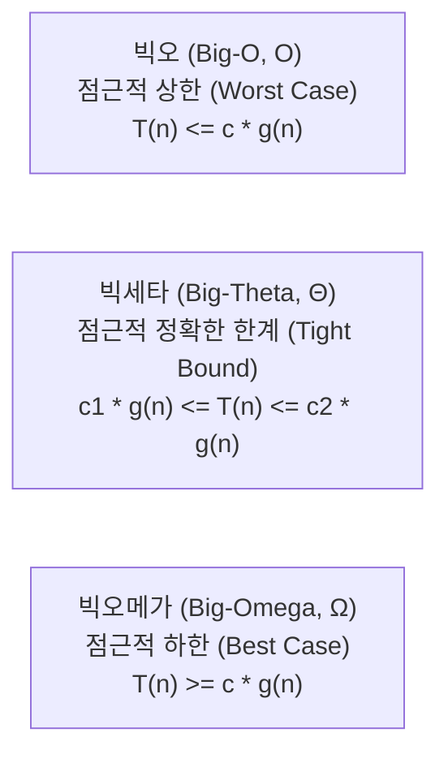

> [!abstract] 핵심 요약
> 알고리즘의 효율성은 하드웨어나 실행 환경에 독립적인 **기본 연산의 수행 횟수 $T(n)$**로 측정한다. 
> 입력 크기 $n$이 무한히 커질 때의 증가율을 표현하기 위해 **점근적 표기법($O, \Omega, \Theta$)**을 사용하며, 분할 정복 재귀식은 **마스터 정리(Master Theorem)**를 통해 빠르게 점근해를 도출한다.

---

## 1. 점근적 표기법의 수학적 정의



| 표기법 | 의미 | 수학적 엄밀 정의 ($n \ge n_0$) | 용도 |
| :-- | :-- | :-- | :-- |
| **$O(g(n))$** | 점근적 상한 (Asymptotic Upper Bound) | $\exists c > 0, n_0 > 0 : 0 \le T(n) \le c \cdot g(n)$ | 최악의 경우(Worst-case) 성능 보장 |
| **$\Omega(g(n))$** | 점근적 하한 (Asymptotic Lower Bound) | $\exists c > 0, n_0 > 0 : 0 \le c \cdot g(n) \le T(n)$ | 문제 해결에 필요한 최소 연산량 하한 |
| **$\Theta(g(n))$** | 점근적 정확한 한계 (Tight Bound) | $\exists c_1, c_2, n_0 > 0 : c_1 g(n) \le T(n) \le c_2 g(n)$ | 알고리즘의 평균·동등 성능 평가 |

---

## 2. 주요 복잡도 계층 및 비교 시뮬레이터

$$O(1) < O(\log n) < O(n) < O(n \log n) < O(n^2) < O(n^3) < O(2^n) < O(n!)$$

```html preview
<div style="font-family:system-ui,-apple-system,sans-serif;padding:20px;background:var(--card);color:var(--card-foreground);border:1px solid var(--border);border-radius:var(--radius)">
  <div style="font-size:16px;font-weight:700;margin-bottom:14px;color:var(--primary);display:flex;align-items:center;gap:8px">
    <span>📈 입력 크기(N)에 따른 시간 복잡도 연산 횟수 계산기</span>
  </div>

  <div style="margin-bottom:16px">
    <div style="display:flex;justify-content:space-between;font-size:12px;font-weight:600;margin-bottom:4px">
      <span>입력 크기 (N):</span>
      <span id="nVal" style="color:var(--primary);font-weight:700">16</span>
    </div>
    <input id="nSlider" type="range" min="1" max="32" step="1" value="16" style="width:100%;accent-color:var(--primary)" />
  </div>

  <div style="display:grid;grid-template-columns:repeat(auto-fit, minmax(130px, 1fr));gap:10px">
    <div style="padding:10px;background:var(--background);border:1px solid var(--border);border-radius:var(--radius)">
      <div style="font-size:11px;color:var(--muted-foreground)">O(log N)</div>
      <div id="cLog" style="font-size:16px;font-weight:700;color:var(--chart-2);margin-top:2px">4</div>
    </div>
    <div style="padding:10px;background:var(--background);border:1px solid var(--border);border-radius:var(--radius)">
      <div style="font-size:11px;color:var(--muted-foreground)">O(N)</div>
      <div id="cN" style="font-size:16px;font-weight:700;color:var(--chart-1);margin-top:2px">16</div>
    </div>
    <div style="padding:10px;background:var(--background);border:1px solid var(--border);border-radius:var(--radius)">
      <div style="font-size:11px;color:var(--muted-foreground)">O(N log N)</div>
      <div id="cNLog" style="font-size:16px;font-weight:700;color:var(--chart-3);margin-top:2px">64</div>
    </div>
    <div style="padding:10px;background:var(--background);border:1px solid var(--border);border-radius:var(--radius)">
      <div style="font-size:11px;color:var(--muted-foreground)">O(N²)</div>
      <div id="cN2" style="font-size:16px;font-weight:700;color:var(--chart-4);margin-top:2px">256</div>
    </div>
    <div style="padding:10px;background:var(--background);border:1px solid var(--border);border-radius:var(--radius)">
      <div style="font-size:11px;color:var(--muted-foreground)">O(2ᴺ)</div>
      <div id="c2N" style="font-size:16px;font-weight:700;color:var(--destructive);margin-top:2px">65,536</div>
    </div>
  </div>

  <script>
    var nSlider = document.getElementById('nSlider');
    var nVal = document.getElementById('nVal');
    var cLog = document.getElementById('cLog');
    var cN = document.getElementById('cN');
    var cNLog = document.getElementById('cNLog');
    var cN2 = document.getElementById('cN2');
    var c2N = document.getElementById('c2N');

    function update() {
      var n = parseInt(nSlider.value);
      nVal.textContent = n;
      cLog.textContent = Math.round(Math.log2(n) * 10) / 10;
      cN.textContent = n.toLocaleString();
      cNLog.textContent = Math.round(n * Math.log2(n)).toLocaleString();
      cN2.textContent = (n * n).toLocaleString();
      c2N.textContent = Math.pow(2, n).toLocaleString();
    }

    nSlider.addEventListener('input', update);
    update();
  </script>
</div>
```

---

## 3. 재귀 점화식과 마스터 정리 (Master Theorem)

분할 정복 알고리즘의 재귀 관계식 $T(n) = a T(n/b) + f(n)$ ($a \ge 1, b > 1, f(n) = \Theta(n^d)$)에 대해:

$$T(n) = \begin{cases} \Theta(n^{\log_b a}) & \text{if } d < \log_b a \quad (\text{Case 1: 하위 문제 지배}) \\ \Theta(n^d \log n) & \text{if } d = \log_b a \quad (\text{Case 2: 분할 균형}) \\ \Theta(n^d) & \text{if } d > \log_b a \quad (\text{Case 3: 결합 단계 지배}) \end{cases}$$
