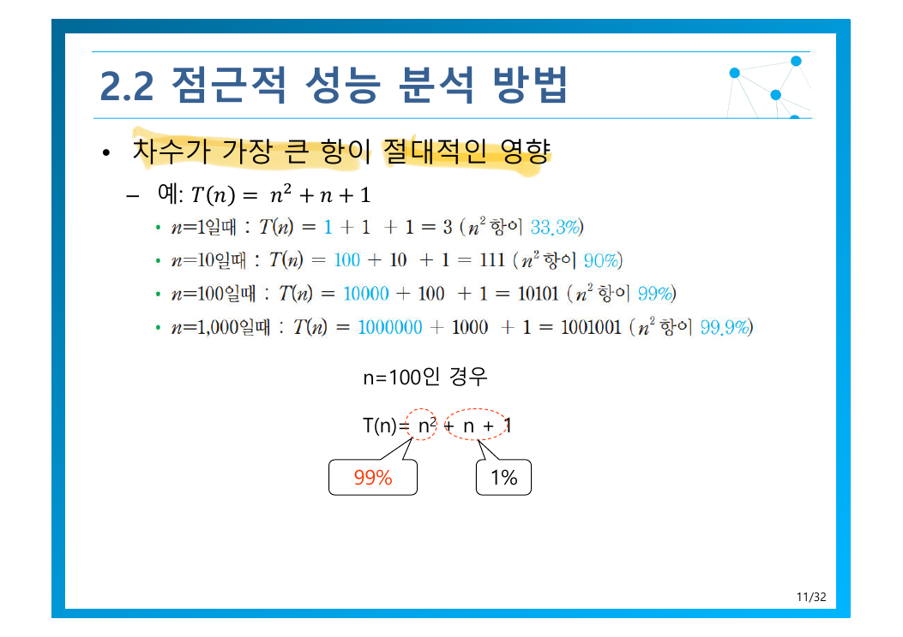
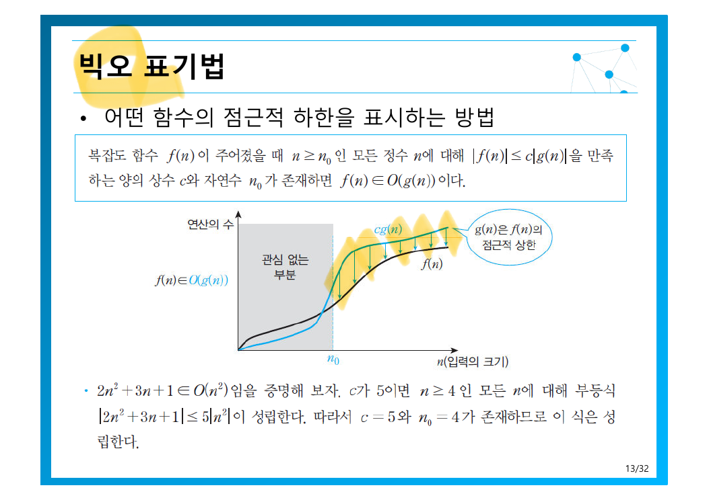
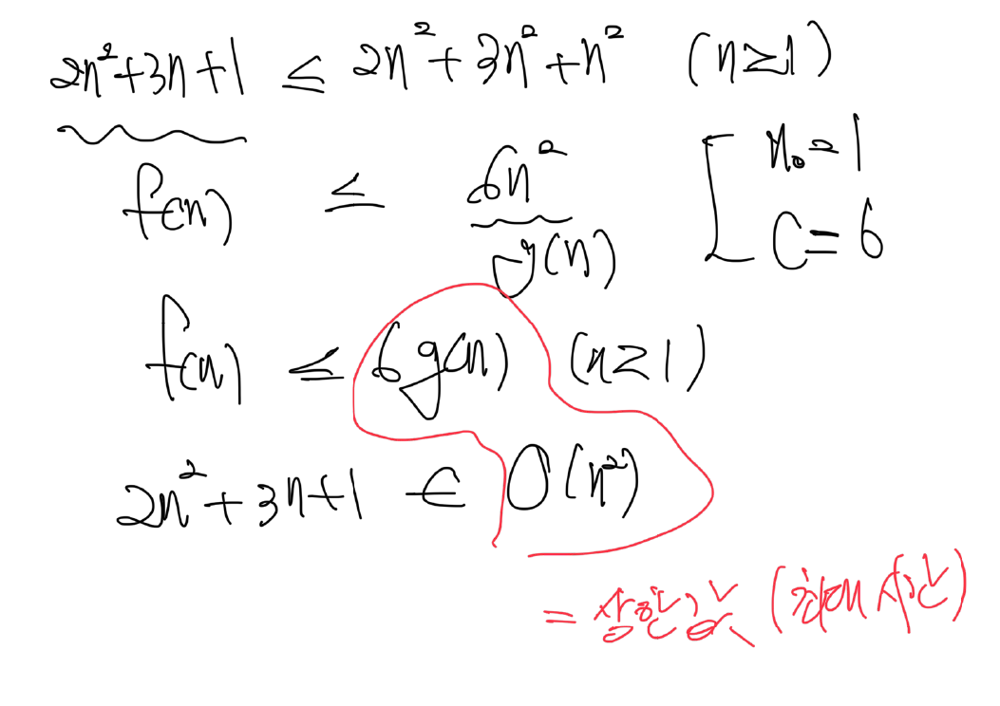
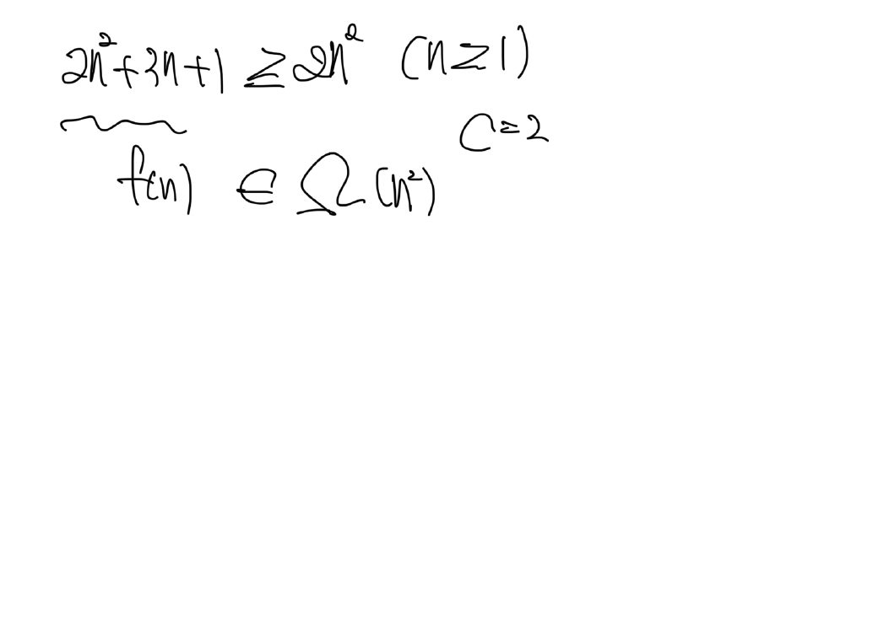
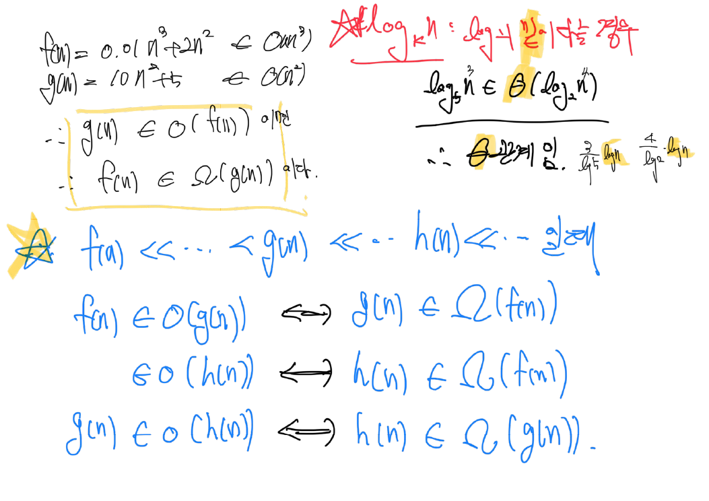
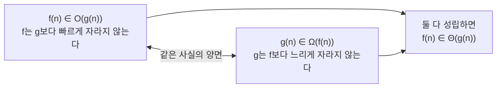

> [!abstract] 이 장의 무게 중심은 슬라이드가 아니라 필기에 있다
> 이 강의자료는 32쪽 중 **네 쪽이 백지에 손으로 쓴 증명**이다(14·16·21·22쪽). 슬라이드는 정의만 던지고, 그 정의를 **실제로 쓰는 법**은 필기에만 남았다. 그래서 이 정리는 필기 네 장을 본문으로 끔어올리고, 슬라이드는 그 주변을 두르는 방식으로 구성했다.
>
> 또 하나 — **원본 13쪽과 15쪽의 설명이 서로 바뀜 있다.** 아래 3절에서 짚는다.

---

## 1. 시계로 재면 왜 안 되는가

가장 소박한 방법은 코드를 돌려보고 초를 재는 것이다. 원본 4쪽은 파이썬으로 실행시간을 측정하는 코드를 보이고 곳바로 네 가지 문제를 지적한다.

| 원본의 물음 | 무엇이 걸리는가 |
| --- | --- |
| **반드시 구현?** | 시간을 재려면 먼저 만들어야 한다. 설계 단계에서 후보를 고를 때는 쓸 수 없다 |
| **같은 조건의 실행시간?** | 같은 코드도 CPU·메모리·백그라운드 프로세스에 따라 값이 달라진다 |
| **소프트웨어 환경, 사용한 언어?** | C로 진 느린 알고리즘이 파이썬으로 진 빠른 알고리즘보다 빨라 보일 수 있다 |
| **모든 데이터에 대해?** | 측정은 시험한 입력에 대해서만 유효하다. 1장의 *모든 유효한 입력* 요구와 정면으로 충돌한다 |

그래서 원본은 화살표 하나로 결론을 낸다 — *절대적인 시간 측정 → 이론적인 복잡도 분석*. 이 화살표가 2장 전체의 제목이다.

단, 버리는 것과 남기는 것을 구분해야 한다. 원본 3쪽은 좋은 알고리즘의 기준을 **시간 효율성**과 **공간 효율성** 둘로 둔다. 이 장은 주로 시간을 다루지만, 둘은 서로 거래 관계에 있으며 그 거래를 적극적으로 이용하는 것이 [6장](./06.%20%EA%B3%B5%EA%B0%84%EC%9C%BC%EB%A1%9C%20%EC%8B%9C%EA%B0%84%20%EB%B2%8C%EA%B8%B0.md)이다.

### 분석 전에 답해야 할 네 가지 질문

원본 5쪽은 복잡도 분석을 네 개의 질문으로 분해한다. 이후 모든 분석 예제가 이 순서를 따른다.


**① 입력의 크기**는 문제마다 다르며, 무엇인지 먼저 **명확히 결정**해야 한다(6쪽). 원본이 든 예가 그 다양성을 보여준다.

| 문제 | 입력의 크기 |
| --- | --- |
| 리스트에서 어떤 값을 찾는 문제 | 리스트의 길이 |
| $x$의 $n$ 거듭제곱 | 지수 $n$ |
| 다항식의 연산 | 차수 |
| Row × Col 행렬 연산 | 행과 열의 수 — **두 개** |
| 그래프 연산 | 정점 수와 간선 수 — 그리고 **표현 방식에 따라 달라짐** (인접 행렬 / 인접 리스트) |

마지막 두 항목이 중요하다. 입력 크기가 **하나가 아닐 수 있고**, 심지어 **자료구조 선택에 따라 바뀜다**. 같은 그래프라도 인접 행렬이면 $V^2$에, 인접 리스트면 $V + E$에 비례하는 비용이 든다.

**② 기본 연산**(basic operation)은 *알고리즘에서 가장 중요한 연산*으로, 이것의 실행 횟수**만**을 센다. 원본이 달아둔 실전 규칙은 간결하다 — *다중 루프의 경우 가장 안쪽 루프에 있는 연산*(7쪽). 나머지 연산을 무시해도 되는 근거는 다음 절의 최고차항 지배에 있다.

**④ 입력의 특성**은 하나의 알고리즘에 세 가지 얼굴을 준다(9~10쪽). 순차 탐색을 보면 — 찾는 값이 **첫 번째**면 1회 비교(최선), **없거나 마지막**이면 $n$회(최악), 평균은 그 사이다. 단 원본은 평균에 대해 *가정이 필요*하다고 단서를 달았다 — 찾는 값이 있을 확률, 각 위치에 균등하게 분포할 확률 같은 확률 모델 없이는 평균이 정의되지 않는다.

---

## 2. 최고차항이 사실상 전부다

원본 11쪽은 이 장에서 가장 설득력 있는 그림을 내놓는다. $T(n) = n^2 + n + 1$ 에서 $n = 100$일 때, 전체 연산량의 **99%를 $n^2$ 항이 차지하고 나머지 모든 항을 합쳐도 1%**에 불과하다.

직접 확인해 보라 — 슬라이더를 오른쪽으로 밀면 저차항들이 어떻게 소멸하는지 보인다.

```html preview h=480px
<div style="font-family:system-ui,-apple-system,sans-serif;padding:20px;color:var(--foreground)">
  <label for="nsl" style="font-size:13px;font-weight:600">입력 크기 n</label>
  <div id="nval" style="font-size:32px;font-weight:700;color:var(--chart-1);margin:4px 0 8px">100</div>
  <input id="nsl" type="range" min="1" max="1000" step="1" value="100"
    style="width:100%;accent-color:var(--primary)" />
  <p style="font-size:12.5px;color:var(--muted-foreground);margin:6px 0 16px">
    T(n) = n² + n + 1 — 세 항이 전체에서 차지하는 비율
  </p>
  <div id="stack" style="display:flex;height:44px;border-radius:var(--radius);overflow:hidden;border:1px solid var(--border)"></div>
  <div id="legend" style="display:flex;gap:18px;flex-wrap:wrap;margin-top:14px;font-size:13px"></div>
  <div id="note" style="margin-top:16px;padding:11px 13px;background:var(--card);border:1px solid var(--border);border-radius:var(--radius);font-size:13px;line-height:1.65"></div>

  <script>
    var sl = document.getElementById('nsl');
    function upd() {
      var n = parseInt(sl.value, 10);
      var t2 = n * n, t1 = n, t0 = 1, tot = t2 + t1 + t0;
      var parts = [
        ['n²', t2, 'var(--chart-1)'],
        ['n', t1, 'var(--chart-3)'],
        ['1', t0, 'var(--chart-5)']
      ];
      document.getElementById('nval').textContent = n.toLocaleString();
      document.getElementById('stack').innerHTML = parts.map(function (p) {
        return '<div title="' + p[0] + '" style="width:' + (p[1] / tot * 100) +
          '%;background:' + p[2] + ';min-width:1px"></div>';
      }).join('');
      document.getElementById('legend').innerHTML = parts.map(function (p) {
        var pct = p[1] / tot * 100;
        return '<span style="display:flex;align-items:center;gap:6px">' +
          '<span style="width:12px;height:12px;border-radius:3px;background:' + p[2] + '"></span>' +
          '<b>' + p[0] + '</b> ' + p[1].toLocaleString() +
          ' <span style="color:var(--muted-foreground)">(' +
          (pct < 0.01 ? pct.toExponential(1) : pct.toFixed(2)) + '%)</span></span>';
      }).join('');
      var dom = (t2 / tot * 100);
      document.getElementById('note').innerHTML =
        'n = ' + n.toLocaleString() + ' 일 때 최고차항 n² 의 비중은 <b style="color:var(--chart-1)">' +
        dom.toFixed(3) + '%</b>. 나머지 모든 항을 합쳤을 때 <b>' + (100 - dom).toFixed(3) +
        '%</b> — n을 키울수록 이 값은 0으로 수렴한다. <br>' +
        '<span style="color:var(--muted-foreground)">이것이 계수와 저차항을 버리고 최고차항만 남기는 근거다.</span>';
    }
    sl.addEventListener('input', upd);
    upd();
  </script>
</div>
```



이 관찰이 두 가지를 동시에 정당화한다.

1. **저차항과 계수를 버려도 된다.** $n^2 + n + 1$과 $n^2$은 큰 $n$에서 사실상 같은 함수다.
2. **기본 연산만 세는 것이 정당하다.** 루프 밖의 초기화나 반환문은 저차항이므로 무시해도 결론이 바뀌지 않는다.

단, 원본이 8쪽에서 붙인 단서를 잊으면 안 된다 — *n이 작은 경우*에는 이 논리가 성립하지 않고, 점근적 분석은 **n이 충분히 큰 경우에만 관심이 있다**. 실무에서 $n$이 항상 작다면 점근적으로 느린 알고리즘이 더 빠를 수 있다 — 슬라이더를 $n = 3$으로 내려 보면 $n^2$의 비중이 69%까지 떨어진다.

---

## 3. 세 가지 점근적 표기 — 그리고 원본의 오타

원본 12쪽은 점근적 표기를 *$n$이 무한대로 커질 때의 복잡도를 간단히 표현*하는 것으로 정의하고, 세 표기를 한 문장씩 소개한다.

| 표기 | 12쪽의 설명 | 의미 |
| --- | --- | --- |
| **빅오** $O$ | 복잡도 함수의 **상한** | 이것보다 느리진 않는다 |
| **빅오메가** $\Omega$ | **하한** | 이것보다 빠르진 않는다 |
| **빅세타** $\Theta$ | 상한인 동시에 하한 | 정확히 이 증가율이다 |

> [!caution] 원본 13쪽·15쪽의 설명이 서로 바뀜 있다
> - **13쪽 “빅오 표기법”** — 불릿에 *어떤 함수의 점근적 **하한**을 표시하는 방법*이라고 적혀 있다.
> - **15쪽 “빅오메가 표기법”** — 불릿에 *점근적 **상한**을 표시하는 방법*이라고 적혀 있다.
>
> 둘 다 반대다. 근거는 같은 슬라이드 안에 있다 — 13쪽 그림의 말풍선은 *g(n)은 f(n)의 점근적 **상한***이라고 올바르게 표시하고 있고, 12쪽 요약도 올바르다. 불릿 한 줄만 뒤집혔다. 시험에서는 **빅오 = 상한, 빅오메가 = 하한**으로 기억할 것.

### 빅오의 정식 정의



원본의 정의는 이렇다.

> 복잡도 함수 $f(n)$이 주어졌을 때 $n \geq n_0$ 인 모든 정수 $n$에 대해 $|f(n)| \leq c\,|g(n)|$ 을 만족하는 양의 상수 $c$와 자연수 $n_0$가 존재하면 $f(n) \in O(g(n))$ 이다.

정의의 급소는 **존재**다. 모든 $c$에 대해서가 아니라, 단 하나의 $(c, n_0)$ 쌍만 찾으면 증명이 끝난다. 그래서 같은 명제에 여러 개의 정답이 존재한다 — 바로 다음이 그 증거다.

그림에서 눈여겨볼 것은 왼쪽의 회색 영역 — **“관심 없는 부분”**이다. $n < n_0$ 구간에서는 $f(n)$이 $cg(n)$을 얼마든지 웃돌아도 정의에 영향을 주지 않는다. 점근적 분석이 *충분히 큰 n*에만 관심을 둔다는 말의 기하학적 번역이다.

### 같은 명제, 두 가지 증명 — 교재와 강의가 다른 상수를 고른다

교재(13쪽 하단)와 강의 필기(14쪽)는 **같은 명제** $2n^2 + 3n + 1 \in O(n^2)$ 를 증명하면서 **서로 다른 상수**를 선택한다.

<b>교재의 선택 — $c = 5$, $n_0 = 4$</b>

> $c$가 5이면 $n \geq 4$ 인 모든 $n$에 대해 부등식 $|2n^2 + 3n + 1| \leq 5|n^2|$ 이 성립한다. 따라서 $c = 5$와 $n_0 = 4$가 존재하므로 이 식은 성립한다.

<b>강의 필기의 선택 — $c = 6$, $n_0 = 1$</b>



필기를 수식으로 옮기면 다음과 같다. 모든 항을 최고차항으로 **올려치는** 기법이다.

$$
2n^2 + 3n + 1 \;\leq\; 2n^2 + 3n^2 + n^2 \;=\; 6n^2 \qquad (n \geq 1)
$$

$n \geq 1$ 이면 $n \leq n^2$ 이고 $1 \leq n^2$ 이므로, $3n \leq 3n^2$ 와 $1 \leq n^2$ 이 동시에 성립한다. 따라서

$$
f(n) \leq 6\,g(n) \quad (n \geq 1) \;\Longrightarrow\; 2n^2 + 3n + 1 \in O(n^2), \quad c = 6,\; n_0 = 1
$$

필기 오른쪽 붉은 글씨가 덧붙인 메모는 **“상한값 (최악에 사용)”** — 빅오가 실무에서 최악의 경우 분석과 짝짓는다는 점을 달아둔 것이다.

> [!tip] 왜 두 증명이 다 맞는가
> 정의가 *존재하면*이기 때문이다. $(5, 4)$도 조건을 만족하고 $(6, 1)$도 만족한다. 무수히 많은 정답 중 하나를 고르면 된다.
> 실전 요령은 필기 쪽이 더 쉽다 — **모든 저차항을 최고차항으로 올려치고 계수를 다 더하면**, $n_0 = 1$ 과 $c = (계수의 합)$ 이 기계적으로 나온다. $n_0 = 4$ 처럼 정교한 경계를 찾으려 애쓸 필요가 없다.

아래에서 $c$와 $n_0$를 직접 움직여 보면, 두 선택이 모두 유효한 이유가 보인다.

```html preview h=520px
<div style="font-family:system-ui,-apple-system,sans-serif;padding:20px;color:var(--foreground)">
  <div style="display:flex;gap:22px;flex-wrap:wrap;margin-bottom:12px">
    <div style="flex:1;min-width:180px">
      <label for="cv" style="font-size:12.5px;font-weight:600">상수 c = <span id="cvv">6</span></label>
      <input id="cv" type="range" min="1" max="10" step="0.5" value="6" style="width:100%;accent-color:var(--primary)" />
    </div>
    <div style="flex:1;min-width:180px">
      <label for="n0v" style="font-size:12.5px;font-weight:600">기준점 n₀ = <span id="n0vv">1</span></label>
      <input id="n0v" type="range" min="1" max="12" step="1" value="1" style="width:100%;accent-color:var(--primary)" />
    </div>
  </div>
  <svg id="plot" viewBox="0 0 640 300" width="100%" role="img" aria-label="f(n)과 c*g(n)의 비교 그래프"></svg>
  <div id="verdict" style="margin-top:10px;padding:11px 13px;border-radius:var(--radius);font-size:13.5px;border:1px solid var(--border)"></div>

  <script>
    var cvEl = document.getElementById('cv'), n0El = document.getElementById('n0v');
    function f(n) { return 2 * n * n + 3 * n + 1; }
    function draw() {
      var c = parseFloat(cvEl.value), n0 = parseInt(n0El.value, 10);
      document.getElementById('cvv').textContent = c;
      document.getElementById('n0vv').textContent = n0;
      var NMAX = 12, W = 640, H = 300, PAD = 34;
      var ymax = Math.max(f(NMAX), c * NMAX * NMAX) * 1.05;
      function X(n) { return PAD + (n / NMAX) * (W - PAD - 12); }
      function Y(v) { return H - PAD - (v / ymax) * (H - PAD - 14); }
      var pf = '', pg = '', n;
      for (n = 0; n <= NMAX; n += 0.25) {
        pf += (n === 0 ? 'M' : 'L') + X(n).toFixed(1) + ',' + Y(f(n)).toFixed(1) + ' ';
        pg += (n === 0 ? 'M' : 'L') + X(n).toFixed(1) + ',' + Y(c * n * n).toFixed(1) + ' ';
      }
      var ok = true, bad = 0;
      for (n = n0; n <= 400; n++) { if (f(n) > c * n * n) { ok = false; bad = n; break; } }
      var shade = '<rect x="' + PAD + '" y="14" width="' + (X(n0) - PAD) + '" height="' + (H - PAD - 14) +
        '" style="fill: var(--muted-foreground); opacity: 0.13" />';
      document.getElementById('plot').innerHTML =
        shade +
        '<line x1="' + PAD + '" y1="' + (H - PAD) + '" x2="' + (W - 12) + '" y2="' + (H - PAD) + '" style="stroke: var(--border); stroke-width:1.5" />' +
        '<line x1="' + PAD + '" y1="14" x2="' + PAD + '" y2="' + (H - PAD) + '" style="stroke: var(--border); stroke-width:1.5" />' +
        '<line x1="' + X(n0) + '" y1="14" x2="' + X(n0) + '" y2="' + (H - PAD) + '" style="stroke: var(--chart-4); stroke-width:2; stroke-dasharray:5 4" />' +
        '<path d="' + pf + '" style="fill:none; stroke: var(--chart-5); stroke-width:2.5" />' +
        '<path d="' + pg + '" style="fill:none; stroke: var(--chart-1); stroke-width:2.5" />' +
        '<text x="' + (W - 16) + '" y="' + (H - 12) + '" text-anchor="end" font-size="12" style="fill: var(--muted-foreground)">n</text>' +
        '<text x="' + (X(n0) + 6) + '" y="26" font-size="12" style="fill: var(--chart-4)">n₀</text>' +
        '<text x="' + (W - 16) + '" y="' + (Y(f(NMAX)) + 4) + '" text-anchor="end" font-size="12.5" font-weight="600" style="fill: var(--chart-5)">f(n) = 2n²+3n+1</text>' +
        '<text x="' + (W - 16) + '" y="' + (Y(c * NMAX * NMAX) + 4) + '" text-anchor="end" font-size="12.5" font-weight="600" style="fill: var(--chart-1)">c·g(n) = ' + c + 'n²</text>';
      var v = document.getElementById('verdict');
      if (ok) {
        v.style.borderColor = 'var(--chart-2)';
        v.innerHTML = '<b style="color:var(--chart-2)">성립</b> — n ≥ ' + n0 + ' 인 모든 n에서 f(n) ≤ ' + c +
          'n² 이므로 (c, n₀) = (' + c + ', ' + n0 + ') 가 정의를 만족한다. 따라서 f(n) ∈ O(n²).';
      } else {
        v.style.borderColor = 'var(--destructive)';
        v.innerHTML = '<b style="color:var(--destructive)">실패</b> — n = ' + bad + ' 에서 f(n) = ' + f(bad).toLocaleString() +
          ' 가 ' + c + 'n² = ' + (c * bad * bad).toLocaleString() + ' 를 넘어선다. 이 (c, n₀) 쌍은 증명이 되지 않는다.';
      }
    }
    cvEl.addEventListener('input', draw);
    n0El.addEventListener('input', draw);
    draw();
  </script>
</div>
```

> [!note] 실험해 볼 것
> `c = 2`로 내리면 $n_0$를 아무리 키워도 실패한다 — $2n^2 + 3n + 1 > 2n^2$ 이 모든 $n$에서 사실이기 때문이다. 반면 `c = 3`이면 $n_0 = 4$ 부근부터 성립한다. **$c$가 클수록 작은 $n_0$로 충분해진다**는 교환 관계가 눈에 보인다.

### 빅오메가는 부등호를 뒤집을 뿐이다



필기는 한 줄로 끝난다.

$$
2n^2 + 3n + 1 \;\geq\; 2n^2 \qquad (n \geq 1), \quad c = 2
$$

$$
\therefore\; f(n) \in \Omega(n^2)
$$

상한 증명이 *저차항을 올려치는* 일이었다면, 하한 증명은 *저차항을 내려버리는* 일이다. $3n + 1 \geq 0$ 이므로 그냥 버리면 부등식이 성립한다.

두 결과를 합치면 자동으로 세타를 얻는다.

$$
2n^2+3n+1 \in O(n^2) \;\wedge\; 2n^2+3n+1 \in \Omega(n^2) \;\Longrightarrow\; 2n^2+3n+1 \in \Theta(n^2)
$$

이 **상한·하한을 따로 잡고 합치는 구조**가 세타 증명의 표준 형식이며, 뒤에 나오는 $\log(n!)$ 증명도 정확히 이 틀을 따른다.

---

## 4. 표기법 사이의 변환 규칙 — 강의의 심화 내용

21쪽은 슬라이드가 아예 없고 **통째로 필기**다. 이 장에서 가장 밀도 높은 한 장이기도 하다.



### 구체적인 예제부터

$$
f(n) = 0.01n^3 + 2n^2 \in O(n^3), \qquad g(n) = 10n^2 + 5 \in O(n^2)
$$

계수 $0.01$은 아마득하게 작고 $10$은 그보다 천 배 크지만, **차수가 모든 것을 결정한다**. 따라서

$$
\therefore\; g(n) \in O(f(n)) \;\text{이며} \quad \therefore\; f(n) \in \Omega(g(n)) \;\text{이다.}
$$

이 두 줄이 별표로 강조된 일반 규칙의 사례다. $f(n) \ll \cdots \ll g(n) \ll \cdots \ll h(n)$ 이라는 증가율 서열이 있을 때:

$$
\begin{aligned}
f(n) \in O(g(n)) &\iff g(n) \in \Omega(f(n)) \\
f(n) \in O(h(n)) &\iff h(n) \in \Omega(f(n)) \\
g(n) \in O(h(n)) &\iff h(n) \in \Omega(g(n))
\end{aligned}
$$

즉 **빅오와 빅오메가는 같은 사실을 양쪽에서 본 것**이다. “A가 B보다 빠르지 않다”와 “B가 A보다 느리지 않다”가 같은 말인 것처럼, 한쪽을 알면 다른 쪽은 공짜로 얻는다.



### 밑이 다른 로그는 서로 세타다

필기의 붉은 글씨 부분이 다루는 주제다 — **로그의 밑이 다를 경우**. 결론은 간명하다.

$$
\log_5 n^2 \in \Theta(\log_2 n^4)
$$

근거는 밑 변환 공식이다. 필기는 두 변환을 나란히 적어 둘을 비교한다.

$$
\log_5 n^2 = \frac{2}{\log 5}\log n, \qquad \log_2 n^4 = \frac{4}{\log 2}\log n
$$

둘 다 $\log n$ 에 **상수를 곱한 꼴**이다. 지수 $2$와 $4$는 로그 밖으로 빠져나와 상수가 되고, 밑 $5$와 $2$도 $1/\log 5$, $1/\log 2$ 라는 상수가 된다. 상수배 차이는 점근적 분석에서 무시되므로 세타 관계가 성립한다.

> [!important] 그래서 $O(\log n)$ 에는 밑을 안 쓴다
> 이진 탐색을 $O(\log_2 n)$ 이 아니라 그냥 $O(\log n)$ 으로 적는 관행은 이 성질 때문이다. 어느 밑을 쓰든 상수배 차이뿐이므로, 점근 표기 안에서는 구분할 이유가 없다.
> 단 **지수는 사정이 다르다**. $2^n$ 과 $3^n$ 은 상수배 관계가 아니므로 서로 다른 복잡도 클래스다 — 아래 위계표에서 $2^n \ll 3^n$ 으로 구분되어 있는 이유다.
