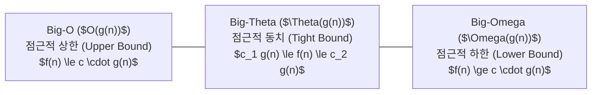

> [!abstract] 핵심 요약
> 점근적 분석(Asymptotic Analysis)은 하드웨어와 구현 환경의 독립성을 유지하면서 입력 크기 $n 	o \infty$일 때의 연산 횟수 성장률(Growth Rate)을 수학적으로 모델링한다.
> 분할 정복 재귀 점화식 $T(n) = a T(n/b) + f(n)$은 **마스터 정리(Master Theorem)**를 적용하여 임계 차수 $\log_b a$와 $f(n)$의 성장 속도 비교만으로 즉시 $O$ 복잡도를 판별할 수 있다.

---

## 1. 점근적 표기법 3대 정의



---

## 2. 마스터 정리 (Master Theorem) 3대 케이스

점화식 형태: $T(n) = a T(n/b) + f(n) \quad (a \ge 1, b > 1)$

| Case | 조건 (비교 기준: $n^{\log_b a}$) | 결과 복잡도 $T(n)$ | 지배적 요인 |
| :--: | :-- | :-- | :-- |
| **Case 1** | $f(n) = O(n^{\log_b a - \epsilon}) \quad (\epsilon > 0)$ | $\Theta(n^{\log_b a})$ | 리프 노드의 재귀 호출 연산 |
| **Case 2** | $f(n) = \Theta(n^{\log_b a} \log^k n) \quad (k \ge 0)$ | $\Theta(n^{\log_b a} \log^{k+1} n)$ | 각 레벨별 고른 연산 분포 |
| **Case 3** | $f(n) = \Omega(n^{\log_b a + \epsilon})$ 및 정규성 만족 | $\Theta(f(n))$ | 루트 노드의 분할/병합 연산 |

---

## 3. 실시간 마스터 정리 복잡도 계산기

```html preview
<div style="font-family:system-ui,-apple-system,sans-serif;padding:20px;background:var(--card);color:var(--card-foreground);border:1px solid var(--border);border-radius:var(--radius)">
  <div style="font-size:16px;font-weight:700;margin-bottom:14px;color:var(--primary);display:flex;align-items:center;gap:8px">
    <span>⚡ 마스터 정리 점화식 복잡도 판별기</span>
  </div>

  <div style="display:grid;grid-template-columns:1fr 1fr 1fr;gap:8px;margin-bottom:14px">
    <div>
      <label style="font-size:11px;color:var(--muted-foreground)">분할 수 (a):</label>
      <input id="inA" type="number" value="2" min="1" style="width:100%;padding:4px;background:var(--background);color:var(--foreground);border:1px solid var(--border);border-radius:var(--radius);font-weight:700" />
    </div>
    <div>
      <label style="font-size:11px;color:var(--muted-foreground)">축소율 (b):</label>
      <input id="inB" type="number" value="2" min="2" style="width:100%;padding:4px;background:var(--background);color:var(--foreground);border:1px solid var(--border);border-radius:var(--radius);font-weight:700" />
    </div>
    <div>
      <label style="font-size:11px;color:var(--muted-foreground)">f(n) 차수 (d in n^d):</label>
      <input id="inD" type="number" value="1" min="0" step="0.5" style="width:100%;padding:4px;background:var(--background);color:var(--foreground);border:1px solid var(--border);border-radius:var(--radius);font-weight:700" />
    </div>
  </div>

  <div style="padding:12px;background:var(--background);border:1px solid var(--border);border-radius:var(--radius)">
    <div style="font-size:11px;font-weight:700;color:var(--muted-foreground);margin-bottom:4px">판정 결과 및 시간 복잡도</div>
    <div id="masterResultOut" style="font-family:monospace;font-size:14px;line-height:1.6;color:var(--primary)">
      log_b(a) = 1.0 vs d = 1.0 -> Case 2: Theta(n log n) [병합 정렬 형태]
    </div>
  </div>

  <script>
    function updateMaster() {
      var a = parseFloat(document.getElementById('inA').value) || 1;
      var b = parseFloat(document.getElementById('inB').value) || 2;
      var d = parseFloat(document.getElementById('inD').value) || 0;
      var logba = Math.log(a) / Math.log(b);
      var out = document.getElementById('masterResultOut');
      if (Math.abs(logba - d) < 1e-4) {
        out.innerHTML = "<strong>Case 2: $\Theta(n^{" + d.toFixed(1) + "} \log n)$</strong> (리프와 루트 비용 균형)";
      } else if (logba > d) {
        out.innerHTML = "<strong>Case 1: $\Theta(n^{\log_" + b + " " + a + "}) = \Theta(n^{" + logba.toFixed(2) + "})$</strong> (리프 노드 비용 지배)";
      } else {
        out.innerHTML = "<strong>Case 3: $\Theta(n^{" + d.toFixed(1) + "})$</strong> (분할/병합 비용 지배)";
      }
    }
    document.getElementById('inA').addEventListener('input', updateMaster);
    document.getElementById('inB').addEventListener('input', updateMaster);
    document.getElementById('inD').addEventListener('input', updateMaster);
  </script>
</div>
```
