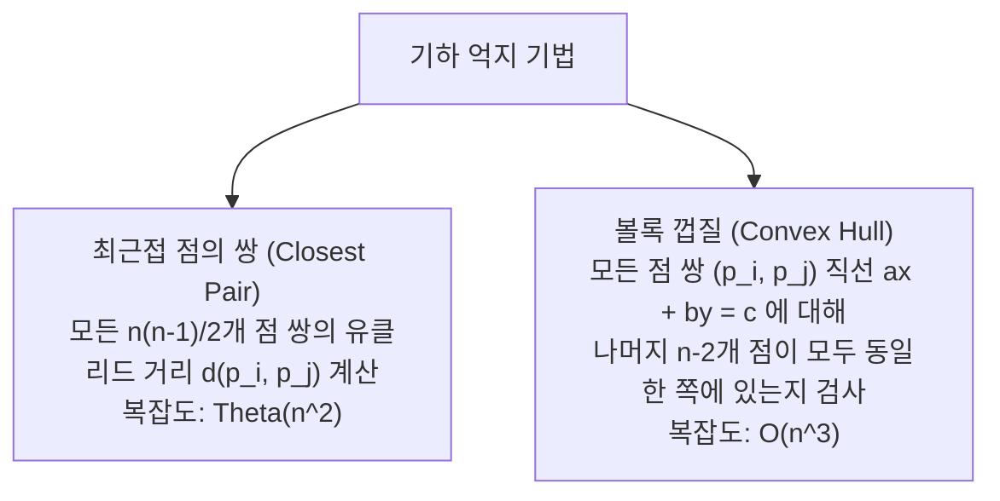

> [!abstract] 핵심 요약
> **억지 기법(Brute Force)**은 문제의 정의와 규칙을 가장 단순하고 직접적인 방식으로 컴퓨터에 명령하는 직관적 설계 전략이다.
> 비록 이론적 시간 복잡도는 비효율적($O(n^2), O(2^n), O(n!)$)일 수 있으나, **알고리즘 설계의 기준점(Baseline)**이자 입력 크기가 작은 실제 환경에서 최적 알고리즘보다 오버헤드가 적은 강력한 실용성을 발휘한다.

---

## 1. 억지 기법의 기초와 2대 기본 정렬

### 1.1. 선택 정렬 (Selection Sort)
- **원리**: 매 패스마다 미정렬 영역에서 최솟값을 찾아 정렬 영역의 첫 번째 원소와 교환($Swap$).
- **비교 횟수**:
  $$C(n) = \sum_{i=0}^{n-2} \sum_{j=i+1}^{n-1} 1 = \sum_{i=0}^{n-2} (n - 1 - i) = \frac{n(n-1)}{2} \in \Theta(n^2)$$
- **교환 횟수**: 정확히 $\Theta(n)$번 수행 (원소 이동 비용이 극도로 큰 시스템에서 유리).
- **특징**: 불안정 정렬(Unstable Sort).

### 1.2. 버블 정렬 (Bubble Sort)
- **원리**: 인접한 두 원소의 대소 관계를 비교하여 큰 원소를 뒤로 지속적으로 교환.
- **최적화**: 특정 패스에서 교환($Swap$)이 단 한 번도 발생하지 않으면 즉시 루프 종료 $\implies$ 최선의 경우 $O(n)$ 달성.

---

## 2. 기하 문제에서의 억지 기법



### 2.1. 볼록 껍질 극단선(Extreme Segment) 판별 판정식
두 점 $p_1(x_1, y_1), p_2(x_2, y_2)$를 잇는 직선 방정식:
$$ax + by = c \quad (a = y_2 - y_1, \; b = x_1 - x_2, \; c = x_1 y_2 - y_1 x_2)$$
임의의 점 $p(x, y)$에 대해 $ax + by - c$의 부호가 모든 나머지 $n-2$개의 점에 대해 동일(모두 $\ge 0$ 또는 모두 $\le 0$)하면, 선분 $\overline{p_1 p_2}$는 볼록 다각형의 경계선이다.

---

## 3. 완전 탐색(Exhaustive Search)과 조합 폭발(Combinatorial Explosion)

| 문제 | 탐색 공간 | 후보 해(Candidate Solutions)의 수 | 시간 복잡도 |
| :-- | :-- | :--: | :--: |
| **외판원 문제 (TSP)** | 해밀턴 순환 (모든 정점 1회 방문) | $\frac{(n-1)!}{2}$ | **$O(n!)$** |
| **0/1 배낭 문제 (Knapsack)** | $n$개 아이템의 모든 부분집합 | $2^n$ | **$O(2^n)$** |
| **작업 할당 문제 (Assignment)** | $n$명 작업자에게 $n$개 일 배정 | $n!$ | **$O(n!)$** |

> [!caution] 조합 폭발의 현실적 한계
> $n=20$일 때 $2^{20} \approx 10^6$ (1밀리초 내 계산 가능)이지만, $n=50$이면 $2^{50} \approx 1.1 \times 10^{15}$ (수백 년 소요)가 된다.
> 완전 탐색은 동적 계획법(DP), 분기 한정(Branch-and-Bound), 메타 휴리스틱의 필요성을 입증하는 배경이 된다.

---

## 4. 실시간 브루트포스 조합 폭발 시뮬레이터

```html preview
<div style="font-family:system-ui,-apple-system,sans-serif;padding:20px;background:var(--card);color:var(--card-foreground);border:1px solid var(--border);border-radius:var(--radius)">
  <div style="font-size:16px;font-weight:700;margin-bottom:12px;color:var(--primary)">
    ⚡ 완전 탐색(Exhaustive Search) 복잡도 조합 폭발 계산기
  </div>

  <div style="margin-bottom:14px">
    <label style="font-size:11px;color:var(--muted-foreground)">원소/도시 수 n (1 ~ 25):</label>
    <input id="inExN" type="range" min="1" max="25" value="10" style="width:100%" />
    <div style="display:flex;justify-content:space-between;font-size:12px;font-weight:700;margin-top:2px">
      <span>n = 1</span>
      <span id="outExNVal" style="color:var(--primary);font-size:15px">n = 10</span>
      <span>n = 25</span>
    </div>
  </div>

  <div style="display:grid;grid-template-columns:1fr 1fr 1fr;gap:10px">
    <div style="padding:10px;background:var(--background);border:1px solid var(--border);border-radius:var(--radius)">
      <div style="font-size:11px;color:var(--muted-foreground)">이차 다항 (n^2)</div>
      <div id="outN2" style="font-family:monospace;font-size:16px;font-weight:800;color:var(--primary);margin-top:4px">100</div>
    </div>
    <div style="padding:10px;background:var(--background);border:1px solid var(--border);border-radius:var(--radius)">
      <div style="font-size:11px;color:var(--muted-foreground)">지수 탐색 (2^n)</div>
      <div id="out2N" style="font-family:monospace;font-size:16px;font-weight:800;color:var(--warning,#f59e0b);margin-top:4px">1,024</div>
    </div>
    <div style="padding:10px;background:var(--background);border:1px solid var(--border);border-radius:var(--radius)">
      <div style="font-size:11px;color:var(--muted-foreground)">순열 계승 (n!)</div>
      <div id="outNF" style="font-family:monospace;font-size:16px;font-weight:800;color:var(--destructive,#ef4444);margin-top:4px">3,628,800</div>
    </div>
  </div>

  <script>
    function fact(n) {
      if (n <= 1) return 1;
      var res = 1;
      for (var i = 2; i <= n; i++) res *= i;
      return res;
    }

    function calcEx() {
      var n = parseInt(document.getElementById('inExN').value);
      document.getElementById('outExNVal').textContent = "n = " + n;
      document.getElementById('outN2').textContent = (n * n).toLocaleString();
      document.getElementById('out2N').textContent = Math.pow(2, n).toLocaleString();
      var f = fact(n);
      document.getElementById('outNF').textContent = f > 1e15 ? f.toExponential(3) : f.toLocaleString();
    }

    document.getElementById('inExN').addEventListener('input', calcEx);
    calcEx();
  </script>
</div>
