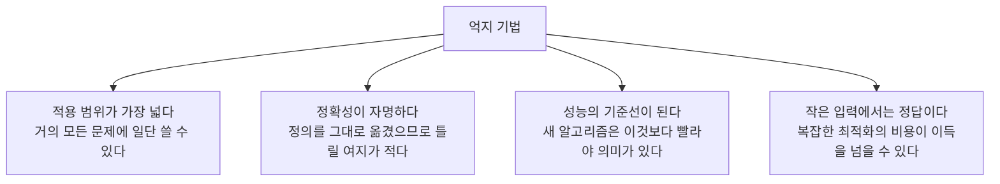

> [!abstract] 이 장은 해법이 아니라 문제 제기다
> 3장에서 다루는 알고리즘은 하나가같이 **문제 정의를 그대로 옮긴 것**들이다. 정렬하라면 가장 작은 것을 찾아 앞으로 보내고, 찾으라면 처음부터 훑으며, 최단 경로를 찾으라면 모든 경로를 다 가 본다.
> 이 장이 흥미로운 것은 그 단순함 때문이 아니라, **거의 모든 절이 “개선 → N장”으로 끝난다**는 점 때문이다. 최근접 쌍은 5장, TSP는 9·10장, 배낭은 7장. 즉 이 장은 나머지 일곱 장이 답해야 할 질문 목록이다.

---

## 1. 억지 기법이란 무엇이며, 왜 배우는가

원본은 억지 기법(brute-force)을 *문제의 정의를 바탕으로 한 가장 직접적인 방법*으로 규정한다. 별칭은 **naive method** — 순진한 방법이다. 이미 만난 예도 든다: [1장의 최대공약수 알고리즘 1](./01.%20%EC%95%8C%EA%B3%A0%EB%A6%AC%EC%A6%98%EC%9D%98%20%EA%B0%9C%EC%9A%94%EC%99%80%20%EB%AC%B8%EC%A0%9C%20%ED%95%B4%EA%B2%B0%20%ED%94%84%EB%A0%88%EC%9E%84%EC%9B%8C%ED%81%AC.md)— 두 수의 약수를 전부 구해 교집합을 찾던 그 방법.

느린 방법을 한 장을 통째로 할애해 배우는 데는 이유가 있다.

특히 세 번째가 중요하다. 5장의 최근접 쌍 $O(n\log n)$ 이 대단해 보이는 것은 **여기서 구한 $O(n^2)$ 이 비교 대상으로 있기 때문**이다. 기준선 없는 개선은 측정되지 않는다.

---

## 2. 억지 기법 다섯 사례와 그 복잡도

3.1절부터 3.4절까지는 네 개의 고전적인 문제를 같은 방식으로 분석한다 — [2장의 네 가지 질문](./02.%20%EC%95%8C%EA%B3%A0%EB%A6%AC%EC%A6%98%20%ED%9A%A8%EC%9C%A8%EC%84%B1%20%EB%B6%84%EC%84%9D%EA%B3%BC%20%EC%A0%90%EA%B7%BC%EC%A0%81%20%ED%91%9C%EA%B8%B0%EB%B2%95.md)을 그대로 적용하는 연습이다.

| 절 | 문제 | 입력 크기 | 기본 연산 | 복잡도 | 개선은 |
| --- | --- | --- | --- | --- | --- |
| 3.1 | 선택 정렬 | 리스트 항목 수 $n$ | 비교 `A[j] < A[least]` | $O(n^2)$ — **입력 무관 일정** | 5장 병합/퀵 |
| 3.2 | 순차 탐색 | 리스트 길이 $n$ | 키 비교 | 최선 $O(1)$ / 최악 $O(n)$ / 평균 $(n{+}1)/2$ | 4장 이진 탐색, 6장 해싱 |
| 3.3 | 문자열 매칭 | 텍스트 $n$, 패턴 $m$ | 문자 비교 | 최선 $O(m)$ / 최악 $O(mn)$ | 6장 |
| 3.4 | 최근접 쌍의 거리 | 점의 개수 $n$ | 유클리드 거리 계산 | $O(n^2)$ | **5장** (원본 명시) |

### 선택 정렬 — 입력을 가리지 않는 알고리즘

원본 7쪽의 분석에서 눈여겨볼 줄은 이것이다 — *입력에 상관없이 항상 일정한 횟수의 비교 연산이 필요*. 이미 정렬된 리스트를 줘도 선택 정렬은 같은 만큼 일한다.

$$
\sum_{i=0}^{n-2}(n-1-i) = (n-1) + (n-2) + \cdots + 1 = \frac{n(n-1)}{2} \;\in\; \Theta(n^2)
$$

이것이 $O$가 아니라 $\Theta$인 이유는 최선과 최악이 같기 때문이다. 반면 5쪽의 *제자리 정렬을 위한 알고리즘 개선*은 공간을 건드린다 — 새 리스트를 만들지 않고 자리를 교환해 $O(1)$ 추가 공간으로 끝낸다.

### 순차 탐색 — 평균은 공짜로 얻어지지 않는다

원본 9쪽은 세 경우를 적고 평균에만 단서를 달았다.

$$
C_{best}(n) = 1 \in O(1), \qquad C_{worst}(n) = n \in O(n), \qquad C_{avg}(n) = \frac{n+1}{2} \in O(n)
$$

> 리스트의 모든 숫자가 골고루 한 번씩 key로 사용되는 경우를 가정

가정 없이는 평균이 정의되지 않는다. 찾는 값이 리스트의 $i$번째에 있을 확률이 모두 $1/n$ 이라면 기댓값은 $\frac{1}{n}\sum_{i=1}^{n} i = \frac{n+1}{2}$ 이 된다. 만약 찾는 값이 앞쪽에 몰려 있는 분포라면 평균은 달라진다. **평균 분석은 항상 확률 모델을 먼저 선언해야 한다.**

흥미로운 점은 평균이 최악의 절반이지만 **점근적으로는 둘 다 $O(n)$** 이라는 것이다. 상수배는 무시되므로, 순차 탐색을 개선하려면 상수가 아니라 **증가율 자체를** 바꿔야 한다. 그게 이진 탐색($O(\log n)$)과 해싱($O(1)$)이다.

### 문자열 매칭 — 최악은 언제 오는가

억지 기법 문자열 매칭은 텍스트의 모든 위치에서 패턴을 처음부터 맞춰 본다. 최선은 각 위치에서 첫 문자만 틀려 즉시 다음으로 넘어가는 경우로 $O(n)$ 수준이지만, 최악은 **매번 마지막 문자에서 틀리는** 경우다.

예를 들어 텍스트가 `AAAAAAAAAB`, 패턴이 `AAAB` 라면 매 시작 위치에서 패턴 길이만큼 비교하고 마지막에 실패한다. 이런 입력이 $O(mn)$을 만든다. 6장은 *이미 비교해 알아낸 정보를 버리지 않는* 방식으로 이를 개선한다.
