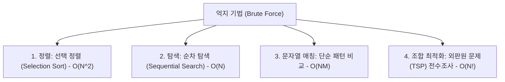

> [!abstract] 핵심 요약
> **억지 기법(Brute Force)**은 문제의 정의와 규칙을 직접 적용하여 가능한 모든 경우를 체계적으로 검사하는 가장 직관적인 알고리즘 설계 패러다임이다. 
> 구현이 단순하고 항상 올바른 해를 도출하지만, 탐색 공간의 크기에 따라 지수 시간 $O(2^n)$이나 계승 시간 $O(n!)$의 계산 비용이 발생한다.

---

## 1. 억지 기법의 주요 적용 알고리즘



---

## 2. 선택 정렬 (Selection Sort) 알고리즘과 동작 원리

$$T(n) = \sum_{i=0}^{n-2} \sum_{j=i+1}^{n-1} 1 = \frac{n(n-1)}{2} = \Theta(n^2)$$

```python
def selection_sort(arr: list) -> list:
    n = len(arr)
    for i in range(n - 1):
        min_idx = i
        for j in range(i + 1, n):
            if arr[j] < arr[min_idx]:
                min_idx = j
        arr[i], arr[min_idx] = arr[min_idx], arr[i]
    return arr
```
