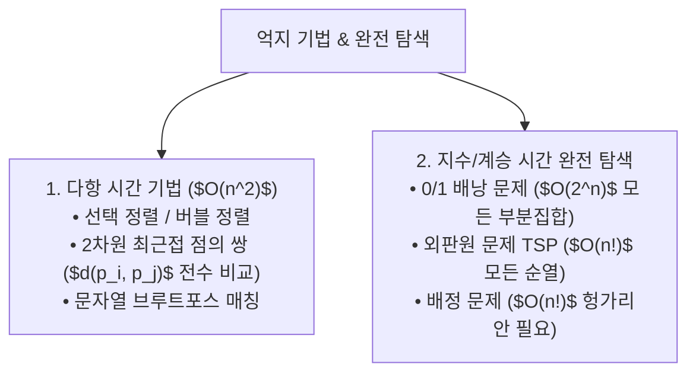

> [!abstract] 핵심 요약
> **억지 기법(Brute Force)**은 문제의 정의를 그대로 구현하는 직관적이고 보편적인 알고리즘 설계 패러다임이다.
> 모든 가능한 경우의 수를 열거하는 **완전 탐색(Exhaustive Search)**은 최적해를 반드시 보장하지만, 입력 크기 $n$에 따라 탐색 공간이 $O(2^n)$ 또는 $O(n!)$으로 폭발하므로 분할 정복이나 동적 계획법, 분기 한정 등의 고급 설계 기법으로 최적화되어야 한다.

---

## 1. 억지 기법 주요 알고리즘 복잡도 비교



---

## 2. 2차원 최근접 점의 쌍 (Closest-Pair Brute Force)

$$d(p_i, p_j) = \sqrt{(x_i - x_j)^2 + (y_i - y_j)^2}$$
$$d_{\min} = \min_{1 \le i < j \le n} d(p_i, p_j) \implies 	ext{총 비교 횟수 } C(n) = \sum_{i=1}^{n-1} \sum_{j=i+1}^n 1 = rac{n(n-1)}{2} \in \Theta(n^2)$$

---

## 3. 실시간 완전 탐색 조합 폭발($n!$ vs $2^n$) 계산기

```html preview
<div style="font-family:system-ui,-apple-system,sans-serif;padding:20px;background:var(--card);color:var(--card-foreground);border:1px solid var(--border);border-radius:var(--radius)">
  <div style="font-size:16px;font-weight:700;margin-bottom:14px;color:var(--primary);display:flex;align-items:center;gap:8px">
    <span>💥 완전 탐색 입력 크기별 경우의 수 폭발 계산기</span>
  </div>

  <div style="margin-bottom:14px">
    <label style="font-size:11px;color:var(--muted-foreground)">입력 크기 N (도시 수 / 물건 수): <span id="nVal">10</span></label>
    <input id="inN" type="range" min="3" max="20" value="10" style="width:100%" />
  </div>

  <div style="display:grid;grid-template-columns:1fr 1fr;gap:12px;margin-bottom:12px">
    <div style="padding:10px;background:var(--background);border:1px solid var(--border);border-radius:var(--radius);text-align:center">
      <div style="font-size:10px;color:var(--muted-foreground)">배낭 부분집합 수 ($2^N$)</div>
      <div id="subsetsOut" style="font-family:monospace;font-size:16px;font-weight:800;color:var(--primary);margin-top:2px">1,024</div>
    </div>
    <div style="padding:10px;background:var(--background);border:1px solid var(--border);border-radius:var(--radius);text-align:center">
      <div style="font-size:10px;color:var(--muted-foreground)">TSP 순열 수 ($N!$)</div>
      <div id="permsOut" style="font-family:monospace;font-size:16px;font-weight:800;color:var(--destructive,#ef4444);margin-top:2px">3,628,800</div>
    </div>
  </div>

  <script>
    function updateExplosion() {
      var n = parseInt(document.getElementById('inN').value);
      document.getElementById('nVal').textContent = n;
      var subsets = Math.pow(2, n);
      var perms = 1;
      for (var i = 1; i <= n; i++) perms *= i;
      document.getElementById('subsetsOut').textContent = subsets.toLocaleString();
      document.getElementById('permsOut').textContent = perms.toLocaleString();
    }
    document.getElementById('inN').addEventListener('input', updateExplosion);
  </script>
</div>
```
