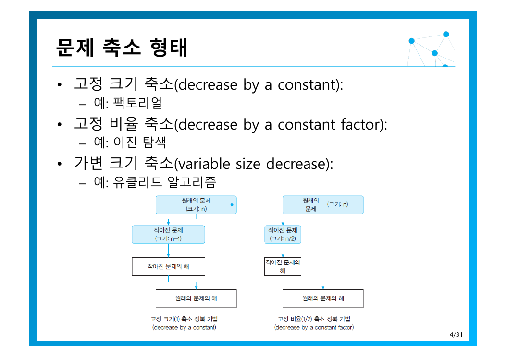
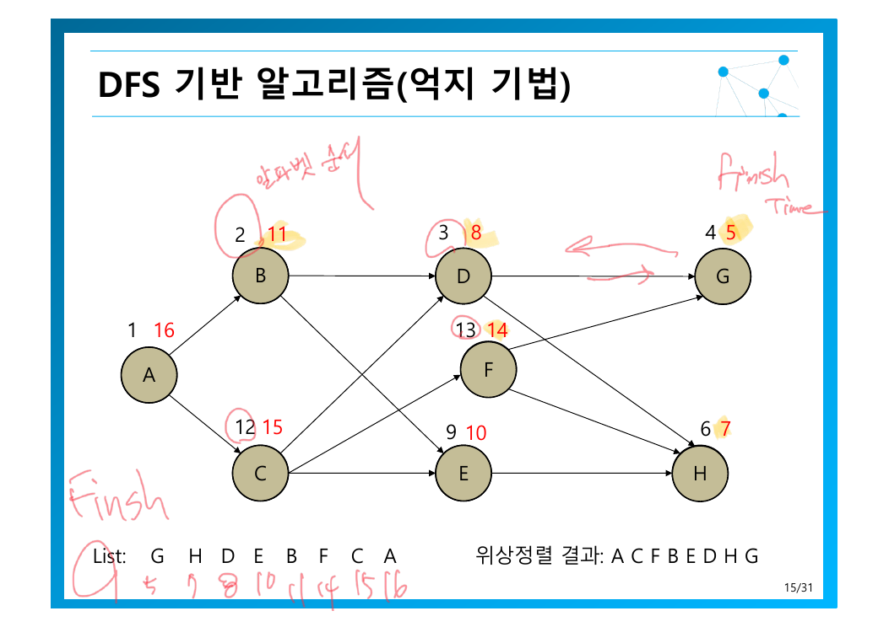
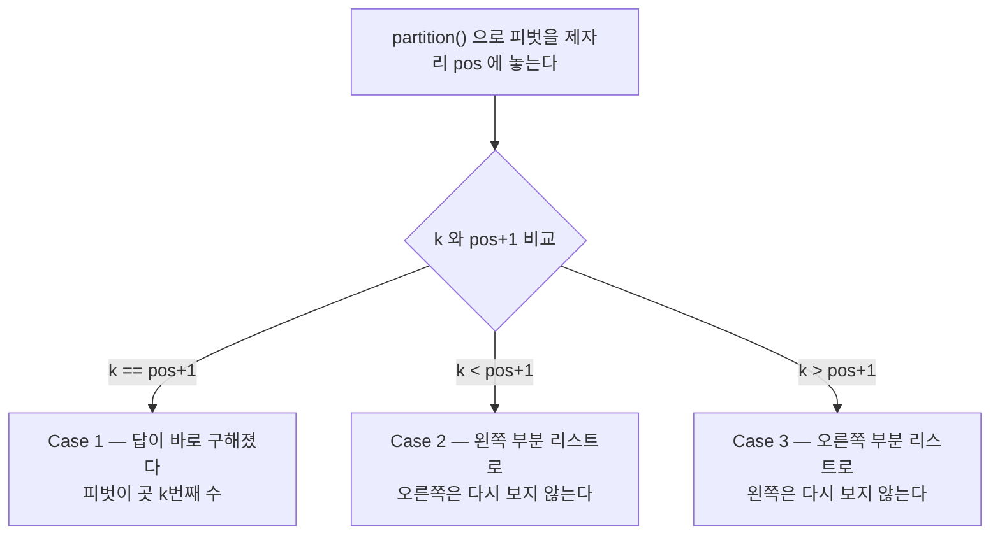
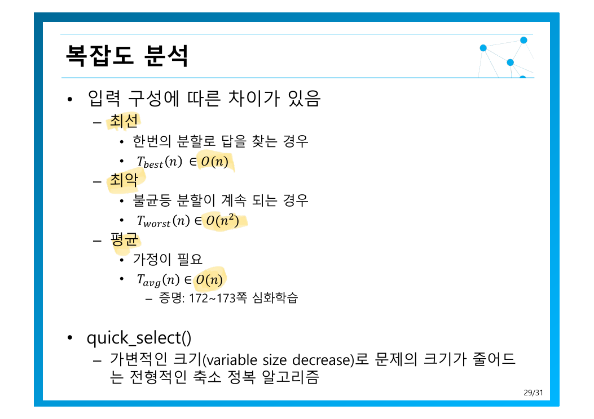

> [!abstract] 한 줄로 요약하면
> 이 장은 **같은 전략의 세 가지 변종**을 다룼다. 문제를 더 작은 같은 문제로 줄인다는 아이디어는 하나지만, **얼마나 줄이느냐**에 따라 결과가 $O(n)$, $O(\log n)$, 또는 “경우에 따라 다름”으로 갈라진다.
> 원본 4쪽이 이 세 분류를 먼저 제시하고 나머지 전체가 그 사례를 채우는 구조이므로, 이 정리도 세 분류를 입구로 삼는다.

---

## 1. 축소 정복이란

원본 3쪽의 정의는 간결하다 — *주어진 문제와 더 작은 문제간의 관계를 이용하는 전략*. 대표 예는 팩토리얼이다.

$$
n! = n \times (n-1)!
$$

$n!$ 을 구하는 문제가 $(n-1)!$ 을 구하는 **같은 종류의 더 작은 문제**로 환원된다. 원본은 이를 *분할 정복 기법의 일종*으로 분류하면서도 구분해 다룬다. 차이는 [5장](./05.%20%EB%B6%84%ED%95%A0%20%EC%A0%95%EB%B3%B5%20%EA%B8%B0%EB%B2%95.md)에서 선명해지지만 미리 말하면 — 축소 정복은 **작은 문제를 하나만** 풀고, 분할 정복은 **여러 개를** 푸는다.

구현 방향은 둘이다(3쪽).

| 방향 | 구조 | 생각하는 순서 |
| --- | --- | --- |
| **하향식** (top-down) | 순환 구조 | “$n$을 풀려면 $n-1$을 알아야 한다” |
| **상향식** (bottom-up) | 반복 구조 | “1부터 쌓아 올려 $n$까지 간다” |

같은 재귀 관계를 어느 방향에서 보느냐의 차이일 뿐, [2장에서 확인했듯이](./02.%20%EC%95%8C%EA%B3%A0%EB%A6%AC%EC%A6%98%20%ED%9A%A8%EC%9C%A8%EC%84%B1%20%EB%B6%84%EC%84%9D%EA%B3%BC%20%EC%A0%90%EA%B7%BC%EC%A0%81%20%ED%91%9C%EA%B8%B0%EB%B2%95.md) 점근적 복잡도는 같다.

---

## 2. 세 가지 축소 형태 — 이 장의 지도



원본은 축소 방식을 셋으로 나누고 각각에 대표 예를 하나씩 붙인다. 이 분류가 중요한 이유는 **각 형태가 서로 다른 점화식을 낳기 때문**이다.

| 형태 | 줄이는 방식 | 점화식 | 결과 | 원본의 예 |
| --- | --- | --- | --- | --- |
| **고정 크기 축소**<br/>decrease by a constant | $n \to n-1$ | $T(n) = T(n-1) + f(n)$ | $f$가 상수면 $O(n)$<br/>$f$가 선형이면 $O(n^2)$ | 팩토리얼, 삽입 정렬, 위상 정렬 |
| **고정 비율 축소**<br/>decrease by a constant factor | $n \to n/2$ | $T(n) = T(n/2) + f(n)$ | $f$가 상수면 $O(\log n)$ | 이진 탐색, 거듭제곱, 위조 동전 |
| **가변 크기 축소**<br/>variable size decrease | 매번 다름 | 고정된 식 없음 | 경우별 분석 필요 | 유클리드, quick_select, 보간 탐색 |

세 형태가 얼마나 다른지 직접 보라 — 문제 크기가 줄어드는 과정을 나란히 놓고 비교한다.

```html preview h=540px
<div style="font-family:system-ui,-apple-system,sans-serif;padding:20px;color:var(--foreground)">
  <label for="dn" style="font-size:13px;font-weight:600">시작 문제 크기 n = <span id="dnv" style="color:var(--chart-1);font-size:19px">64</span></label>
  <input id="dn" type="range" min="8" max="256" step="8" value="64" style="width:100%;accent-color:var(--primary);margin:8px 0 16px" />
  <div id="dsteps"></div>
  <div id="dnote" style="margin-top:14px;padding:11px 13px;background:var(--card);border:1px solid var(--border);border-radius:var(--radius);font-size:13px;line-height:1.7"></div>

  <script>
    var dn = document.getElementById('dn');
    function bar(label, seq, color, note) {
      var shown = seq.slice(0, 14);
      var cells = shown.map(function (v, i) {
        var w = Math.max(3, (v / seq[0]) * 100);
        return '<div title="' + v + '" style="height:13px;width:' + w + '%;background:' + color +
          ';opacity:' + (1 - i * 0.045) + ';border-radius:3px;margin-bottom:3px"></div>';
      }).join('');
      return '<div style="margin-bottom:16px">' +
        '<div style="display:flex;justify-content:space-between;font-size:13px;margin-bottom:6px">' +
        '<b style="color:' + color + '">' + label + '</b>' +
        '<span style="color:var(--muted-foreground)">' + note + ' · <b>' + seq.length + '단계</b>' +
        (seq.length > 14 ? ' (상위 14단계만 표시)' : '') + '</span></div>' +
        cells + '</div>';
    }
    function dupd() {
      var n = parseInt(dn.value, 10);
      document.getElementById('dnv').textContent = n;
      var s1 = [], v = n;
      while (v >= 1) { s1.push(v); v -= 1; }
      var s2 = [], w = n;
      while (w >= 1) { s2.push(w); w = Math.floor(w / 2); }
      var s3 = [], u = n, seed = n * 7 + 13;
      while (u >= 1) { s3.push(u); seed = (seed * 1103515245 + 12345) % 2147483648;
        var frac = 0.15 + (seed / 2147483648) * 0.7; u = Math.floor(u * (1 - frac)); }
      document.getElementById('dsteps').innerHTML =
        bar('고정 크기 축소  n → n−1', s1, 'var(--chart-5)', '삽입 정렬 · 팩토리얼') +
        bar('고정 비율 축소  n → n/2', s2, 'var(--chart-2)', '이진 탐색 · 거듭제곱') +
        bar('가변 크기 축소  n → ?', s3, 'var(--chart-3)', 'quick_select · 유클리드');
      document.getElementById('dnote').innerHTML =
        'n = ' + n + ' 에서 고정 크기 축소는 <b style="color:var(--chart-5)">' + s1.length +
        '단계</b>, 고정 비율 축소는 <b style="color:var(--chart-2)">' + s2.length +
        '단계</b>. 문제를 “하나씩” 줄이느냐 “절반씩” 줄이느냐가 ' +
        '<b>' + n + '대 ' + s2.length + '</b>의 차이를 만든다.<br>' +
        '<span style="color:var(--muted-foreground)">가변 크기 축소는 매번 줄어드는 폭이 달라서 단계 수가 실행마다 변한다 — 그래서 평균 분석이 필요하다.</span>';
    }
    dn.addEventListener('input', dupd);
    dupd();
  </script>
</div>
```

> [!important] 이 그림이 말하는 것
> 고정 크기 축소의 막대는 **조금씩 줄어들며 오래 간다**. 고정 비율 축소는 **몇 단계 만에 사라진다**. 같은 “축소”이라는 이름을 쓰지만 $O(n)$과 $O(\log n)$ 을 가르는 것은 이 한 가지 선택이다.

---

## 3. 고정 크기 축소 — 한 개씩 줄이기

### 3.1 삽입 정렬 — “마지막 하나를 끼워 넣는다”

원본 5쪽의 발상이 정확히 축소 정복이다.

$$
A[0..n{-}1] \text{의 정렬} \;=\; A[0..n{-}2] \text{의 정렬} \;+\; A[n{-}1] \text{을 끼워 넣기}
$$

앞의 $n-1$개가 이미 정렬되어 있다면, 남은 일은 마지막 하나를 제자리에 넣는 것뿐이다. 원본은 이를 **상향식**(6쪽)으로 구현한다 — 항목을 하나씩 늘려가며 매번 제자리를 찾아준다.

삽입 위치를 찾는 방향에도 이유가 있다(7쪽) — *뒤에서 앞으로 넣을 위치를 찾아나감*. 그래야 **항목을 미리 뒤로 옮길 수 있기** 때문이다. 앞에서 찾으면 위치를 안 뒤에 다시 되돌아와 밀어야 하므로 두 번 순회하게 된다.

복잡도는 입력에 따라 세 갈래로 나뉩니다(9쪽).

| 경우 | 입력 | 복잡도 | 왜 |
| --- | --- | --- | --- |
| 최선 | **이미 정렬된** 리스트 | $O(n)$ | 각 항목이 바로 앞과 한 번만 비교되고 제자리에 멈춘다 |
| 최악 | **역으로 정렬된** 리스트 | $O(n^2)$ | 매번 맨 앞까지 밀고 간다 |
| 평균 | 무작위 | $O(n^2)$ | 최악의 절반 정도 |

최선이 $O(n)$ 이라는 점이 삽입 정렬을 특별하게 만든다. [3장의 선택 정렬](./03.%20%EC%96%B5%EC%A7%80%20%EA%B8%B0%EB%B2%95%EA%B3%BC%20%EC%99%84%EC%A0%84%20%ED%83%90%EC%83%89.md)이 입력과 무관하게 $\Theta(n^2)$ 인 것과 대조된다. 원본이 덧붙인 특징도 이 점을 가리킨다 — *레코드가 이미 정렬되어 있는 경우 효율적 → 셔(Shell) 정렬*. 셔 정렬은 먼 간격부터 대략 정렬해 놓아 마지막 삽입 정렬을 최선에 가깝게 만드는 전략이다.

### 3.2 위상 정렬 — 정점을 하나씩 때어내기

원본 10쪽은 수강 순서로 문제를 제시한다. 선수 과목 관계가 있을 때 $\langle A,B,C,D,E,F \rangle$ 나 $\langle B,A,C,D,E,F \rangle$ 는 가능하지만 $\langle C,A,B,D,E,F \rangle$ 는 불가능하다. **가능한 순서가 여럿이라는 점**이 이 문제의 특징이다.

#### 방법 1 — 진입 차수 기반 (순수 축소 정복)

원본 11쪽의 절차는 축소 정복의 교과서적 형태다.

1. 진입 차수가 0인 임의의 정점을 선택한다
2. 그 정점과 진출하는 모든 간선을 삭제하고 차수를 갱신한다
3. 반복 — **문제의 크기가 1 줄어든다**

마지막 문장이 핵심이다. 정점 하나를 때어내면 같은 종류의 더 작은 문제가 남으므로 정확히 고정 크기 축소다. 복잡도는 12쪽에 단계별로 적혀 있고 전체는 $O(n + e)$ — 모든 정점과 간선을 한 번씩 다룬다.

#### 방법 2 — DFS 기반

여기서 원본의 흥미로운 흔적이 나온다. **13쪽 제목에는 “(틀린 설명)”이라는 표기가 붙어 있고**, 14쪽이 정정된 설명이다.

| | 13쪽 (틀린 설명) | 14쪽 (올바른 설명) |
| --- | --- | --- |
| 절차 | 진입 차수 0인 정점에서 DFS로 방문하며 그 **방문 순서**를 쓴다 | DFS를 돌려 각 정점의 **종료시각** $f[v]$ 를 계산하고, 종료될 때마다 list에 추가한 뒤 **역순**으로 출력 |
| 문제 | 방문 순서는 선행 관계를 보장하지 않는다 | 종료시각 역순은 보장한다 |

왜 종료시각 역순이어야 하는가? 정점 $u$에서 $v$로 가는 간선이 있다면, DFS는 $u$를 끝내기 전에 반드시 $v$를 먼저 끝낸다. 즉 $f[u] > f[v]$ 가 항상 성립하므로, 종료시각을 내림차순으로 나열하면 선행 관계가 지켜진다.



15쪽 예제를 표로 정리하면 구조가 보인다. 각 정점은 `발견시각 / 종료시각` 을 갖는다.

| 정점 | A | B | D | G | H | E | C | F |
| --- | --- | --- | --- | --- | --- | --- | --- | --- |
| 발견 | 1 | 2 | 3 | 4 | 6 | 9 | 12 | 13 |
| **종료** | **16** | **11** | **8** | **5** | **7** | **10** | **15** | **14** |

종료시각이 작은 순서로 list에 쌓이면 `G(5) H(7) D(8) E(10) B(11) F(14) C(15) A(16)`, 즉 **List: G H D E B F C A**. 이것을 뒤집으면

$$
\text{위상정렬 결과:} \quad A \to C \to F \to B \to E \to D \to H \to G
$$

슬라이드 오른쪽 아래에 적힌 것과 정확히 일치한다. 필기에 “알파벳 순서”라고 적혀 있는 것은, 이웃을 꺼내는 순서를 알파벳순으로 고정해야 답이 하나로 정해진다는 뜻이다 — [3장 DFS 실습](./03.%20%EC%96%B5%EC%A7%80%20%EA%B8%B0%EB%B2%95%EA%B3%BC%20%EC%99%84%EC%A0%84%20%ED%83%90%EC%83%89.md)에서 인접 리스트를 정렬해 둔 것과 같은 이유다.

---

## 4. 고정 비율 축소 — 절반씩 줄이기

### 4.1 이진 탐색

전략은 한 줄이다(16쪽) — *중앙에 있는 항목을 먼저 조사*. 중앙값과 비교하면 나머지 절반은 볼 필요가 없어지므로 문제가 $n \to n/2$ 로 줄어든다.

복잡도(19쪽):

$$
C_{best}(n) \in O(1), \qquad C_{worst}(n) \in O(\log_2 n) \quad (n = 2^k \text{일 때})
$$

최악은 *리스트에 찾는 값이 없는 경우*다 — 끝까지 반씩 줄여가다가 범위가 빈 뒤에야 포기한다. 반면 운 좋게 첫 비교에서 맞히면 $O(1)$.

그런데 이 속도에는 대가가 붙는다. 원본이 붙인 두 줄의 단서를 놓치면 안 된다.

> [!warning] 이진 탐색의 전제조건
>
> - **반드시 리스트가 정렬되어 있어야 한다** — 정렬 비용 $O(n\log n)$ 을 이미 치렀거나, 정렬 상태를 유지하고 있어야 한다
> - **데이터의 삽입이나 삭제가 빈번한 응용에는 적합하지 않다** — 삽입마다 정렬을 유지하려면 $O(n)$ 이 든다
>
> 한 번 정렬해 두고 수없이 검색하는 상황이라면 이상적이고, 쓰기가 잦으면 [6장의 해싱](./06.%20%EA%B3%B5%EA%B0%84%EC%9C%BC%EB%A1%9C%20%EC%8B%9C%EA%B0%84%20%EB%B2%8C%EA%B8%B0.md)이 나은 선택이다.

### 4.2 거듭제곱 — 곱셈 횟수를 로그로 줄이기

억지 기법은 $x$를 $n$번 곱하므로 $n-1$번의 곱셈이 필요하다. 축소 정복은 지수를 절반으로 접는다.

$$
x^n = \begin{cases}
\left(x^{n/2}\right)^2 & n \text{이 짝수} \\
x \cdot \left(x^{(n-1)/2}\right)^2 & n \text{이 홀수}
\end{cases}
$$

원본은 순환 호출 한 번마다 $n$이 절반씩 줄어든닠다고 정리하고(22쪽), $n = 2^k$ 일 때 복잡도를 $O(\log_2 n)$ 으로 적는다. 차이를 직접 확인해 보라.

```html preview h=430px
<div style="font-family:system-ui,-apple-system,sans-serif;padding:20px;color:var(--foreground)">
  <label for="pw" style="font-size:13px;font-weight:600">지수 n = <span id="pwv" style="color:var(--chart-1);font-size:19px">1024</span></label>
  <input id="pw" type="range" min="2" max="4096" step="1" value="1024" style="width:100%;accent-color:var(--primary);margin:8px 0 16px" />
  <div style="display:flex;gap:14px;flex-wrap:wrap;margin-bottom:14px">
    <div style="flex:1;min-width:160px;padding:15px;background:var(--card);border:1px solid var(--border);border-radius:var(--radius)">
      <div style="font-size:12.5px;color:var(--muted-foreground)">억지 기법 — x를 n번 곱함</div>
      <div id="pwbf" style="font-size:26px;font-weight:700;color:var(--chart-5);margin-top:4px"></div>
    </div>
    <div style="flex:1;min-width:160px;padding:15px;background:var(--card);border:1px solid var(--border);border-radius:var(--radius)">
      <div style="font-size:12.5px;color:var(--muted-foreground)">축소 정복 — 지수 절반씩</div>
      <div id="pwdc" style="font-size:26px;font-weight:700;color:var(--chart-2);margin-top:4px"></div>
    </div>
    <div style="flex:1;min-width:160px;padding:15px;background:var(--card);border:1px solid var(--border);border-radius:var(--radius)">
      <div style="font-size:12.5px;color:var(--muted-foreground)">절감된 곱셈</div>
      <div id="pwrt" style="font-size:26px;font-weight:700;color:var(--chart-1);margin-top:4px"></div>
    </div>
  </div>
  <div id="pwtrace" style="font-size:13px;color:var(--muted-foreground);line-height:1.75;padding:11px 13px;background:var(--card);border:1px solid var(--border);border-radius:var(--radius)"></div>

  <script>
    var pw = document.getElementById('pw');
    function pupd() {
      var n = parseInt(pw.value, 10);
      document.getElementById('pwv').textContent = n.toLocaleString();
      var bf = n - 1;
      var mul = 0, steps = [], v = n;
      while (v > 1) {
        if (v % 2 === 0) { steps.push(v + ' → (' + (v / 2) + ')²'); mul += 1; v = v / 2; }
        else { steps.push(v + ' → x·(' + ((v - 1) / 2) + ')²'); mul += 2; v = (v - 1) / 2; }
      }
      document.getElementById('pwbf').textContent = bf.toLocaleString() + '회';
      document.getElementById('pwdc').textContent = mul + '회';
      document.getElementById('pwrt').textContent = Math.round(bf / Math.max(1, mul)) + '배 적게';
      document.getElementById('pwtrace').innerHTML =
        '<b style="color:var(--foreground)">축소 과정 (' + steps.length + '단계)</b><br>' +
        steps.slice(0, 14).join(' &nbsp;·&nbsp; ') + (steps.length > 14 ? ' ⋯' : '');
    }
    pw.addEventListener('input', pupd);
    pupd();
  </script>
</div>
```

원본은 마지막에 한 줄을 더 붙인다 — *행렬의 거듭제곱 문제에도 동일한 적용이 가능*. 곱셈이 결합법칙을 만족하기만 하면 이 기법이 통하기 때문이다. 피보나치 수열을 $O(\log n)$ 에 구하는 행렬 거듭제곱법이 바로 이 응용이다.

### 4.3 위조 동전 찾기

4.6절의 추가 예제다(30쪽). 원본은 **1/2 축소**와 **1/3 축소** 두 가지를 모두 제시한다.

| 방식 | 한 번에 줄이는 범위 | 필요 측정 횟수 |
| --- | --- | --- |
| 둘로 나눠 비교 | $n \to n/2$ | $\lceil \log_2 n \rceil$ |
| 셋으로 나눠 비교 | $n \to n/3$ | $\lceil \log_3 n \rceil$ |

저울은 한 번에 세 묶음을 구별할 수 있다 — 왼쪽이 무거워 · 오른쪽이 무거워 · 균형. 그래서 1/3 축소가 더 빠르다. 단 [2장에서 본 대로](./02.%20%EC%95%8C%EA%B3%A0%EB%A6%AC%EC%A6%98%20%ED%9A%A8%EC%9C%A8%EC%84%B1%20%EB%B6%84%EC%84%9D%EA%B3%BC%20%EC%A0%90%EA%B7%BC%EC%A0%81%20%ED%91%9C%EA%B8%B0%EB%B2%95.md) $\log_2 n$ 과 $\log_3 n$ 은 상수배 차이뿐이므로 **점근적으로는 둘 다 $O(\log n)$** 이다. 실제 측정 횟수는 줄지만 복잡도 클래스는 같다.

---

## 5. 가변 크기 축소 — 얼마나 줄어들지 미리 알 수 없다

### 5.1 k번째 작은 수 찾기 — 정렬하지 않고도

원본 23쪽은 두 방법을 대치시킨다.

| 방법 | 전략 | 비용 |
| --- | --- | --- |
| 방법1 | 정렬한 뒤 $k$번째를 꺼낸다 | $O(n\log n)$ |
| 방법2 | **quick_select** — 축소 정복 | 평균 $O(n)$ |

전체를 정렬하는 것은 과잉 작업이다. 우리는 $k$번째 하나만 알면 되는데 나머지 $n-1$개의 순서까지 다 결정해 버렸기 때문이다.

quick_select는 **호어(Hoare) 분할**로 피벗을 제자리에 놓고, 그 위치 `pos` 와 $k$를 비교해 세 경우로 갈라진다(25쪽).



핵심은 Case 2와 3에서 **한쪽을 통째로 버린다**는 것이다. 분할 정복이라면 양쪽을 다 풀어야 하지만, 여기서는 답이 있는 쪽만 보면 된다. 그래서 분할 정복이 아니라 **축소 정복**이다.

다만 얼마나 버려지는지는 피벗이 어디 떨어지느냐에 달렸다 — 이것이 “가변 크기”의 의미다.



| 경우 | 상황 | 복잡도 |
| --- | --- | --- |
| 최선 | 한번의 분할로 답을 찾는 경우 | $O(n)$ |
| 최악 | **불균등 분할이 계속되는 경우** | $O(n^2)$ |
| 평균 | 가정이 필요 | $O(n)$ |

최악이 $O(n^2)$ 인 이유는 매번 피벗이 끝에 떨어져 문제가 $n \to n-1$ 로만 줄어들 때다 — **가변 축소가 최악의 경우 고정 크기 축소로 퇴화하는 것**이다. 그러면 $n + (n-1) + \cdots + 1 = O(n^2)$.

반면 평균적으로는 $O(n)$ 이다. 직관적으로는 매번 절반씩 줄어든다면 $n + n/2 + n/4 + \cdots < 2n$ 이 되기 때문이다 — **기하급수는 수렴한다**. 정렬이 $O(n\log n)$인 것과 달리 선택은 $O(n)$인 이유가 여기 있다. (엄밀한 증명은 원본이 교재 172~173쪽 심화학습으로 넘긴다.)

원본은 quick_select를 *가변적인 크기로 문제의 크기가 줄어드는 전형적인 축소 정복 알고리즘*으로 못 박는다(29쪽).

### 5.2 보간 탐색 — 사전을 찾는 방식

31쪽의 비유가 적절하다 — *사전에서 단어를 찾을 때와 같이 탐색키가 존재할 위치를 예측하여 탐색하는 방법*. 영한사전에서 `zebra`를 찾을 때 한가운데를 펎치는 사람은 없다. 끝으로 간다.

이진 탐색이 항상 중앙을 보는 반면, 보간 탐색은 찾는 값의 크기에 비례해 지점을 고른다. 데이터가 고르게 분포해 있으면 이진 탐색보다 빠르지만, 편향된 분포에서는 오히려 느려질 수 있다. **예측이 맞는지가 입력에 달렸으므로 가변 크기 축소**다.

---

## 정리 — 세 형태와 점화식의 대응

이 장의 모든 알고리즘을 [2장의 점화식](./02.%20%EC%95%8C%EA%B3%A0%EB%A6%AC%EC%A6%98%20%ED%9A%A8%EC%9C%A8%EC%84%B1%20%EB%B6%84%EC%84%9D%EA%B3%BC%20%EC%A0%90%EA%B7%BC%EC%A0%81%20%ED%91%9C%EA%B8%B0%EB%B2%95.md) 틀에 넣으면 하나의 표로 모인다.

| 축소 형태 | 점화식 | 복잡도 | 이 장의 사례 |
| --- | --- | --- | --- |
| 고정 크기, 상수 작업 | $T(n) = T(n-1) + O(1)$ | $O(n)$ | 팩토리얼 |
| 고정 크기, 선형 작업 | $T(n) = T(n-1) + O(n)$ | $O(n^2)$ | 삽입 정렬(최악), quick_select(최악) |
| 고정 비율 | $T(n) = T(n/2) + O(1)$ | $O(\log n)$ | 이진 탐색, 거듭제곱, 위조 동전 |
| 가변 크기 | 고정된 식 없음 | 경우별 | 유클리드, quick_select(평균 $O(n)$), 보간 탐색 |

> [!tip] 세 문장 요약
>
> 1. **축소 정복은 더 작은 문제 하나만 푸는 것**이다. 여럿을 푸는 분할 정복과 여기서 갈라진다.
> 2. **줄이는 방식이 복잡도를 결정한다.** 하나씩이면 선형대, 절반씩이면 로그대, 매번 다르면 평균 분석이 필요하다.
> 3. **가변 축소는 최악에 고정 축소로 퇴화한다.** quick_select의 $O(n^2)$ 가 그 증거이며, 이 위험을 다루는 것이 피벗 선택 전략이다.

다음 장은 버리지 않고 **양쪽을 모두 푸는** 경우를 다룬다 — [분할 정복 기법](./05.%20%EB%B6%84%ED%95%A0%20%EC%A0%95%EB%B3%B5%20%EA%B8%B0%EB%B2%95.md). 점화식의 순환 호출이 하나에서 둘로 늘어날 때 무슨 일이 벌어지는지가 그 장의 주제다.

---

### 근거 자료

강의 원본 `04장-축소정복기법-수정판.pdf` (33쪽)에 근거한다. 인용 슬라이드는 4쪽(세 축소 형태), 15쪽(DFS 위상 정렬 예시), 29쪽(quick_select 복잡도)이다. 위상 정렬 표의 발견/종료 시각은 15쪽 슬라이드에 기재된 숫자를 그대로 옮겼으며, 결과 `A C F B E D H G` 도 슬라이드와 일치한다. **원본 13쪽 제목에 명시된 “(틀린 설명)” 표기**를 그대로 반영해 13쪽과 14쪽을 대조했다.
