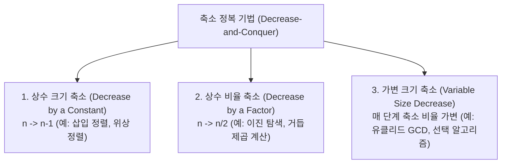

> [!abstract] 핵심 요약
> **축소 정복(Decrease-and-Conquer)** 기법은 원래 문제의 크기 $n$을 작은 크기($n-1$, $n/2$ 등)로 축소하여 하위 문제를 해결한 후, 이를 바탕으로 원래 문제의 해를 구축하는 설계 기법이다.

---

## 1. 축소 정복의 3대 변형 모델



---

## 2. 삽입 정렬 (Insertion Sort)

```python
def insertion_sort(arr: list) -> list:
    for i in range(1, len(arr)):
        key = arr[i]
        j = i - 1
        while j >= 0 and arr[j] > key:
            arr[j + 1] = arr[j]
            j -= 1
        arr[j + 1] = key
    return arr
```
