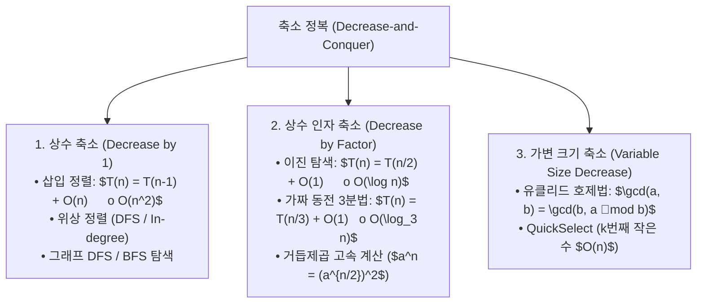

> [!abstract] 핵심 요약
> **축소 정복(Decrease-and-Conquer)**은 원본 문제의 인스턴스를 하나 이상의 작은 인스턴스로 쪼개지 않고, **더 작은 크기의 단일 부분 인스턴스**로 축소하여 해를 점진적으로 확장하는 기법이다.
> DAG(방향 비순환 그래프)의 선후 관계를 선형 정렬하는 **위상 정렬(Topological Sorting)**은 DFS 역방향 방문 완료 순서 또는 진입 차수(In-degree) 0인 정점의 반복적 제거를 통해 $O(V + E)$에 수행된다.

---

## 1. 축소 정복 3대 변형 모델



---

## 2. 위상 정렬 알고리즘 2가지 접근법

| 알고리즘 | 동작 메커니즘 | 시간 복잡도 | 사이클 감지 방식 |
| :-- | :-- | :--: | :-- |
| **Kahn 알고리즘 (진입차수)** | 진입 차수(In-degree)가 0인 정점을 큐에 삽입 후 인접 간선 제거 반복 | $O(V + E)$ | 정렬된 정점 수가 $V$보다 작으면 사이클 존재 |
| **DFS 역방향 정렬** | DFS 탐색 후 함수 반환 시점에 정점을 연결 리스트 맨 앞에 삽입 | $O(V + E)$ | 역방향 간선(Back Edge) 방문 시 사이클 감지 |

---

## 3. 실시간 위상 정렬 진입차수 큐 시뮬레이터

```html preview
<div style="font-family:system-ui,-apple-system,sans-serif;padding:20px;background:var(--card);color:var(--card-foreground);border:1px solid var(--border);border-radius:var(--radius)">
  <div style="font-size:16px;font-weight:700;margin-bottom:14px;color:var(--primary);display:flex;align-items:center;gap:8px">
    <span>🔄 Kahn 위상 정렬 진입차수(In-degree) 단계 분석기</span>
  </div>

  <div style="margin-bottom:14px">
    <label style="font-size:11px;color:var(--muted-foreground)">과목 수강 선수 조건 시나리오:</label>
    <select id="selTopoScenario" style="width:100%;padding:6px;background:var(--background);color:var(--foreground);border:1px solid var(--border);border-radius:var(--radius);font-weight:700">
      <option value="cs">CS 커리큘럼: (이산수학, C언어) -> 자료구조 -> 알고리즘 -> 머신러닝</option>
      <option value="cycle">순환 참조 오류: A -> B -> C -> A (사이클 존재)</option>
    </select>
  </div>

  <div style="padding:12px;background:var(--background);border:1px solid var(--border);border-radius:var(--radius)">
    <div style="font-size:11px;font-weight:700;color:var(--muted-foreground);margin-bottom:4px">위상 정렬 결과 및 진입차수 감소 순서</div>
    <div id="topoResultOut" style="font-size:13px;line-height:1.6;color:var(--primary)">
      1단계: [이산수학, C언어] (In-degree 0) 처리 -> 2단계: [자료구조] -> 3단계: [알고리즘] -> 4단계: [머신러닝]
    </div>
  </div>

  <script>
    document.getElementById('selTopoScenario').onchange = function() {
      var val = this.value;
      var out = document.getElementById('topoResultOut');
      if (val === 'cs') {
        out.innerHTML = "<strong style='color:var(--primary)'>✅ 위상 정렬 성공 (DAG):</strong><br/>• 1단계: 진입차수 0인 [이산수학, C언어] 이수<br/>• 2단계: 후속 과목 [자료구조] 진입차수 0 도달 및 이수<br/>• 3단계: [알고리즘] 이수 -> 4단계: [머신러닝] 최종 이수 완료";
      } else {
        out.innerHTML = "<strong style='color:var(--destructive,#ef4444)'>❌ 위상 정렬 실패 (Cycle Detected):</strong><br/>• 모든 정점의 진입차수가 1 이상으로 유지되어 큐에 진입 불가<br/>• DAG가 아니므로 유효한 수강 순서 생성 불가능";
      }
    };
  </script>
</div>
```
