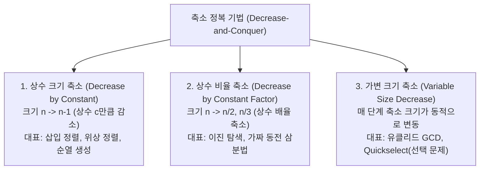
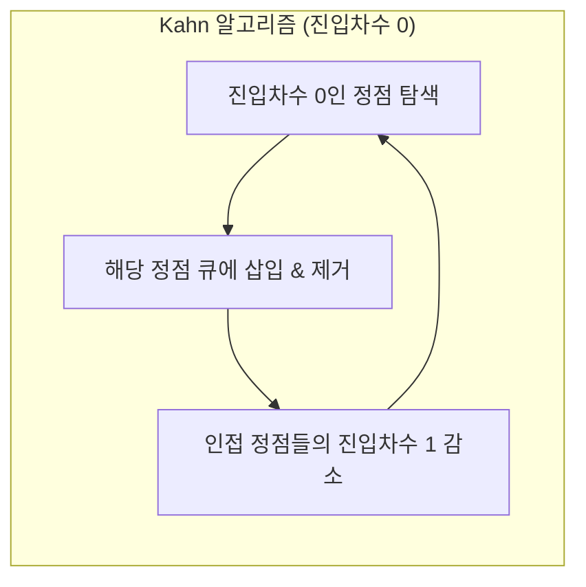

> [!abstract] 핵심 요약
> **축소 정복(Decrease-and-Conquer)**은 원본 문제의 인스턴스를 **더 작은 크기의 단 하나의 부분 문제**로 귀속시켜 해결하는 기법이다.
> 여러 개의 부분문제로 쪼개는 분할 정복(Divide-and-Conquer)과 구별되며, **상수 크기 축소(Decrease by Constant)**, **상수 비율 축소(Decrease by Constant Factor)**, **가변 크기 축소(Variable Size Decrease)**의 3대 축으로 체계화된다.

---

## 1. 축소 정복의 3대 분류 체계



---

## 2. 상수 크기 축소: 삽입 정렬과 위상 정렬

### 2.1. 삽입 정렬 (Insertion Sort)
- $A[0 \dots i-1]$이 이미 정렬되어 있을 때, $A[i]$를 적절한 위치에 삽입하여 $A[0 \dots i]$ 정렬 완성.
- **비교 횟수**:
  - 최선의 경우(이미 정렬됨): $C_{\text{best}}(n) = n - 1 \in \Theta(n)$
  - 최악의 경우(역순 정렬): $C_{\text{worst}}(n) = \frac{n(n-1)}{2} \in \Theta(n^2)$
  - 평균 비교 횟수: $C_{\text{avg}}(n) \approx \frac{n^2}{4} \in \Theta(n^2)$

### 2.2. 위상 정렬 (Topological Sorting)
방향 비순환 그래프(DAG: Directed Acyclic Graph)의 모든 정점을 간선 방향을 거스르지 않도록 일렬로 나열하는 알고리즘이다.



- **Kahn 알고리즘**: 진입 차수(In-degree)가 0인 정점을 반복적으로 제거 $\implies O(V + E)$
- **DFS 기반 위상 정렬**: DFS 완료 시간(Finishing Time)의 역순으로 정점 나열 $\implies O(V + E)$

---

## 3. 상수 비율 및 가변 크기 축소

### 3.1. 이진 탐색 (Binary Search)
- 정렬된 배열에서 중앙값 $A[mid]$와 목표값 $K$를 비교하여 탐색 범위를 정확히 절반($n/2$)으로 축소.
- 점화식: $T(n) = T(n/2) + \Theta(1) \implies \Theta(\log n)$

### 3.2. 선택 문제와 퀵셀렉트 (Quickselect / Hoare's Selection)
- $n$개의 원소 중 $k$번째로 작은 원소를 찾는 문제.
- 피벗 $P$를 기준으로 파티션 후, 피벗의 위치 $s$와 $k$를 비교하여 **피벗의 좌측 또는 우측 단 하나의 영역만 재귀 탐색**.
- 점화식: $T(n) = T(n/2) + \Theta(n) \implies \Theta(n)$ (평균 선형 시간 달성!)

---

## 4. 실시간 축소 정복 위상 정렬 시뮬레이터

```html preview
<div style="font-family:system-ui,-apple-system,sans-serif;padding:20px;background:var(--card);color:var(--card-foreground);border:1px solid var(--border);border-radius:var(--radius)">
  <div style="font-size:16px;font-weight:700;margin-bottom:12px;color:var(--primary)">
    ⚡ DAG 진입차수(In-Degree) 기반 위상 정렬 시뮬레이터
  </div>

  <div style="font-size:12px;color:var(--muted-foreground);margin-bottom:10px">
    과목 선수과목 그래프: <strong>CS101 → CS201 → CS301</strong>, <strong>MATH101 → CS201</strong>
  </div>

  <button onclick="runTopoSim()" style="padding:8px 16px;background:var(--primary);color:var(--primary-foreground);border:none;border-radius:var(--radius);font-weight:700;cursor:pointer">
    위상 정렬 단계별 실행
  </button>

  <div id="topoLog" style="margin-top:14px;padding:12px;background:var(--background);border:1px solid var(--border);border-radius:var(--radius);font-family:monospace;font-size:13px;line-height:1.6">
    [대기 중] '실행' 버튼을 클릭하면 진입차수 0인 노드를 제거하며 순서를 결정합니다.
  </div>

  <script>
    function runTopoSim() {
      var log = document.getElementById('topoLog');
      log.innerHTML = "<strong>1단계:</strong> 진입차수 계산 -> CS101(0), MATH101(0), CS201(2), CS301(1)<br/>" +
                      "<strong>2단계:</strong> 진입차수 0인 [CS101, MATH101] 제거 -> 수강 순서에 추가<br/>" +
                      "<strong>3단계:</strong> CS201의 진입차수 2 -> 0으로 감소, 큐에 삽입 후 제거<br/>" +
                      "<strong>4단계:</strong> CS301의 진입차수 1 -> 0으로 감소, 큐에 삽입 후 제거<br/>" +
                      "<span style='color:var(--primary);font-weight:700'>최종 위상 정렬 결과: [CS101, MATH101, CS201, CS301]</span>";
    }
  </script>
</div>
