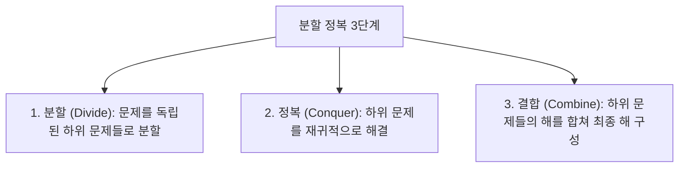

> [!abstract] 핵심 요약
> **분할 정복(Divide-and-Conquer)** 기법은 문제를 독립적인 2개 이상의 동일한 하위 문제로 **분할(Divide)**하고, 하위 문제를 재귀적으로 **정복(Conquer)**한 뒤, 그 결과를 **결합(Combine)**하여 최종 해를 구하는 기법이다.

---

## 1. 병합 정렬과 퀵 정렬의 복잡도 비교

| 알고리즘 | 분할 단계 | 결합 단계 | 최선 시간복잡도 | 최악 시간복잡도 | 안정 정렬 여부 |
| :-- | :-- | :-- | :-- | :-- | :-- |
| **병합 정렬 (Merge Sort)** | 단순 중간 분할 ($O(1)$) | 정렬된 두 배열 병합 ($O(n)$) | $O(n \log n)$ | $O(n \log n)$ | **안정 (Stable)** |
| **퀵 정렬 (Quick Sort)** | 피벗 기준 파티셔닝 ($O(n)$) | 추가 결합 불필요 ($O(1)$) | $O(n \log n)$ | $O(n^2)$ | **불안정 (Unstable)** |
