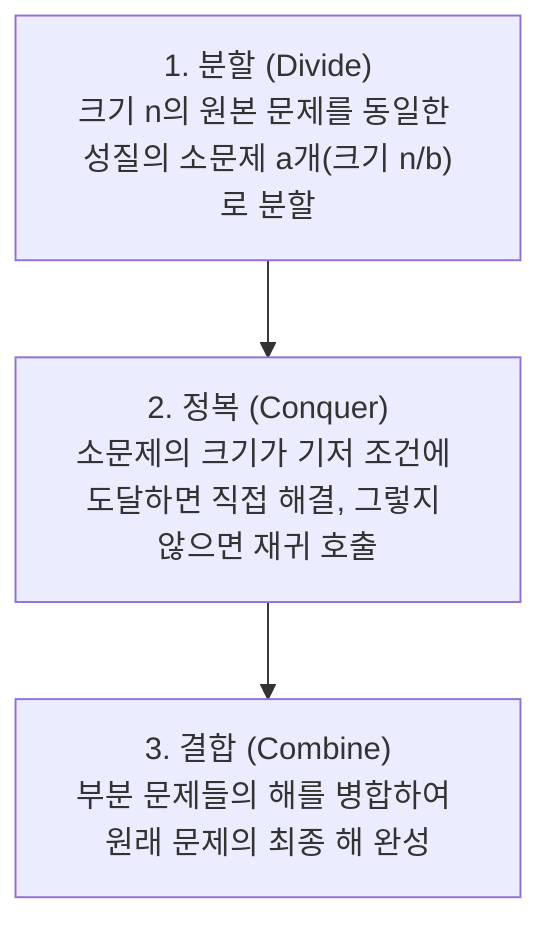

> [!abstract] 핵심 요약
> **분할 정복(Divide-and-Conquer)**은 문제를 크기가 같은 하위 부분 문제들로 **분할(Divide)**하고, 부분 문제를 재귀적으로 **정복(Conquer)**한 뒤, 그 결과를 **결합(Combine)**하여 전체 해를 구하는 강력한 알고리즘 기법이다.
> 합병 정렬의 안정성, 퀵 정렬의 캐시 친화적 제자리 분할, 스트라센의 곱셈 횟수 감축($8 \to 7$) 원리를 마스터한다.

---

## 1. 분할 정복의 3대 단계 파이프라인



---

## 2. 합병 정렬 vs 퀵 정렬 심층 비교

| 특성 | 합병 정렬 (Merge Sort) | 퀵 정렬 (QuickSort) |
| :-- | :-- | :-- |
| **분할 방식** | 인덱스 기준 균등 2분할 ($n/2$) | **피벗(Pivot) 기준 값의 대소에 따른 불균등 분할** |
| **주요 작업 위치** | **결합(Combine) 단계** (Merge 연산) | **분할(Divide) 단계** (Partition 연산) |
| **시간 복잡도 (최선)** | $\Theta(n \log n)$ | $\Theta(n \log n)$ |
| **시간 복잡도 (최악)** | $\Theta(n \log n)$ | $\Theta(n^2)$ (이미 정렬된 경우 편향 분할) |
| **시간 복잡도 (평균)** | $\Theta(n \log n)$ | $\Theta(n \log n)$ (평균적으로 합병 정렬보다 2~3배 빠름) |
| **추가 공간 복잡도** | $O(n)$ (보조 배열 필요) | **$O(\log n)$ (제자리 정렬 In-Place)** |
| **정렬 안정성** | **안정 정렬 (Stable)** | **불안정 정렬 (Unstable)** |

---

## 3. 스트라센(Strassen) 행렬 곱셈 알고리즘

$2 \times 2$ 블록 행렬 $C = A \times B$ 연산 시, 기존 표준 방식은 **8회의 곱셈과 4회의 덧셈**을 수행하여 $O(n^3)$의 복잡도를 가진다.

스트라센은 곱셈 횟수를 **7회**로 줄이고 덧셈/뺄셈 횟수를 18회로 조정하는 기법을 개발했다.

### 3.1. 7개의 핵심 곱셈 항 ($M_1 \sim M_7$)
$$\begin{aligned}
M_1 &= (A_{11} + A_{22})(B_{11} + B_{22}) \\
M_2 &= (A_{21} + A_{22})B_{11} \\
M_3 &= A_{11}(B_{12} - B_{22}) \\
M_4 &= A_{22}(B_{21} - B_{11}) \\
M_5 &= (A_{11} + A_{12})B_{22} \\
M_6 &= (A_{21} - A_{11})(B_{11} + B_{12}) \\
M_7 &= (A_{12} - A_{22})(B_{21} + B_{22})
\end{aligned}$$

- **점화식**: $T(n) = 7T(n/2) + \Theta(n^2)$
- **마스터 정리 적용**: $\log_2 7 \approx 2.807 \implies \mathbf{\Theta(n^{2.807})}$ 달성!

---

## 4. 실시간 합병 정렬 vs 퀵 정렬 연산 비교 시뮬레이터

```html preview
<div style="font-family:system-ui,-apple-system,sans-serif;padding:20px;background:var(--card);color:var(--card-foreground);border:1px solid var(--border);border-radius:var(--radius)">
  <div style="font-size:16px;font-weight:700;margin-bottom:12px;color:var(--primary)">
    ⚡ 분할 정복 정렬 알고리즘 복잡도 비교기
  </div>

  <div style="margin-bottom:14px">
    <label style="font-size:11px;color:var(--muted-foreground)">배열 원소 수 n:</label>
    <input id="inSortN" type="range" min="100" max="100000" step="100" value="10000" style="width:100%" />
    <div style="display:flex;justify-content:space-between;font-size:12px;font-weight:700;margin-top:2px">
      <span>100</span>
      <span id="outSortNVal" style="color:var(--primary);font-size:15px">n = 10,000</span>
      <span>100,000</span>
    </div>
  </div>

  <div style="display:grid;grid-template-columns:1fr 1fr 1fr;gap:10px">
    <div style="padding:10px;background:var(--background);border:1px solid var(--border);border-radius:var(--radius)">
      <div style="font-size:11px;color:var(--muted-foreground)">합병 정렬 (O(n log n))</div>
      <div id="outMergeOps" style="font-family:monospace;font-size:16px;font-weight:800;color:var(--primary);margin-top:4px">132,877</div>
      <div style="font-size:11px;color:var(--muted-foreground)">추가 메모리: O(n)</div>
    </div>
    <div style="padding:10px;background:var(--background);border:1px solid var(--border);border-radius:var(--radius)">
      <div style="font-size:11px;color:var(--muted-foreground)">퀵 정렬 (평균 1.39 n log n)</div>
      <div id="outQuickOps" style="font-family:monospace;font-size:16px;font-weight:800;color:var(--primary);margin-top:4px">184,699</div>
      <div style="font-size:11px;color:var(--muted-foreground)">추가 메모리: O(log n)</div>
    </div>
    <div style="padding:10px;background:var(--background);border:1px solid var(--border);border-radius:var(--radius)">
      <div style="font-size:11px;color:var(--muted-foreground)">선택 정렬 (O(n^2))</div>
      <div id="outSelectOps" style="font-family:monospace;font-size:16px;font-weight:800;color:var(--destructive,#ef4444);margin-top:4px">49,995,000</div>
      <div style="font-size:11px;color:var(--muted-foreground)">추가 메모리: O(1)</div>
    </div>
  </div>

  <script>
    function calcSortSim() {
      var n = parseInt(document.getElementById('inSortN').value);
      document.getElementById('outSortNVal').textContent = "n = " + n.toLocaleString();

      var logN = Math.log2(n);
      var mergeOps = Math.round(n * logN);
      var quickOps = Math.round(1.386 * n * logN);
      var selectOps = Math.round((n * (n - 1)) / 2);

      document.getElementById('outMergeOps').textContent = mergeOps.toLocaleString();
      document.getElementById('outQuickOps').textContent = quickOps.toLocaleString();
      document.getElementById('outSelectOps').textContent = selectOps > 1e12 ? selectOps.toExponential(3) : selectOps.toLocaleString();
    }

    document.getElementById('inSortN').addEventListener('input', calcSortSim);
    calcSortSim();
  </script>
</div>
