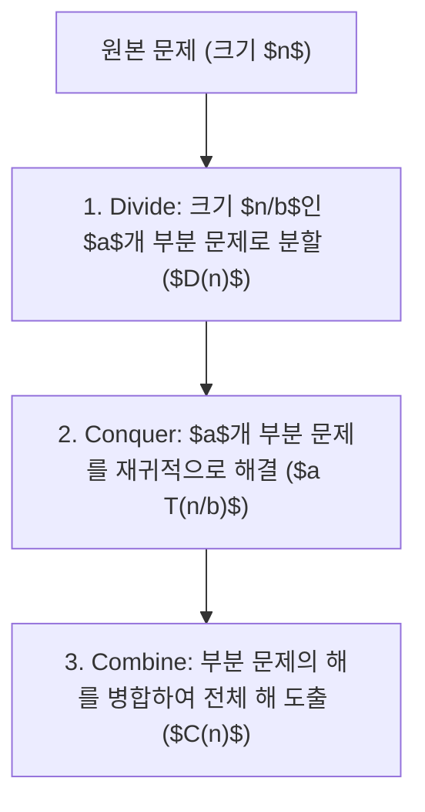

> [!abstract] 핵심 요약
> **분할 정복(Divide-and-Conquer)**은 문제를 동일한 형태의 **독립적인 $a$개 부분 문제($n/b$ 크기)**로 분할(Divide)하고, 재귀적으로 해결(Conquer)한 뒤 결과를 병합(Combine)하는 핵심 설계 기법이다.
> **합병 정렬**은 항상 $O(n \log n)$을 보장하지만 $O(n)$ 추가 공간이 필요하며, **퀵 정렬**은 제자리 정렬(In-place)로서 평균적으로 가장 빠른 $O(n \log n)$ 속도를 발휘한다.

---

## 1. 분할 정복 3단계 및 점화식 체계



---

## 2. 합병 정렬 vs 퀵 정렬 vs 스트라센 비교

| 알고리즘 | 분할 방식 | 정복 및 병합 | 최선/평균 시간 | 최악 시간 | 추가 공간 |
| :-- | :-- | :-- | :--: | :--: | :--: |
| **합병 정렬 (Merge Sort)** | 단순히 중간 위치 $n/2$로 분할 | 병합 단계에서 대소 비교 정렬 | $\Theta(n \log n)$ | $\Theta(n \log n)$ | $O(n)$ |
| **퀵 정렬 (QuickSort)** | 피벗 기준으로 작은 값/큰 값 분할 | 분할 과정에서 정렬 완료, 병합 $O(1)$ | $\Theta(n \log n)$ | $\Theta(n^2)$ | $O(\log n)$ |
| **스트라센 행렬 곱** | $n/2 	imes n/2$ 블록 행렬 7개 곱 | 덧셈/뺄셈 18회로 병합 | $\Theta(n^{\log_2 7}) pprox \Theta(n^{2.807})$ | $\Theta(n^{2.807})$ | $O(n^2)$ |

---

## 3. 실시간 퀵 정렬 vs 합병 정렬 연산 횟수 비교기

```html preview
<div style="font-family:system-ui,-apple-system,sans-serif;padding:20px;background:var(--card);color:var(--card-foreground);border:1px solid var(--border);border-radius:var(--radius)">
  <div style="font-size:16px;font-weight:700;margin-bottom:14px;color:var(--primary);display:flex;align-items:center;gap:8px">
    <span>⚡ 배열 크기 $N$에 따른 합병/퀵 정렬 비교 횟수 계산기</span>
  </div>

  <div style="margin-bottom:14px">
    <label style="font-size:11px;color:var(--muted-foreground)">배열 원소 수 (N):</label>
    <input id="inSortN" type="number" value="1000" min="10" max="100000" step="100" style="width:100%;padding:4px;background:var(--background);color:var(--foreground);border:1px solid var(--border);border-radius:var(--radius);font-weight:700" />
  </div>

  <div style="display:grid;grid-template-columns:1fr 1fr;gap:12px;margin-bottom:12px">
    <div style="padding:10px;background:var(--background);border:1px solid var(--border);border-radius:var(--radius);text-align:center">
      <div style="font-size:10px;color:var(--muted-foreground)">평균 연산 횟수 ($N \log_2 N$)</div>
      <div id="avgSortOut" style="font-family:monospace;font-size:18px;font-weight:800;color:var(--primary);margin-top:2px">9,966 회</div>
    </div>
    <div style="padding:10px;background:var(--background);border:1px solid var(--border);border-radius:var(--radius);text-align:center">
      <div style="font-size:10px;color:var(--muted-foreground)">퀵 정렬 최악 연산 ($N^2 / 2$)</div>
      <div id="worstSortOut" style="font-family:monospace;font-size:18px;font-weight:800;color:var(--destructive,#ef4444);margin-top:2px">500,000 회</div>
    </div>
  </div>

  <script>
    function updateSortOps() {
      var n = parseFloat(document.getElementById('inSortN').value) || 10;
      var avg = n * (Math.log(n) / Math.log(2));
      var worst = (n * (n - 1)) / 2;
      document.getElementById('avgSortOut').textContent = Math.round(avg).toLocaleString() + " 회";
      document.getElementById('worstSortOut').textContent = Math.round(worst).toLocaleString() + " 회";
    }
    document.getElementById('inSortN').addEventListener('input', updateSortOps);
  </script>
</div>
```
