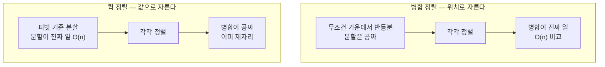

> [!abstract] 이 장의 구조
> 5.1절이 **도구**를 주고, 5.2절부터는 그 도구를 계속 쓰는 연습이다. 도구는 **마스터 정리** 하나다. 순환 관계식을 세우고 $a$, $b$, $d$ 세 숫자만 읽어내면 복잡도가 바로 나온다.
> 그런데 이 장은 마지막에 자기 자신을 반박한다 — 5.7절 피보나치는 **분할 정복을 쓰면 안 되는 경우**다. 이미 4쪽에서 예고하기도 했다 — *항상 억지 기법보다 모든 문제에서 더 효율적인 것은 아님*.

---

## 1. 분할 정복과 순환 관계식

[4장의 축소 정복](./04.%20%EC%B6%95%EC%86%8C%20%EC%A0%95%EB%B3%B5%20%EA%B8%B0%EB%B2%95.md)은 더 작은 문제를 **하나**만 풀었다. 분할 정복은 **여러 개**를 풀고 그 답들을 합친다. 이 차이가 순환 관계식에 그대로 나타난다.

원본 5쪽은 일반형을 이렇게 세운다 — 크기 $n$인 문제를 $b$개의 같은 크기 부분 문제로 나누고, 그중 $a$개를 다시 해결해야 할 때:

$$
T(n) = a\,T\!\left(\frac{n}{b}\right) + f(n)
$$

여기서 $f(n)$ 은 *문제를 부분문제들로 나누는 과정과 부분문제들의 해를 병합하여 최종해를 만드는데 사용되는 연산들의 합*이다. 즐, **나누는 비용 + 합치는 비용**.

원본이 든 첫 예제는 리스트의 합 구하기다.

| 기호 | 값 | 이유 |
| --- | --- | --- |
| $b$ | 2 | 숫자들을 두 그룹으로 나눈다 |
| $a$ | 2 | **모든 그룹이 해결되어야** 한다 |
| $f(n)$ | 1 | 병합을 위해 한번 더한다 |

$$
T(n) = 2\,T\!\left(\frac{n}{2}\right) + 1
$$

$a$와 $b$가 따로 있는 이유를 여기서 알 수 있다. **나누긴 했지만 일부만 풀면 되는 경우**가 있기 때문이다 — 이진 탐색이 바로 $b=2$, $a=1$ 이고, 그래서 축소 정복으로 분류되었다.

---

## 2. 마스터 정리 — 세 숫자만 읽으면 된다


원본의 진술을 그대로 옮기면:

$$
T(n) = \begin{cases} c & n = 1 \\ a\,T(n/b) + f(n) & \text{otherwise} \end{cases}
$$

이때 $a \geq 1$, $b > 1$ 이고 $f(n) \in O(n^d)$ 라면,

$$
T(n) = \begin{cases}
O(n^d) & \text{if } a < b^d \\
O(n^d \log n) & \text{if } a = b^d \\
O\!\left(n^{\log_b a}\right) & \text{if } a > b^d
\end{cases}
$$

이것은 $\Omega$-표기와 $\Theta$-표기에서도 동일하게 적용된다.

세 경우가 의미하는 바는 직관적이다 — **재귀 생성 속도($a$)와 문제 축소 속도($b^d$)의 경주**다.

| 경우 | 누가 이기는가 | 비용이 몰리는 곳 |
| --- | --- | --- |
| $a < b^d$ | 분할·병합 비용이 지배 | **최상위 호출** — 맨 위 한 번의 $f(n)$ |
| $a = b^d$ | 비김 | **모든 레벨이 균등** — 레벨 수 $\log n$ 만큼 곱해진다 |
| $a > b^d$ | 재귀 호출 수가 지배 | **최하위 리프** — 말단 노드 개수 $n^{\log_b a}$ |

직접 숫자를 넣어 보라. 이 장에서 다룰 알고리즘들의 값이 프리셋으로 들어 있다.

```html preview h=560px
<div style="font-family:system-ui,-apple-system,sans-serif;padding:20px;color:var(--foreground)">
  <div style="display:flex;gap:8px;flex-wrap:wrap;margin-bottom:16px">
    <button class="mpre" data-a="2" data-b="2" data-d="1">병합 정렬</button>
    <button class="mpre" data-a="2" data-b="2" data-d="0">리스트 합</button>
    <button class="mpre" data-a="1" data-b="2" data-d="0">이진 탐색</button>
    <button class="mpre" data-a="8" data-b="2" data-d="2">행렬 곱 (억지)</button>
    <button class="mpre" data-a="7" data-b="2" data-d="2">슈트라센</button>
  </div>
  <div style="display:flex;gap:20px;flex-wrap:wrap;margin-bottom:18px">
    <div style="flex:1;min-width:150px">
      <label for="ma" style="font-size:12.5px;font-weight:600">a (풀어야 할 부분문제 수) = <span id="mav">2</span></label>
      <input id="ma" type="range" min="1" max="12" step="1" value="2" style="width:100%;accent-color:var(--primary)" />
    </div>
    <div style="flex:1;min-width:150px">
      <label for="mb" style="font-size:12.5px;font-weight:600">b (나누는 수) = <span id="mbv">2</span></label>
      <input id="mb" type="range" min="2" max="6" step="1" value="2" style="width:100%;accent-color:var(--primary)" />
    </div>
    <div style="flex:1;min-width:150px">
      <label for="md" style="font-size:12.5px;font-weight:600">d (f(n) ∈ O(n^d)) = <span id="mdv">1</span></label>
      <input id="md" type="range" min="0" max="3" step="1" value="1" style="width:100%;accent-color:var(--primary)" />
    </div>
  </div>
  <div id="mrec" style="font-size:16px;font-weight:600;margin-bottom:12px;text-align:center;padding:12px;background:var(--card);border:1px solid var(--border);border-radius:var(--radius)"></div>
  <div id="mcases"></div>
  <div id="mres" style="margin-top:14px;padding:13px;border-radius:var(--radius);font-size:14px;border:2px solid var(--chart-1);text-align:center"></div>

  <style>
    .mpre{padding:7px 12px;font-size:12px;cursor:pointer;background:var(--card);
      color:var(--foreground);border:1px solid var(--border);border-radius:var(--radius)}
    .mpre:hover{border-color:var(--primary);color:var(--primary)}
  </style>

  <script>
    var ids = ['ma', 'mb', 'md'];
    function mupd() {
      var a = +document.getElementById('ma').value;
      var b = +document.getElementById('mb').value;
      var d = +document.getElementById('md').value;
      document.getElementById('mav').textContent = a;
      document.getElementById('mbv').textContent = b;
      document.getElementById('mdv').textContent = d;
      var bd = Math.pow(b, d);
      var fn = d === 0 ? '1' : (d === 1 ? 'n' : 'n^' + d);
      document.getElementById('mrec').innerHTML =
        'T(n) = ' + a + '·T(n/' + b + ') + ' + fn +
        ' <span style="color:var(--muted-foreground);font-weight:400;font-size:13px">&nbsp; b^d = ' + b + '^' + d + ' = ' + bd + '</span>';
      var cases = [
        ['a < bᵈ', a < bd, 'O(nᵈ) = O(' + fn + ')', '분할·병합 비용이 지배 — 최상위가 결정'],
        ['a = bᵈ', a === bd, 'O(nᵈ log n) = O(' + (d === 0 ? 'log n' : fn + ' log n') + ')', '모든 레벨이 균등 — 레벨 수만큼 곱해짐'],
        ['a > bᵈ', a > bd, 'O(n^log_b a) = O(n^' + (Math.log(a) / Math.log(b)).toFixed(3) + ')', '재귀 호출 수가 지배 — 말단 노드가 결정']
      ];
      document.getElementById('mcases').innerHTML = cases.map(function (c) {
        var on = c[1];
        return '<div style="display:flex;gap:12px;align-items:center;padding:9px 12px;margin-bottom:6px;' +
          'border-radius:var(--radius);border:1px solid ' + (on ? 'var(--chart-1)' : 'var(--border)') +
          ';background:' + (on ? 'var(--card)' : 'transparent') + ';opacity:' + (on ? '1' : '0.45') + '">' +
          '<b style="width:70px;font-size:13px;color:' + (on ? 'var(--chart-1)' : 'var(--muted-foreground)') + '">' + c[0] + '</b>' +
          '<span style="width:190px;font-size:13px;font-weight:' + (on ? '700' : '400') + '">' + c[2] + '</span>' +
          '<span style="flex:1;font-size:12px;color:var(--muted-foreground)">' + c[3] + '</span></div>';
      }).join('');
      var win = cases.filter(function (c) { return c[1]; })[0];
      document.getElementById('mres').innerHTML =
        '<span style="color:var(--muted-foreground);font-size:13px">' + win[0] + ' 이므로 &nbsp;</span>' +
        '<b style="font-size:18px;color:var(--chart-1)">T(n) ∈ ' + win[2] + '</b>';
    }
    ids.forEach(function (id) { document.getElementById(id).addEventListener('input', mupd); });
    Array.prototype.forEach.call(document.querySelectorAll('.mpre'), function (btn) {
      btn.addEventListener('click', function () {
        document.getElementById('ma').value = btn.getAttribute('data-a');
        document.getElementById('mb').value = btn.getAttribute('data-b');
        document.getElementById('md').value = btn.getAttribute('data-d');
        mupd();
      });
    });
    mupd();
  </script>
</div>
```

원본의 예제를 따라가 보면 — 리스트 합 $T(n) = 2T(n/2) + 1$ 에서 $a = b = 2$ 이고 $f(n) = 1 \in O(n^0)$ 이므로 $d = 0$. 세 번째 경우 $a > b^d$ ($2 > 2^0 = 1$)에 해당하고, 따라서 $O(n^{\log_2 2}) = O(n)$ 이다.

> [!note] 원본 7쪽의 오식
> 빨간 상자 안에 결과가 `O(log^{log_2 2}) = O(n)` 으로 적혀 있는데, 밑이 `log`가 아니라 **$n$** 이어야 한다 — $O(n^{\log_2 2}) = O(n^1) = O(n)$. 결과 값은 맞으니 표기만 주의하면 된다.

---

## 3. 두 가지 정렬 — 어디서 자르느냐의 차이

원본 12쪽의 한 줄이 둘을 가른다 — 퀵 정렬은 *위치에 따른 분할(병합)이 아니라 **값에 따른 분할***이다.



일의 무게중심이 정반대다. 병합 정렬은 나누는 것이 쉬우나 합치는 데 $O(n)$이 들고, 퀵 정렬은 나누는 데 $O(n)$이 들지만 합칠 것이 없다.

### 3.1 병합 정렬 — 입력을 가리지 않는다

원본 11쪽의 첫 줄이 핵심이다 — *입력 구성에 따른 차이가 없음. 항상 동일한 시간에 정렬이 완료*. 무조건 반으로 가르므로 입력이 끼어들 여지가 없다.

$n = 2^k$ 로 두면 $k = \log_2 n$ 이고, 부분 배열의 크기는 $2^k \to 2^{k-1} \to \cdots \to 2^1 \to 2^0$ 으로 줄어든다.

$$
T(n) = 2\,T\!\left(\frac{n}{2}\right) + (n-1), \qquad T(1) = 0
$$

병합 비용 $n-1$ 은 두 정렬된 리스트를 합칠 때 필요한 최대 비교 횟수다. 마스터 정리로 넣으면 $a = 2$, $b = 2$, $f(n) \in O(n^1)$ 이므로 $d = 1$, 그러면 $a = b^d$ ($2 = 2^1$) — 두 번째 경우다.

$$
T(n) \in O(n^d \log n) = O(n \log n)
$$

원본은 마스터 정리와 연속 대치법 **둘 다** $O(n\log n)$ 을 준다고 적어 두었다. 도구가 달라도 답은 같다는 확인이다.

| | 내용 |
| --- | --- |
| **장점** | 효율적 · **안정성 만족** · 입력과 무관하게 동일한 시간 |
| **단점** | **임시 리스트 사용** — $O(n)$ 추가 공간 |

안정성은 [1장에서 정렬의 비교 축으로 언급된 것](./01.%20%EC%95%8C%EA%B3%A0%EB%A6%AC%EC%A6%98%EC%9D%98%20%EA%B0%9C%EC%9A%94%EC%99%80%20%EB%AC%B8%EC%A0%9C%20%ED%95%B4%EA%B2%B0%20%ED%94%84%EB%A0%88%EC%9E%84%EC%9B%8C%ED%81%AC.md)이다 — 같은 키를 가진 레코드의 상대 순서가 보존된다는 성질. 병합 단계에서 같으면 왼쪽을 먼저 넣도록 구현하면 자연히 얻어진다.

### 3.2 퀵 정렬 — 이미 정렬된 입력이 최악이라는 역설

원본 14쪽의 최악 설명이 인상적이다 — *불균등 분할: **이미 정렬된 리스트**의 정렬*.

| 경우 | 상황 | 점화식 | 복잡도 |
| --- | --- | --- | --- |
| 최선 | 분할이 항상 균등 | $T(n) = 2T(n/2) + n$ | $O(n\log n)$ |
| 최악 | 불균등 분할이 계속 | $T(n) = T(n-1) + n$ | $O(n^2)$ |

최악의 점화식을 보라. 순환 호출이 **하나**로 줄고 문제는 **1만큼** 줄어든다 — [4장의 고정 크기 축소](./04.%20%EC%B6%95%EC%86%8C%20%EC%A0%95%EB%B3%B5%20%EA%B8%B0%EB%B2%95.md) 그 자체다. 분할 정복이 축소 정복로 **퇴화**한 것이고, 그래서 $\log n$ 이 사라지고 $n$이 남는다.

이미 정렬된 입력이 최악인 이유는 맨 끝(또는 맨 앞) 원소를 피벗으로 고를 때 모든 원소가 한쪽으로 몰리기 때문이다. 가장 흔한 입력이 가장 나쁜 입력이라는 점이 실무에서 심각해서, 원본은 15쪽에 개선책을 셋 나열한다.

| 개선책 | 방법 |
| --- | --- |
| **median of three** | 첫·중간·끝 세 값의 중간값을 피벗으로 — 정렬된 입력에서 정확히 가운데가 선택된다 |
| **이중 피벗 퀵 정렬** | 피벗 둘로 세 구간으로 나눈다 (Java의 `Arrays.sort` 구현) |
| **하이브리드 정렬** | 작은 구간은 삽입 정렬로 전환 — [4장에서 본](./04.%20%EC%B6%95%EC%86%8C%20%EC%A0%95%EB%B3%B5%20%EA%B8%B0%EB%B2%95.md) 삽입 정렬의 최선 $O(n)$ 을 활용 |

### 3.3 이진트리 — 구조 자체가 분할 정복적이다

이진트리는 정의부터 재귀적이라 분할 정복이 그냥 들어맞는다. 높이 문제의 점화식은 원본 20쪽에 있다.

$$
T(n) = T(n_{left}) + T(n_{right}) + 1 \quad (n > 0), \qquad T(0) = 0
$$

앞의 예들과 달리 **양쪽 크기가 같다는 보장이 없다**. 그래도 결론은 간단하다 — 모든 노드를 정확히 한 번씩 방문하므로 $T(n) \in O(n)$. 원본은 기본 연산을 달리 잡아도 같다는 점까지 확인한다 — 덧셈으로 잡아 내부 노드만 세든, 공백 검사로 잡아 외부 노드까지 세든 **둘 다 $O(n)$**.

표준 순회 세 가지도 분할 정복의 변형이다(21쪽). 차이는 **나를 언제 처리하느냐**뿐이다.

| 순회 | 순서 | 의미 |
| --- | --- | --- |
| 전위(preorder) | **V** L R | 나를 먼저 — 트리 복사, 접두사 표기 |
| 중위(inorder) | L **V** R | 가운데 — 이진탐색트리를 정렬된 순서로 |
| 후위(postorder) | L R **V** | 나를 나중에 — 트리 삭제, 높이 계산 |

세 순회 모두 $T(n) \in \Theta(n)$ 이다(22쪽).
