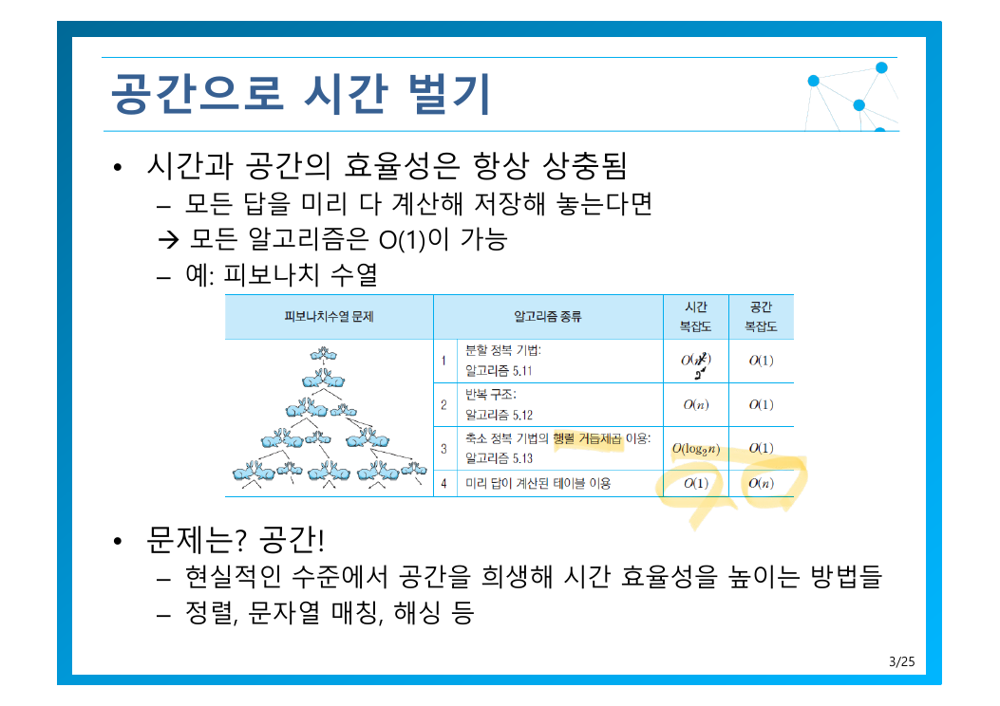
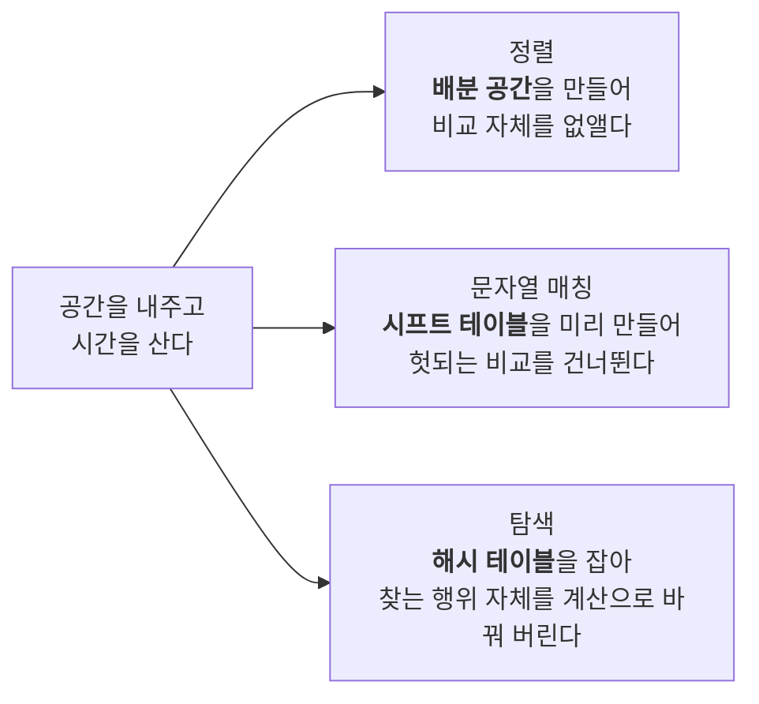

> [!abstract] 사고실험으로 시작하는 장
> 원본 3쪽은 극단적인 가정을 던진다 — *모든 답을 미리 다 계산해 저장해 놓는다면 → **모든 알고리즘은 $O(1)$이 가능***.
> 논리적으로 틀린 말이 아니다. 그리고 바로 반문한다 — ***문제는? 공간!*** 이 장은 그 극단과 현실 사이에서 **현실적인 수준의 거래**를 찾는 방법들을 모아 놓은 것이다.

---

## 1. 시간과 공간은 항상 상충한다



원본이 든 예가 피보나치라는 것이 의미심장하다. [5장 마지막에서](./05.%20%EB%B6%84%ED%95%A0%20%EC%A0%95%EB%B3%B5%20%EA%B8%B0%EB%B2%95.md) 분할 정복이 $O(2^n)$ 으로 터진 바로 그 문제다. 중복 계산이 문제였으니, **계산한 것을 적어 두면** 된다. 그 대가로 메모리를 낸다.

이 거래가 이 장의 세 가지 주제에서 각각 다른 모습으로 나타난다.



---

## 2. 비교하지 않고 정렬하기

[3~5장의 정렬들](./05.%20%EB%B6%84%ED%95%A0%20%EC%A0%95%EB%B3%B5%20%EA%B8%B0%EB%B2%95.md)은 모두 **비교 기반**이었다. [2장에서 $\log(n!) = \Theta(n\log n)$ 을 증명했듯이](./02.%20%EC%95%8C%EA%B3%A0%EB%A6%AC%EC%A6%98%20%ED%9A%A8%EC%9C%A8%EC%84%B1%20%EB%B6%84%EC%84%9D%EA%B3%BC%20%EC%A0%90%EA%B7%BC%EC%A0%81%20%ED%91%9C%EA%B8%B0%EB%B2%95.md) 비교만으로는 $O(n\log n)$ 이 한계다.

그런데 이 절의 정렬들은 그보다 빠르다. 모순이 아니다 — **비교를 안 하기 때문**이다. 하한은 “비교로 정렬한다면”이라는 전제 위에 서 있었고, 그 전제를 버리면 하한도 사라진다.

### 2.1 기수 정렬 — 낮은 자리부터 배분한다

원본 5~10쪽은 예제 하나를 여섯 장에 걸쳐 천천히 진행한다. 아래에서 같은 데이터로 직접 돌려 보라 — 버튼을 누를 때마다 한 단계씩 진행한다.

```html preview h=620px
<div style="font-family:system-ui,-apple-system,sans-serif;padding:20px;color:var(--foreground)">
  <div style="display:flex;gap:8px;margin-bottom:14px;flex-wrap:wrap;align-items:center">
    <button id="rstep" class="rbtn">다음 단계 ▶</button>
    <button id="rreset" class="rbtn">처음으로</button>
    <span id="rphase" style="font-size:13px;color:var(--muted-foreground)"></span>
  </div>
  <div style="font-size:12.5px;font-weight:600;margin-bottom:5px">현재 리스트</div>
  <div id="rlist" style="display:flex;gap:5px;flex-wrap:wrap;margin-bottom:16px"></div>
  <div style="font-size:12.5px;font-weight:600;margin-bottom:6px">버킷 (큐 10개)</div>
  <div id="rbuckets" style="display:flex;gap:4px"></div>
  <div id="rnote" style="margin-top:14px;padding:11px 13px;background:var(--card);border:1px solid var(--border);border-radius:var(--radius);font-size:13px;line-height:1.65"></div>

  <style>
    .rbtn{padding:7px 13px;font-size:12.5px;cursor:pointer;background:var(--card);
      color:var(--foreground);border:1px solid var(--border);border-radius:var(--radius)}
    .rbtn:hover{border-color:var(--primary);color:var(--primary)}
    .rcell{padding:6px 9px;border-radius:var(--radius);font-size:13.5px;font-weight:600;
      border:1px solid var(--border);background:var(--card);min-width:32px;text-align:center}
  </style>

  <script>
    var INIT = [28, 93, 39, 81, 63, 72, 38, 26, 16, 18, 62];
    var list = INIT.slice(), phase = 0, buckets = null;
    // phase 0: 시작 / 1: 1의자리 배분 / 2: 모음 / 3: 10의자리 배분 / 4: 모음(완료)
    function draw() {
      document.getElementById('rlist').innerHTML = list.map(function (v, i) {
        var hl = (phase === 4) ? 'var(--chart-2)' : 'var(--card)';
        var fg = (phase === 4) ? 'var(--primary-foreground)' : 'var(--foreground)';
        return '<span class="rcell" style="background:' + hl + ';color:' + fg + '">' + v + '</span>';
      }).join('');
      var dig = phase <= 2 ? 1 : 10;
      document.getElementById('rbuckets').innerHTML = [0,1,2,3,4,5,6,7,8,9].map(function (d) {
        var items = buckets ? buckets[d] : [];
        return '<div style="flex:1;min-height:76px;border:1px solid var(--border);border-radius:var(--radius);' +
          'padding:5px 3px;background:' + (items.length ? 'var(--card)' : 'transparent') + '">' +
          '<div style="font-size:11px;color:var(--muted-foreground);text-align:center;margin-bottom:4px">' + d + '</div>' +
          items.map(function (v) {
            return '<div style="font-size:12px;font-weight:600;text-align:center;padding:2px 0;color:var(--chart-' +
              (dig === 1 ? '3' : '1') + ')">' + v + '</div>';
          }).join('') + '</div>';
      }).join('');
      var texts = [
        ['시작 — 정렬되지 않은 입력', '원본 5쪽의 데이터다. 비교를 하지 않고 <b>자릿수만 보고</b> 정렬한다.'],
        ['1단계 — 1의 자리로 배분', '각 수를 1의 자리 값에 해당하는 큐에 넣었다. 비교 연산은 <b>한 번도</b> 없었다.'],
        ['2단계 — 큐 순서대로 모음', '0번 큐부터 순서대로 꺼내 붙였다. 이제 1의 자리 기준으로 정렬된 상태다.'],
        ['3단계 — 10의 자리로 배분', '<b>이전 순서가 보존된 채로</b> 10의 자리로 다시 배분한다 — 큐의 FIFO 성질이 안정성을 보장한다.'],
        ['완료 — 정렬됨', '두 번의 배분만으로 정렬이 끝났다. 자릿수 d=2 이므로 <b>O(dn) = O(2n)</b>.']
      ];
      document.getElementById('rphase').textContent = texts[phase][0];
      document.getElementById('rnote').innerHTML = texts[phase][1];
    }
    function distribute(dig) {
      buckets = [[],[],[],[],[],[],[],[],[],[]];
      list.forEach(function (v) { buckets[Math.floor(v / dig) % 10].push(v); });
    }
    function collect() {
      list = buckets.reduce(function (acc, q) { return acc.concat(q); }, []);
      buckets = [[],[],[],[],[],[],[],[],[],[]];
    }
    document.getElementById('rstep').onclick = function () {
      phase = (phase + 1) % 5;
      if (phase === 0) { list = INIT.slice(); buckets = null; }
      else if (phase === 1) distribute(1);
      else if (phase === 2) collect();
      else if (phase === 3) distribute(10);
      else collect();
      draw();
    };
    document.getElementById('rreset').onclick = function () {
      phase = 0; list = INIT.slice(); buckets = null; draw();
    };
    buckets = [[],[],[],[],[],[],[],[],[],[]];
    draw();
  </script>
</div>
```

복잡도는 자릿수 $d$와 항목 수 $n$으로 결정된다(12쪽).

$$
\text{시간: } O(dn), \qquad \text{공간: } O(n)
$$

그런데 원본은 공짜 점심이 없다고 못 박는다.

> [!warning] 기수 정렬의 적용 조건
> *킷값이 자연수로 표현되어야만 적용 가능. **Why?*** — 배분하려면 각 자리의 값이 **유한한 개수의 버킷 번호로 직접 변환**되어야 한다. 실수는 자리가 무한히 이어질 수 있고, 한글·한자는 코드 범위가 너무 넓어 버킷 수가 감당되지 않는다.
> 즉 $O(dn)$ 은 **적용할 수 있을 때만** 유효한 속도다. 범용성을 포기한 대가로 얻은 것이다.

### 2.2 카운팅 정렬 — 세기만 해서 정렬하기

더 극단적이다. 각 값이 몇 번 나오는지 세고, 그 숫자대로 적어 내려간다. 원본의 예제는 `[1, 4, 1, 2, 7, 5, 2]` 다(14쪽).

| | 복잡도 | 의미 |
| --- | --- | --- |
| 시간 | $O(k + n)$ | 카운팅 배열 순회 $k$ + 입력 순회 $n$ |
| 공간 | $O(k + n)$ | **값의 범위 $k$ 만큼의 배열이 필요** |

여기서 $k$가 복병이다. 원본의 물음 — *$k$가 매우 크다면? 예) 실수*. 값이 0~7이면 배열 8칸이면 되지만, 값이 0~10억이면 10억칸이 필요하다. **입력이 7개여도** 그렇다. 시간을 사려고 무한히 공간을 낼 수는 없다는 것이 이 장의 진짜 교훈이다.
