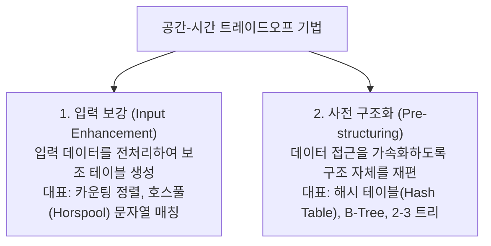

> [!abstract] 핵심 요약
> **공간으로 시간 벌기(Space-and-Time Tradeoffs)**는 컴퓨터 메모리(보조 테이블, 인덱스)를 추가로 사용하여 시간 복잡도를 비약적으로 개선하는 설계 패러다임이다.
> 전처리 정보를 보관하는 **입력 보강(Input Enhancement)**과 검색에 최적화된 자료구조를 미리 구축하는 **사전 구조화(Pre-structuring)**의 두 축을 마스터한다.

---

## 1. 공간-시간 트레이드오프의 2대 축



---

## 2. 입력 보강: 호스풀(Horspool) 문자열 매칭 알고리즘

텍스트 $T$ (길이 $n$)에서 패턴 $P$ (길이 $m$)를 검색할 때, 패턴의 **오른쪽 끝 문자부터 왼쪽으로 비교**하며 불일치 발생 시 사전 계산된 **이동 테이블(Shift Table)**을 참조하여 여러 칸을 한 번에 건너뛴다.

### 2.1. 이동 테이블 $Shift(c)$ 계산 공식
$$Shift(c) = \begin{cases} m, & \text{문자 } c \text{가 패턴의 처음 } m-1 \text{개 문자에 나타나지 않는 경우} \\ m - 1 - \max \{ k \mid P[k] == c, \; 0 \le k \le m-2 \}, & \text{나타나는 경우} \end{cases}$$

- **평균 시간 복잡도**: $O(n/m)$ (매우 긴 텍스트에서 단순 비교 $O(mn)$ 대비 압도적 성능)
- **최악 시간 복잡도**: $O(mn)$

---

## 3. 사전 구조화: 해시 테이블과 충돌(Collision) 해결 기법

| 기법 | 구조적 특징 | 장점 | 단점 |
| :-- | :-- | :-- | :-- |
| **체이닝 (Chaining)** | 각 버킷을 연결 리스트(Linked List)로 유지 | 적재율 $\alpha > 1$ 허용, 삭제 연산 간단 | 포인터 메모리 오버헤드, 캐시 지역성 저하 |
| **선형 조사법 (Linear Probing)** | $(h(k) + i) \bmod M$ | 구현 단순, 우수한 캐시 지역성 | **1차 군집화(Primary Clustering)** 발생 |
| **이차 조사법 (Quadratic Probing)** | $(h(k) + c_1 i + c_2 i^2) \bmod M$ | 1차 군집화 완화 | **2차 군집화(Secondary Clustering)** |
| **이중 해싱 (Double Hashing)** | $(h_1(k) + i \cdot h_2(k)) \bmod M$ | 모든 군집화 현상 방지 | 해시 함수 2개 연산 오버헤드 |

---

## 4. 실시간 호스풀(Horspool) 이동 테이블 생성기

```html preview
<div style="font-family:system-ui,-apple-system,sans-serif;padding:20px;background:var(--card);color:var(--card-foreground);border:1px solid var(--border);border-radius:var(--radius)">
  <div style="font-size:16px;font-weight:700;margin-bottom:12px;color:var(--primary)">
    ⚡ 호스풀(Horspool) 이동 테이블(Shift Table) 계산기
  </div>

  <div style="margin-bottom:12px">
    <label style="font-size:11px;color:var(--muted-foreground)">패턴 문자열 P 입력:</label>
    <input id="inPattern" type="text" value="BARBER" style="width:100%;padding:6px;background:var(--background);color:var(--foreground);border:1px solid var(--border);border-radius:var(--radius);font-weight:700;font-family:monospace" />
  </div>

  <div style="padding:12px;background:var(--background);border:1px solid var(--border);border-radius:var(--radius)">
    <div style="font-size:12px;font-weight:700;margin-bottom:6px">알파벳별 이동 거리 Table (패턴 길이 m = <span id="outPLen">6</span>):</div>
    <div id="outShiftTable" style="display:flex;flex-wrap:wrap;gap:8px;font-family:monospace;font-size:13px"></div>
  </div>

  <script>
    function calcShift() {
      var pat = document.getElementById('inPattern').value.toUpperCase() || "A";
      var m = pat.length;
      document.getElementById('outPLen').textContent = m;

      var table = {};
      for (var i = 0; i < m - 1; i++) {
        table[pat[i]] = m - 1 - i;
      }

      var container = document.getElementById('outShiftTable');
      container.innerHTML = "";

      // Unique chars in pattern + default
      var seen = {};
      for (var i = 0; i < m; i++) {
        var ch = pat[i];
        if (!seen[ch]) {
          seen[ch] = true;
          var shift = table[ch] !== undefined ? table[ch] : m;
          var box = document.createElement('div');
          box.style.cssText = "padding:6px 10px;background:var(--card);border:1px solid var(--border);border-radius:var(--radius);text-align:center";
          box.innerHTML = "<div style='color:var(--muted-foreground);font-size:10px'>" + ch + "</div><div style='color:var(--primary);font-weight:800;font-size:15px'>" + shift + "</div>";
          container.appendChild(box);
        }
      }

      var defBox = document.createElement('div');
      defBox.style.cssText = "padding:6px 10px;background:var(--card);border:1px solid var(--border);border-radius:var(--radius);text-align:center";
      defBox.innerHTML = "<div style='color:var(--muted-foreground);font-size:10px'>기타 문자(*)</div><div style='color:var(--primary);font-weight:800;font-size:15px'>" + m + "</div>";
      container.appendChild(defBox);
    }

    document.getElementById('inPattern').addEventListener('input', calcShift);
    calcShift();
  </script>
</div>
