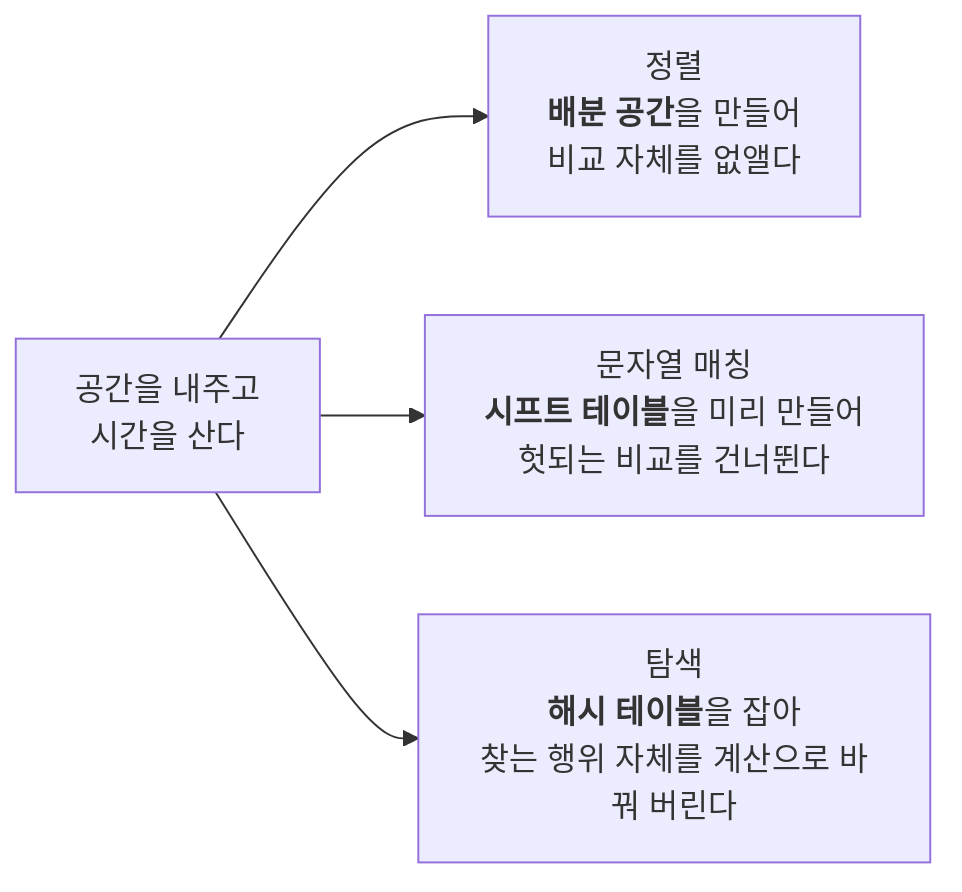
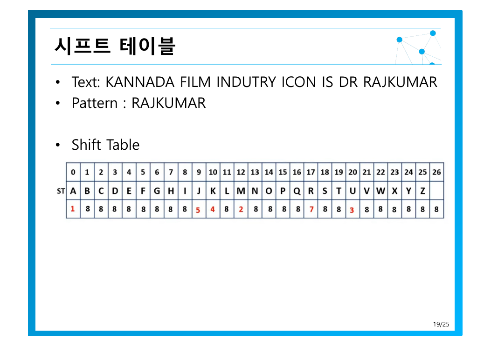
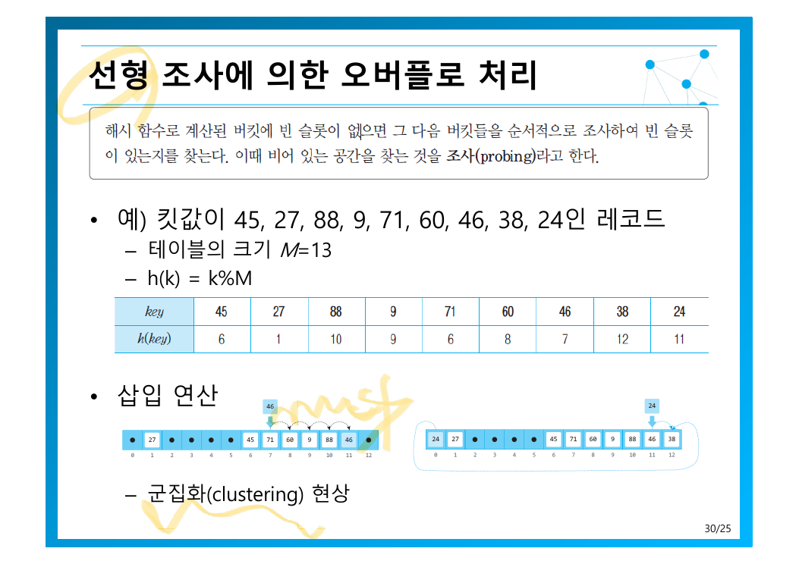

> [!abstract] 사고실험으로 시작하는 장
> 원본 3쪽은 극단적인 가정을 던진다 — *모든 답을 미리 다 계산해 저장해 놓는다면 → **모든 알고리즘은 $O(1)$이 가능***.
> 논리적으로 틀린 말이 아니다. 그리고 바로 반문한다 — ***문제는? 공간!*** 이 장은 그 극단과 현실 사이에서 **현실적인 수준의 거래**를 찾는 방법들을 모아 놓은 것이다.

---

## 1. 시간과 공간은 항상 상충한다


원본이 든 예가 피보나치라는 것이 의미심장하다. [5장 마지막에서](./05.%20%EB%B6%84%ED%95%A0%20%EC%A0%95%EB%B3%B5%20%EA%B8%B0%EB%B2%95.md) 분할 정복이 $O(2^n)$ 으로 터진 바로 그 문제다. 중복 계산이 문제였으니, **계산한 것을 적어 두면** 된다. 그 대가로 메모리를 낸다.

이 거래가 이 장의 세 가지 주제에서 각각 다른 모습으로 나타난다.



---

## 2. 비교하지 않고 정렬하기

[3~5장의 정렬들](./05.%20%EB%B6%84%ED%95%A0%20%EC%A0%95%EB%B3%B5%20%EA%B8%B0%EB%B2%95.md)은 모두 **비교 기반**이었다. [2장에서 $\log(n!) = \Theta(n\log n)$ 을 증명했듯이](./02.%20%EC%95%8C%EA%B3%A0%EB%A6%AC%EC%A6%98%20%ED%9A%A8%EC%9C%A8%EC%84%B1%20%EB%B6%84%EC%84%9D%EA%B3%BC%20%EC%A0%90%EA%B7%BC%EC%A0%81%20%ED%91%9C%EA%B8%B0%EB%B2%95.md) 비교만으로는 $O(n\log n)$ 이 한계다.

그런데 이 절의 정렬들은 그보다 빠르다. 모순이 아니다 — **비교를 안 하기 때문**이다. 하한은 “비교로 정렬한다면”이라는 전제 위에 서 있었고, 그 전제를 버리면 하한도 사라진다.

### 2.1 기수 정렬 — 낮은 자리부터 배분한다

원본 5~10쪽은 예제 하나를 여섯 장에 걸쳐 천천히 진행한다. 아래에서 같은 데이터로 직접 돌려 보라 — 버튼을 누를 때마다 한 단계씩 진행한다.

```html preview h=620px
<div style="font-family:system-ui,-apple-system,sans-serif;padding:20px;color:var(--foreground)">
  <div style="display:flex;gap:8px;margin-bottom:14px;flex-wrap:wrap;align-items:center">
    <button id="rstep" class="rbtn">다음 단계 ▶</button>
    <button id="rreset" class="rbtn">처음으로</button>
    <span id="rphase" style="font-size:13px;color:var(--muted-foreground)"></span>
  </div>
  <div style="font-size:12.5px;font-weight:600;margin-bottom:5px">현재 리스트</div>
  <div id="rlist" style="display:flex;gap:5px;flex-wrap:wrap;margin-bottom:16px"></div>
  <div style="font-size:12.5px;font-weight:600;margin-bottom:6px">버킷 (큐 10개)</div>
  <div id="rbuckets" style="display:flex;gap:4px"></div>
  <div id="rnote" style="margin-top:14px;padding:11px 13px;background:var(--card);border:1px solid var(--border);border-radius:var(--radius);font-size:13px;line-height:1.65"></div>

  <style>
    .rbtn{padding:7px 13px;font-size:12.5px;cursor:pointer;background:var(--card);
      color:var(--foreground);border:1px solid var(--border);border-radius:var(--radius)}
    .rbtn:hover{border-color:var(--primary);color:var(--primary)}
    .rcell{padding:6px 9px;border-radius:var(--radius);font-size:13.5px;font-weight:600;
      border:1px solid var(--border);background:var(--card);min-width:32px;text-align:center}
  </style>

  <script>
    var INIT = [28, 93, 39, 81, 63, 72, 38, 26, 16, 18, 62];
    var list = INIT.slice(), phase = 0, buckets = null;
    // phase 0: 시작 / 1: 1의자리 배분 / 2: 모음 / 3: 10의자리 배분 / 4: 모음(완료)
    function draw() {
      document.getElementById('rlist').innerHTML = list.map(function (v, i) {
        var hl = (phase === 4) ? 'var(--chart-2)' : 'var(--card)';
        var fg = (phase === 4) ? 'var(--primary-foreground)' : 'var(--foreground)';
        return '<span class="rcell" style="background:' + hl + ';color:' + fg + '">' + v + '</span>';
      }).join('');
      var dig = phase <= 2 ? 1 : 10;
      document.getElementById('rbuckets').innerHTML = [0,1,2,3,4,5,6,7,8,9].map(function (d) {
        var items = buckets ? buckets[d] : [];
        return '<div style="flex:1;min-height:76px;border:1px solid var(--border);border-radius:var(--radius);' +
          'padding:5px 3px;background:' + (items.length ? 'var(--card)' : 'transparent') + '">' +
          '<div style="font-size:11px;color:var(--muted-foreground);text-align:center;margin-bottom:4px">' + d + '</div>' +
          items.map(function (v) {
            return '<div style="font-size:12px;font-weight:600;text-align:center;padding:2px 0;color:var(--chart-' +
              (dig === 1 ? '3' : '1') + ')">' + v + '</div>';
          }).join('') + '</div>';
      }).join('');
      var texts = [
        ['시작 — 정렬되지 않은 입력', '원본 5쪽의 데이터다. 비교를 하지 않고 <b>자릿수만 보고</b> 정렬한다.'],
        ['1단계 — 1의 자리로 배분', '각 수를 1의 자리 값에 해당하는 큐에 넣었다. 비교 연산은 <b>한 번도</b> 없었다.'],
        ['2단계 — 큐 순서대로 모음', '0번 큐부터 순서대로 꺼내 붙였다. 이제 1의 자리 기준으로 정렬된 상태다.'],
        ['3단계 — 10의 자리로 배분', '<b>이전 순서가 보존된 채로</b> 10의 자리로 다시 배분한다 — 큐의 FIFO 성질이 안정성을 보장한다.'],
        ['완료 — 정렬됨', '두 번의 배분만으로 정렬이 끝났다. 자릿수 d=2 이므로 <b>O(dn) = O(2n)</b>.']
      ];
      document.getElementById('rphase').textContent = texts[phase][0];
      document.getElementById('rnote').innerHTML = texts[phase][1];
    }
    function distribute(dig) {
      buckets = [[],[],[],[],[],[],[],[],[],[]];
      list.forEach(function (v) { buckets[Math.floor(v / dig) % 10].push(v); });
    }
    function collect() {
      list = buckets.reduce(function (acc, q) { return acc.concat(q); }, []);
      buckets = [[],[],[],[],[],[],[],[],[],[]];
    }
    document.getElementById('rstep').onclick = function () {
      phase = (phase + 1) % 5;
      if (phase === 0) { list = INIT.slice(); buckets = null; }
      else if (phase === 1) distribute(1);
      else if (phase === 2) collect();
      else if (phase === 3) distribute(10);
      else collect();
      draw();
    };
    document.getElementById('rreset').onclick = function () {
      phase = 0; list = INIT.slice(); buckets = null; draw();
    };
    buckets = [[],[],[],[],[],[],[],[],[],[]];
    draw();
  </script>
</div>
```

복잡도는 자릿수 $d$와 항목 수 $n$으로 결정된다(12쪽).

$$
\text{시간: } O(dn), \qquad \text{공간: } O(n)
$$

그런데 원본은 공짜 점심이 없다고 못 박는다.

> [!warning] 기수 정렬의 적용 조건
> *킷값이 자연수로 표현되어야만 적용 가능. **Why?*** — 배분하려면 각 자리의 값이 **유한한 개수의 버킷 번호로 직접 변환**되어야 한다. 실수는 자리가 무한히 이어질 수 있고, 한글·한자는 코드 범위가 너무 넓어 버킷 수가 감당되지 않는다.
> 즉 $O(dn)$ 은 **적용할 수 있을 때만** 유효한 속도다. 범용성을 포기한 대가로 얻은 것이다.

### 2.2 카운팅 정렬 — 세기만 해서 정렬하기

더 극단적이다. 각 값이 몇 번 나오는지 세고, 그 숫자대로 적어 내려간다. 원본의 예제는 `[1, 4, 1, 2, 7, 5, 2]` 다(14쪽).

| | 복잡도 | 의미 |
| --- | --- | --- |
| 시간 | $O(k + n)$ | 카운팅 배열 순회 $k$ + 입력 순회 $n$ |
| 공간 | $O(k + n)$ | **값의 범위 $k$ 만큼의 배열이 필요** |

여기서 $k$가 복병이다. 원본의 물음 — *$k$가 매우 크다면? 예) 실수*. 값이 0~7이면 배열 8칸이면 되지만, 값이 0~10억이면 10억칸이 필요하다. **입력이 7개여도** 그렇다. 시간을 사려고 무한히 공간을 낼 수는 없다는 것이 이 장의 진짜 교훈이다.

---

## 3. 문자열 매칭 — 헛되는 비교를 건너뛰기

[3장의 억지 기법](./03.%20%EC%96%B5%EC%A7%80%20%EA%B8%B0%EB%B2%95%EA%B3%BC%20%EC%99%84%EC%A0%84%20%ED%83%90%EC%83%89.md)은 한 칸씩 밀며 매번 처음부터 비교해 $O(mn)$ 이었다. 이 절의 알고리즘들은 공통의 아이디어를 갖는다 — **패턴을 미리 분석해 표로 만들어 두고, 헛되는 위치를 건너뛴다**.

원본은 세 가지를 언급하고(16쪽) 호스풀을 자세히 다룬다 — 호스풀(Horspool), 보이어-무어(Boyer-Moore), KMP.

### 3.1 호스풀 — 마지막 문자만 보고 점프 거리를 정한다

핵심 전략은 둘이다(17~18쪽).

1. **불일치 문자가 패턴에 없는 문자면?** → 패턴 길이만큼 통째로 점프한다. 그 자리에서는 어차피 맞을 수 없기 때문이다.
2. **패턴에 있는 문자면?** → 미리 만들어 둔 **시프트 테이블**을 본다.



원본의 예제는 텍스트 `KANNADA FILM INDUTRY ICON IS DR RAJKUMAR` 에서 패턴 `RAJKUMAR` 를 찾는 것이다. 시프트 테이블은 *모든 가능한 알파벳에 대해 패턴에서의 위치를 저장한 표*로, 패턴 길이가 $m$일 때 마지막 문자를 제외한 각 문자 $c$에 대해:

$$
t(c) = m - 1 - (\text{패턴에서 } c \text{의 마지막 출현 위치}), \qquad \text{패턴에 없으면 } t(c) = m
$$

`RAJKUMAR` ($m = 8$) 에 적용하면:

| 문자 | R | A | J | K | U | M | 그 외 모두 |
| --- | --- | --- | --- | --- | --- | --- | --- |
| 시프트 량 | 7 | 1 | 5 | 4 | 3 | 2 | **8** |

`A`가 1인 것은 패턴에 `A`가 두 번(인덱스 1과 6) 나오지만 **마지막 출현을 기준**으로 잡기 때문이다. 안전한 쪽으로 잡는 것이며, 더 많이 건너뛰면 답을 놓칠 수 있다.

22쪽이 설명하는 규칙이 호스풀의 특이점이다 — *일부 문자만 일치될 경우: 틀린 곳을 찾은 다음, shift할 문자수는 **패턴의 마지막 문자**(이 예엔 ‘R’)를 보고 shift table에서 그 문자의 이동 경로만큼 이동한다*.

즉, 어디서 틀렸든 **항상 텍스트의 마지막 정렬 위치 문자**를 기준으로 점프한다. 이 단순함이 호스풀을 구현하기 쉬운 알고리즘으로 만들었고, 보이어-무어는 여기에 휴리스틱 하나를 더 얻는다(27쪽) — **나쁜 심벌 휴리스틱**과 **좋은 접미어 휴리스틱** 중 더 많이 점프하는 쪽을 택한다.

원본은 이 예제에서 **패턴 이동 횟수가 5번**이었다고 적고 억지 기법과 비교하라고 한다(25쪽). 텍스트가 40자가 넘는데 다섯 번만에 찾은 것이다.

복잡도는 이렇다(26쪽).

| | 복잡도 |
| --- | --- |
| 최악 | $O(mn)$ — 억지 기법과 같다 |
| 무작위 텍스트 | 거의 $O(n)$ |

> [!question] 왜 무작위 텍스트에서는 $O(n)$에 가까운가
> 사용하는 알파벳이 넓고 패턴이 짧을수록, **불일치 문자가 패턴에 아예 없을 확률이 높다**. 그러면 매번 패턴 길이만큼 통째로 점프하므로 텍스트를 $n/m$ 번 정도만 건드리게 된다. 반대로 알파벳이 좁거나(DNA 같은 4문자) 반복이 많은 텍스트면 점프가 짧아져 최악에 가까워진다.

---

## 4. 해싱 — 찾지 않고 계산한다

원본은 해싱을 *공간으로 시간 벌기 전략의 **가장 대표적인 예***로 소개한다(29쪽). 이상적인 경우 $O(1)$.

발상의 전환이 극적이다. 탐색은 지금까지 *비교하며 찾는* 행위였는데, 해싱은 *키로부터 주소를 계산*한다. 비교가 아예 사라지므로 [4장 이진 탐색의 $O(\log n)$](./04.%20%EC%B6%95%EC%86%8C%20%EC%A0%95%EB%B3%B5%20%EA%B8%B0%EB%B2%95.md) 보다도 빠르다.

대가는 둘이다 — **테이블 공간**, 그리고 **충돌**.

### 4.1 선형 조사와 군집화



원본 예제를 그대로 돌려 보라 — 킷값 45, 27, 88, 9, 71, 60, 46, 38, 24 를 크기 $M = 13$ 인 테이블에 $h(k) = k \bmod 13$ 으로 넣는다.

```html preview h=560px
<div style="font-family:system-ui,-apple-system,sans-serif;padding:20px;color:var(--foreground)">
  <div style="display:flex;gap:8px;margin-bottom:14px;flex-wrap:wrap;align-items:center">
    <button id="hstep" class="hbtn">다음 키 삽입 ▶</button>
    <button id="hall" class="hbtn">전부 삽입</button>
    <button id="hreset" class="hbtn">초기화</button>
    <span style="font-size:12.5px;color:var(--muted-foreground)">M = 13, h(k) = k mod 13</span>
  </div>
  <div style="font-size:12.5px;font-weight:600;margin-bottom:6px">삽입 대기열</div>
  <div id="hqueue" style="display:flex;gap:5px;flex-wrap:wrap;margin-bottom:16px"></div>
  <div style="font-size:12.5px;font-weight:600;margin-bottom:6px">해시 테이블</div>
  <div id="htable" style="display:flex;gap:3px;flex-wrap:wrap"></div>
  <div id="hlog" style="margin-top:14px;padding:11px 13px;background:var(--card);border:1px solid var(--border);border-radius:var(--radius);font-size:13px;line-height:1.7;min-height:52px"></div>

  <style>
    .hbtn{padding:7px 13px;font-size:12.5px;cursor:pointer;background:var(--card);
      color:var(--foreground);border:1px solid var(--border);border-radius:var(--radius)}
    .hbtn:hover{border-color:var(--primary);color:var(--primary)}
  </style>

  <script>
    var KEYS = [45, 27, 88, 9, 71, 60, 46, 38, 24], M = 13;
    var table = new Array(M).fill(null), idx = 0, probes = new Array(M).fill(0);
    function hdraw(msg) {
      document.getElementById('hqueue').innerHTML = KEYS.map(function (k, i) {
        var done = i < idx;
        return '<span style="padding:5px 9px;border-radius:var(--radius);font-size:13px;font-weight:600;' +
          'border:1px solid var(--border);background:' + (done ? 'transparent' : 'var(--card)') +
          ';opacity:' + (done ? '0.35' : '1') + '">' + k + '</span>';
      }).join('');
      document.getElementById('htable').innerHTML = table.map(function (v, i) {
        var bg = v === null ? 'transparent' : (probes[i] > 0 ? 'var(--chart-5)' : 'var(--chart-2)');
        var fg = v === null ? 'var(--muted-foreground)' : 'var(--primary-foreground)';
        return '<div style="flex:1;min-width:44px;text-align:center;padding:7px 2px;border:1px solid var(--border);' +
          'border-radius:var(--radius);background:' + bg + '">' +
          '<div style="font-size:10.5px;color:var(--muted-foreground)">' + i + '</div>' +
          '<div style="font-size:14px;font-weight:700;color:' + fg + '">' + (v === null ? '·' : v) + '</div>' +
          '</div>';
      }).join('');
      if (msg) document.getElementById('hlog').innerHTML = msg;
    }
    function insertOne() {
      if (idx >= KEYS.length) return false;
      var k = KEYS[idx], home = k % M, i = home, p = 0;
      while (table[i] !== null) { i = (i + 1) % M; p++; }
      table[i] = k; probes[i] = p; idx++;
      hdraw(p === 0
        ? '<b>' + k + '</b> → h(' + k + ') = ' + home + ' — <span style="color:var(--chart-2)">빈 칸, 바로 삽입</span>'
        : '<b>' + k + '</b> → h(' + k + ') = ' + home + ' 이 이미 차 있음 — ' +
          '<span style="color:var(--chart-5)">선형 조사 ' + p + '번</span> 후 ' + i + '번에 삽입');
      return true;
    }
    document.getElementById('hstep').onclick = function () {
      if (!insertOne()) hdraw('모든 키가 삽입되었다. <b style="color:var(--chart-5)">붉은 칸</b>은 충돌 후 밀려난 키다 — 6~12번에 <b>군집화(clustering)</b>가 보인다.');
    };
    document.getElementById('hall').onclick = function () {
      while (insertOne()) {}
      hdraw('완료. <b style="color:var(--chart-5)">붉은 칸</b>은 충돌로 밀려난 키 — 6~12번이 연속된 덩어리를 이루는 <b>군집화</b> 현상이다. 덩어리가 커질수록 다음 충돌의 조사 거리도 길어진다.');
    };
    document.getElementById('hreset').onclick = function () {
      table = new Array(M).fill(null); probes = new Array(M).fill(0); idx = 0;
      hdraw('초기화됨. “다음 키 삽입”을 눌러 한 번씩 진행해 보라.');
    };
    hdraw('“다음 키 삽입”을 눌러 한 개씩 넣어 보라. 충돌이 언제 생기는지 보인다.');
  </script>
</div>
```

군집화(clustering)가 문제인 이유는 **자기 증식적**이기 때문이다. 덩어리가 클수록 그 덩어리에 걸릴 확률이 높아지고, 걸리면 덩어리가 더 커진다. 원본은 완화법을 둘 제시한다(32쪽).

| 방법 | 조사 위치 | 효과 |
| --- | --- | --- |
| 이차 조사법 | $h(k) + i^2$ | 덩어리를 건너뛰어 선형 군집을 깨뜼린다 |
| 이중 해싱법 | $h(k, i) = (h_1(k) + i \cdot h_2(k)) \bmod M$ | 키마다 **조사 보폭이 달라져** 가장 고르게 흔어진다 |

### 4.2 체이닝과 해시 함수

체이닝은 아예 다른 접근다(33쪽) — 같은 주소에 연결 리스트를 달아 버킷 안에 여럿을 담는다. 주소 공간을 넘는 항목 수도 수용하며, 삭제가 깔끔하다 — 선형 조사법은 삭제 시 *빈 버켓을 두 가지로 분류해야* 하는 번거로움이 있다(31쪽). 한번도 안 쓴 칸과 삭제된 칸을 구별하지 않으면 탐색이 중간에 끈겨 뒤에 있는 동의어를 못 찾는다.

좋은 해시 함수의 조건은 셋이다(34쪽) — **충돌이 적고, 주소가 테이블에서 고르게 분포되며, 계산이 빠를 것**. 제산 함수 $h(k) = k \bmod M$ 에서 **$M$을 소수로** 잡는 관행도 여기서 나온다. $M$이 합성수면 그 약수의 배수인 키들이 특정 칸에 몰리기 때문이다.

> [!important] 이상과 현실
> 35쪽은 못 박는다 — *실제 해싱의 탐색 연산은 이상적인 $O(1)$ 보다 느리다*. 성능을 좌우하는 것이 **적재 밀도**(loading density)이다. 테이블이 차오를수록 충돌이 늘고 조사 거리가 길어진다.
> 결국 **공간을 더 낼수록 시간이 빨라진다**는 이 장의 명제가 해싱에서 가장 정량적으로 드러난다.

---

## 정리

| 전략 | 낸 공간 | 산 시간 | 제약 |
| --- | --- | --- | --- |
| 기수 정렬 | $O(n)$ 버킷 | $O(n\log n) \to O(dn)$ | 킷값이 자연수여야 함 |
| 카운팅 정렬 | $O(k+n)$ | $O(n\log n) \to O(k+n)$ | 값의 범위 $k$가 작아야 함 |
| 호스풀 매칭 | 시프트 테이블 | $O(mn) \to$ 사실상 $O(n)$ | 최악은 여전히 $O(mn)$ |
| 해싱 | 테이블 $O(M)$ | $O(\log n) \to O(1)$ | 적재 밀도가 높으면 저하 |

> [!tip] 세 문장 요약
>
> 1. **공간을 내면 시간을 살 수 있다.** 극단적으로는 모든 답을 저장해 $O(1)$이 되지만, 공간이 감당하지 못한다.
> 2. **비교 하한 $\Omega(n\log n)$ 은 비교를 할 때만 유효**하다. 배분으로 바꾸면 하한 자체가 사라진다 — 대신 적용 범위를 잃는다.
> 3. **전처리는 미래의 비교를 생략하기 위한 투자**다. 시프트 테이블도, 해시 테이블도 모두 같은 발상이다.

다음 장은 이 발상을 **부분 문제의 답**에 적용한다. [5장이 피보나치에서 막혔던](./05.%20%EB%B6%84%ED%95%A0%20%EC%A0%95%EB%B3%B5%20%EA%B8%B0%EB%B2%95.md) 지점을 정면으로 돌파하는 [동적 계획법](./07.%20%EB%8F%99%EC%A0%81%20%EA%B3%84%ED%9A%8D%EB%B2%95.md)이다.

---

### 근거 자료

강의 원본 `06장-공간으로시간벌기-수정판.pdf` (37쪽)에 근거한다. 인용 슬라이드는 3쪽(시간·공간 상충), 19쪽(시프트 테이블), 30쪽(선형 조사 군집화)이다. 기수 정렬 시각화는 원본 5쪽의 데이터 `28, 93, 39, 81, 63, 72, 38, 26, 16, 18, 62` 를 그대로 쓰며, 중간 결과(7쪽)와 최종 결과(10쪽)가 슬라이드와 일치함을 확인했다. 해싱 시각화도 30쪽의 킷값 9개와 $M=13$ 을 그대로 사용했다.
