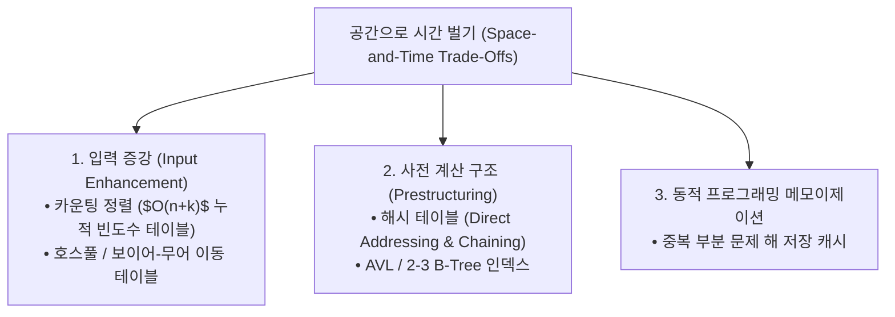

> [!abstract] 핵심 요약
> **공간으로 시간 벌기(Space-and-Time Trade-Offs)**는 사전 계산(Precomputing) 및 추가 메모리 구조(입력 증강/동적 테이블)를 도입하여 탐색 및 정렬 연산을 획기적으로 가속하는 전략이다.
> 문자열 매칭에서 **호스풀 알고리즘**은 불일치 발생 시 패턴의 마지막 문자에 대한 시프트 거리 테이블을 참조하여 최대 패턴 길이 $m$만큼 본문 포인터를 단번에 건너뜀으로써 평균 $O(n / m)$의 초고속 탐색을 달성한다.

---

## 1. 공간-시간 절충 3대 핵심 기법



---

## 2. 호스풀 시프트 테이블 계산 공식

패턴 $P[0 \dots m-1]$에 대해 알파벳 $c$의 시프트 값:
$$T[c] = egin{cases} m, & c 	ext{가 패턴의 앞선 } m-1 	ext{개 문자에 존재하지 않음} \ m - 1 - \max \{i \mid P[i] = c, 0 \le i < m-1\}, & c 	ext{가 패턴의 앞선 } m-1 	ext{개 문자에 존재} \end{cases}$$

---

## 3. 실시간 호스풀 시프트 테이블 생성기

```html preview
<div style="font-family:system-ui,-apple-system,sans-serif;padding:20px;background:var(--card);color:var(--card-foreground);border:1px solid var(--border);border-radius:var(--radius)">
  <div style="font-size:16px;font-weight:700;margin-bottom:14px;color:var(--primary);display:flex;align-items:center;gap:8px">
    <span>🔍 호스풀(Horspool) 이동 테이블(Shift Table) 계산기</span>
  </div>

  <div style="margin-bottom:14px">
    <label style="font-size:11px;color:var(--muted-foreground)">검색할 패턴 (Pattern):</label>
    <input id="inPattern" type="text" value="BARBER" style="width:100%;padding:4px;background:var(--background);color:var(--foreground);border:1px solid var(--border);border-radius:var(--radius);font-weight:700;text-transform:uppercase" />
  </div>

  <div style="padding:12px;background:var(--background);border:1px solid var(--border);border-radius:var(--radius)">
    <div style="font-size:11px;font-weight:700;color:var(--muted-foreground);margin-bottom:4px">패턴 내 주요 문자 시프트 거리 ($m=6$)</div>
    <div id="shiftOut" style="font-family:monospace;font-size:13px;line-height:1.6;color:var(--primary)">
      B -> 2 | A -> 4 | R -> 3 | E -> 1 | 기타 문자 -> 6
    </div>
  </div>

  <script>
    function updateShift() {
      var pat = (document.getElementById('inPattern').value || "BARBER").toUpperCase();
      var m = pat.length;
      var table = {};
      for (var i = 0; i < m - 1; i++) {
        table[pat[i]] = m - 1 - i;
      }
      var res = [];
      for (var k in table) {
        res.push(k + " -> " + table[k]);
      }
      res.push("기타 문자 -> " + m);
      document.getElementById('shiftOut').textContent = res.join(" | ");
    }
    document.getElementById('inPattern').addEventListener('input', updateShift);
  </script>
</div>
```
