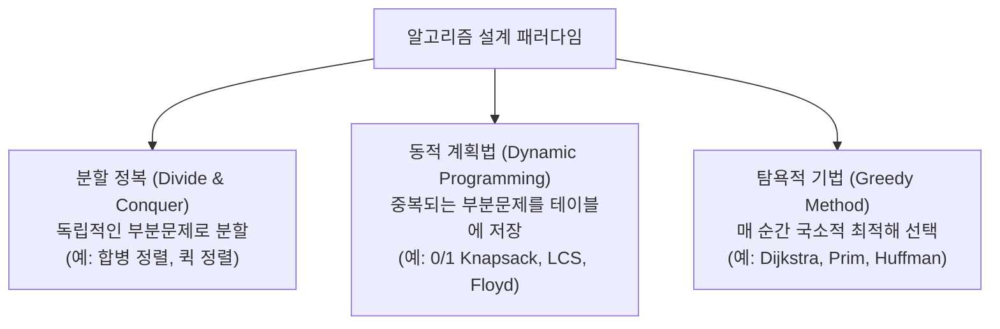

> [!abstract] 핵심 요약
> **동적 계획법(Dynamic Programming)**은 큰 문제의 최적해가 작은 부분 문제들의 최적해로부터 구성되는 **최적 부분구조(Optimal Substructure)**를 가질 때, 동일한 부분 문제의 반복 계산을 방지하기 위해 해를 테이블에 기록(**Memoization / Tabulation**)하는 설계 패러다임이다.
> 지수 시간 $O(2^n)$의 브루트포스 문제를 다항 시간 $O(nW), O(V^3), O(mn)$으로 획기적으로 개선한다.

---

## 1. 분할 정복 vs 동적 계획법 vs 탐욕적 기법 비교



---

## 2. 0/1 배낭 문제 (0/1 Knapsack Problem) DP 모델링

용량 $W$인 배낭과 $n$개의 물건(무게 $w_i$, 가치 $v_i$)이 주어졌을 때 총 가치를 극대화하는 문제이다.

### 2.1. DP 상태 전이 점화식
$V[i, j]$: $1 \sim i$번째 물건까지 고려하고 배낭 용량이 $j$일 때 얻을 수 있는 최대 가치 ($0 \le i \le n, 0 \le j \le W$)

$$V[i, j] = \begin{cases} 0, & \text{if } i = 0 \text{ or } j = 0 \\ V[i-1, j], & \text{if } j < w_i \quad (\text{물건 } i \text{를 담을 수 없음}) \\ \max(V[i-1, j], \; v_i + V[i-1, j - w_i]), & \text{if } j \ge w_i \quad (\text{물건 } i \text{를 담지 않거나 담음}) \end{cases}$$

- **시간 복잡도**: $\Theta(nW)$ (의사 다항 시간 Pseudo-polynomial Time)
- **공간 복잡도**: $\Theta(nW)$ (1차원 배열 최적화 시 $\Theta(W)$)

---

## 3. 모든 쌍 최단 경로: 플로이드-워셜 (Floyd-Warshall)

- 정점 집합 $\{1, 2, \dots, k\}$만을 경유지로 거쳐갈 수 있을 때의 정점 $i$에서 $j$까지의 최단 경로 $D^{(k)}[i, j]$ 계산.
- **점화식**:
  $$D^{(k)}[i, j] = \min \left( D^{(k-1)}[i, j], \; D^{(k-1)}[i, k] + D^{(k-1)}[k, j] \right)$$
- **시간 복잡도**: 3중 루프 $\Theta(V^3)$, 음수 가중치 허용 (음수 사이클 감지 가능).

---

## 4. 실시간 0/1 배낭 문제 DP 테이블 시뮬레이터

```html preview
<div style="font-family:system-ui,-apple-system,sans-serif;padding:20px;background:var(--card);color:var(--card-foreground);border:1px solid var(--border);border-radius:var(--radius)">
  <div style="font-size:16px;font-weight:700;margin-bottom:12px;color:var(--primary)">
    ⚡ 0/1 Knapsack 동적 계획법 테이블 계산기
  </div>

  <div style="font-size:12px;color:var(--muted-foreground);margin-bottom:12px">
    아이템 목록: Item 1(w:2, v:3), Item 2(w:3, v:4), Item 3(w:4, v:5), Item 4(w:5, v:6)
  </div>

  <div style="margin-bottom:14px">
    <label style="font-size:11px;color:var(--muted-foreground)">배낭 용량 W (1 ~ 10):</label>
    <input id="inKnapW" type="range" min="1" max="10" value="5" style="width:100%" />
    <div style="display:flex;justify-content:space-between;font-size:12px;font-weight:700;margin-top:2px">
      <span>W = 1</span>
      <span id="outKnapWVal" style="color:var(--primary);font-size:15px">W = 5</span>
      <span>W = 10</span>
    </div>
  </div>

  <div style="padding:14px;background:var(--background);border:1px solid var(--border);border-radius:var(--radius)">
    <div style="font-size:12px;color:var(--muted-foreground)">최대 달성 가치 V[n, W]:</div>
    <div id="outKnapResult" style="font-family:monospace;font-size:24px;font-weight:800;color:var(--primary);margin-top:4px">7 (Item 1 + Item 2)</div>
  </div>

  <script>
    var items = [
      { w: 2, v: 3 },
      { w: 3, v: 4 },
      { w: 4, v: 5 },
      { w: 5, v: 6 }
    ];

    function calcKnap() {
      var W = parseInt(document.getElementById('inKnapW').value);
      document.getElementById('outKnapWVal').textContent = "W = " + W;

      var n = items.length;
      var dp = [];
      for (var i = 0; i <= n; i++) {
        dp[i] = new Array(W + 1).fill(0);
      }

      for (var i = 1; i <= n; i++) {
        var wi = items[i - 1].w;
        var vi = items[i - 1].v;
        for (var j = 0; j <= W; j++) {
          if (j < wi) {
            dp[i][j] = dp[i - 1][j];
          } else {
            dp[i][j] = Math.max(dp[i - 1][j], vi + dp[i - 1][j - wi]);
          }
        }
      }

      document.getElementById('outKnapResult').textContent = dp[n][W] + " (용량 " + W + " 최적해)";
    }

    document.getElementById('inKnapW').addEventListener('input', calcKnap);
    calcKnap();
  </script>
</div>
