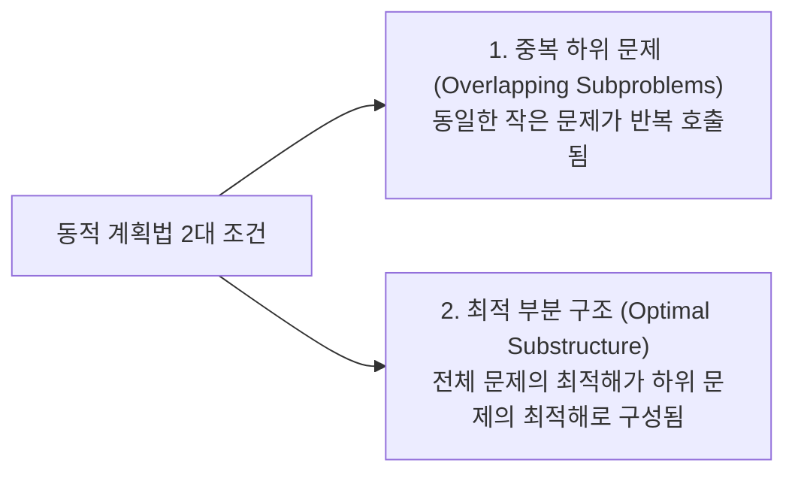

> [!abstract] 핵심 요약
> **동적 계획법(Dynamic Programming, DP)**은 문제를 중복되는 하위 문제(Overlapping Subproblems)로 나누고, **최적 부분 구조(Optimal Substructure)**를 이용하여 작은 문제의 해를 테이블에 저장(Memoization/Tabulation)한 후 재사용하여 $O(2^n)$의 지수 복잡도를 다항 시간($O(n^2), O(nW)$)으로 단축하는 기법이다.

---

## 1. 0-1 배낭 문제 (0-1 Knapsack Problem) 점화식

용량이 $W$인 배낭에 무게 $w_i$, 가치 $v_i$인 $n$개의 물건 중 일부를 담아 가치 합을 극대화할 때:

$$K(i, w) = \begin{cases} 0 & \text{if } i = 0 \text{ or } w = 0 \\ K(i-1, w) & \text{if } w_i > w \\ \max(K(i-1, w), K(i-1, w - w_i) + v_i) & \text{if } w_i \le w \end{cases}$$

