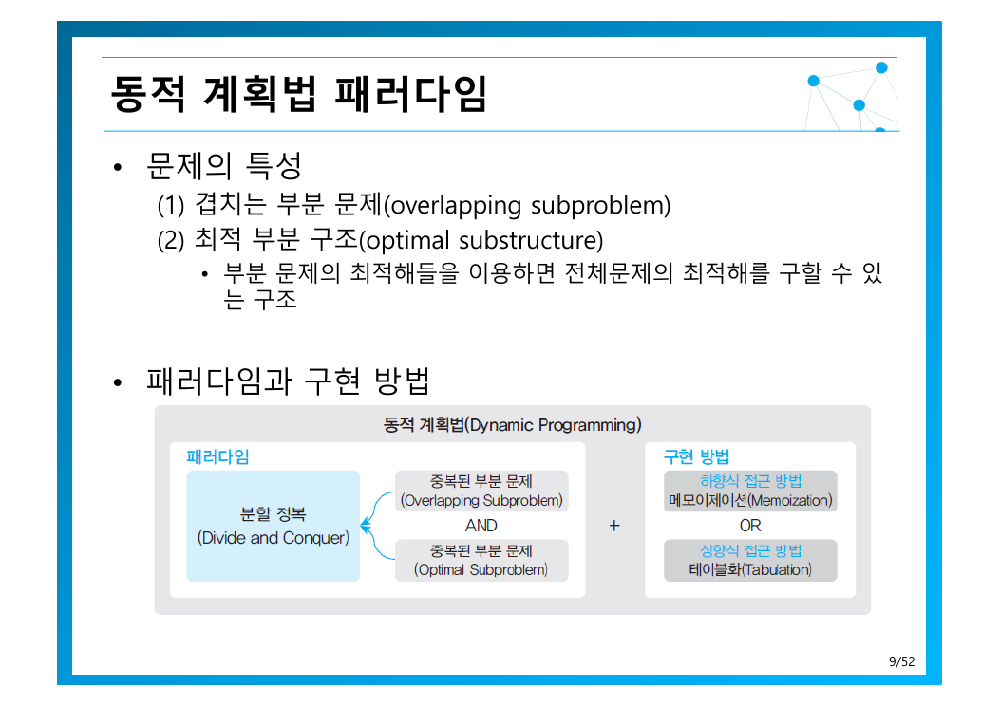
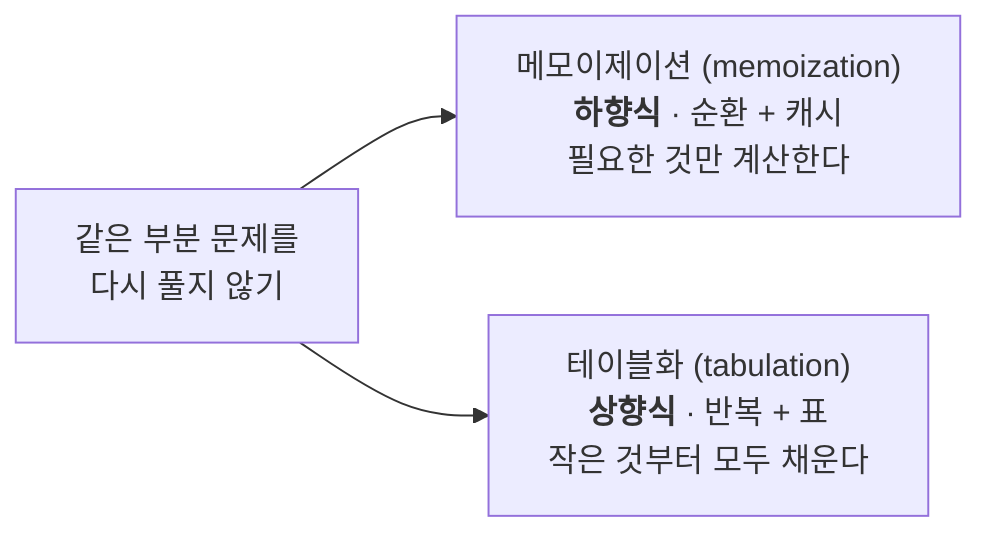
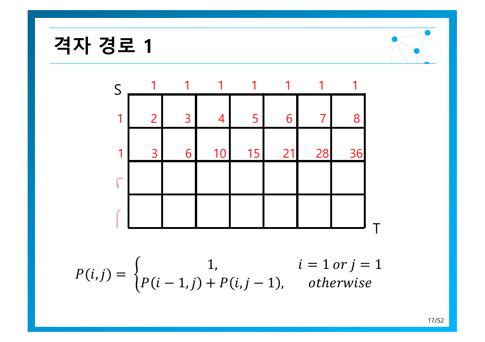
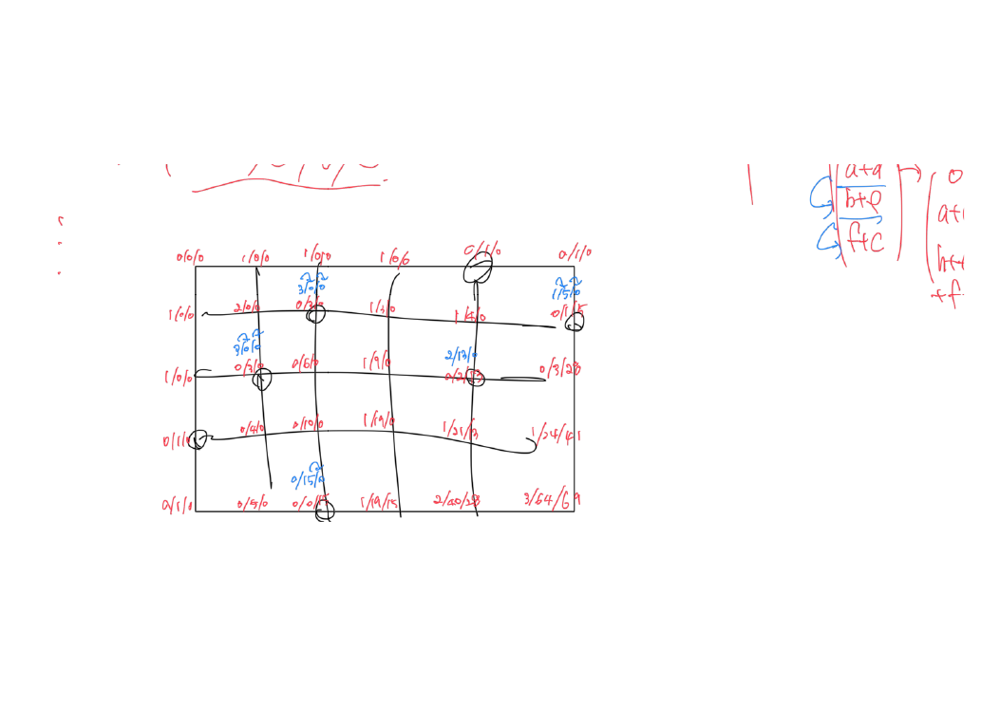
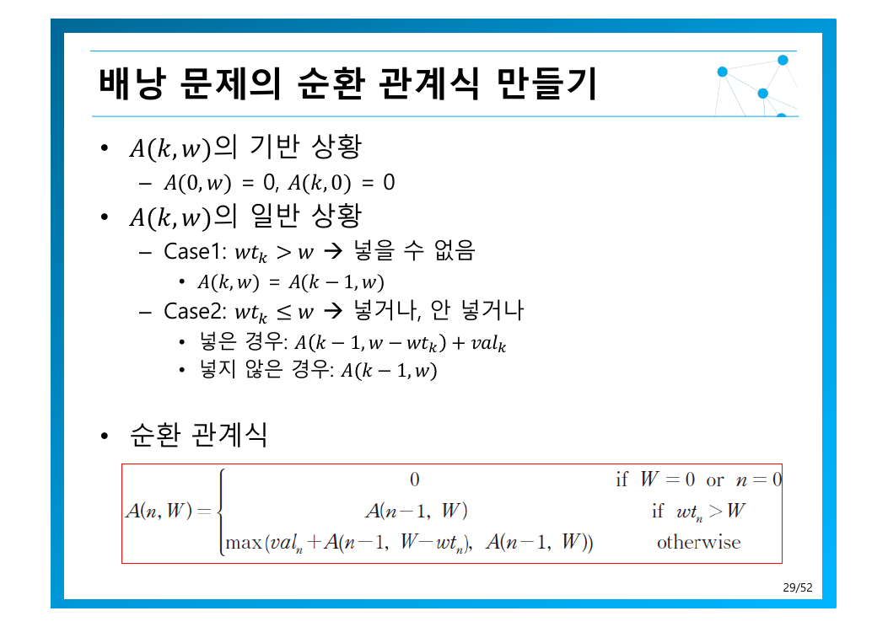

> [!abstract] 이름에 속지 말 것
> “동적 계획법”은 이름이 내용을 거의 설명하지 못하는 대표적인 사례다. 원본이 밝히듯이 1950년대 미국 수학자 **벨만(Richard Bellman)**이 *다단계의 의사 결정 프로세스를 최적화하는 일반적인 방법*으로 붙인 이름을 번역한 것이다.
> 실제 내용은 한 줄로 준다 — ***어렵게 구한 답을 한 번만 쓰고 버리지 말고 저장해 재사용***(4쪽). [6장의 “공간으로 시간 벌기”](./06.%20%EA%B3%B5%EA%B0%84%EC%9C%BC%EB%A1%9C%20%EC%8B%9C%EA%B0%84%20%EB%B2%8C%EA%B8%B0.md)의 일종이며, [5장이 피보나치에서 막혔던](./05.%20%EB%B6%84%ED%95%A0%20%EC%A0%95%EB%B3%B5%20%EA%B8%B0%EB%B2%95.md) 바로 그 지점을 뚫는다.

---

## 1. 언제 쓸 수 있는가 — 두 가지 조건



원본 9쪽은 적용 조건을 둘로 정리한다.

| 조건 | 뜻 | 없으면 |
| --- | --- | --- |
| **겹치는 부분 문제**<br/>overlapping subproblem | 같은 부분 문제가 여러 번 다시 나타난다 | 저장해도 재사용할 일이 없다 → [5장 분할 정복](./05.%20%EB%B6%84%ED%95%A0%20%EC%A0%95%EB%B3%B5%20%EA%B8%B0%EB%B2%95.md)으로 충분 |
| **최적 부분 구조**<br/>optimal substructure | *부분 문제의 최적해들을 이용하면 전체문제의 최적해를 구할 수 있는 구조* | 부분의 최적이 전체의 최적을 보장하지 않으면 표를 채워도 무의미 |

두 조건이 맞으면 구현은 두 방향 중 하나다(4쪽).



피보나치에 둘 다 적용해 보면 **시간·공간 모두 $O(n)$** 으로 같다(6·8쪽). [5장의 $O(2^n)$](./05.%20%EB%B6%84%ED%95%A0%20%EC%A0%95%EB%B3%B5%20%EA%B8%B0%EB%B2%95.md) 에서 지수가 통째로 사라졌다. 둘의 차이는 성능이 아니라 성격이다.

| | 메모이제이션 | 테이블화 |
| --- | --- | --- |
| 시작점 | 원래 문제에서 내려간다 | 기반 상황에서 쌓아 올린다 |
| 계산 범위 | **실제 필요한 칸만** | 표 전체 |
| 장점 | 순환식을 그대로 옮기면 된다 | 함수 호출 오버헤드가 없다 |
| 단점 | 재귀 깊이 제한에 걸릴 수 있다 | 안 쓸 칸까지 계산할 수 있다 |

---

## 2. 순환 관계식을 세우는 법 — 이항계수로 연습

이 장의 모든 문제는 같은 절차를 밟는다. 원본 11쪽이 그 틀을 명시적으로 보여준다.

1. **기반 상황** — *답이 이미 알려진 가장 작은 부분 문제*
2. **일반 상황** — 마지막 선택을 기준으로 경우를 나눈다
3. 둘을 합쳐 **순환 관계식**

이항계수 $C(n, k)$ — $n$개에서 $k$개를 뽑는 순서 없는 조합의 가짓수 — 에 적용하면:

$$
C(n, 0) = 1, \qquad C(n, n) = 1 \qquad \text{(기반 상황)}
$$

일반 상황은 **$n$번째 항목을 포함하는가**로 갈라진다.

$$
C(n, k) = \underbrace{C(n-1, k-1)}_{n\text{번째를 포함}} + \underbrace{C(n-1, k)}_{n\text{번째를 미포함}}
$$

이것이 파스칼의 삼각형이다. 분할 정복으로 풀면 *많은 중복이 발생*하지만(12쪽), **변수가 둘이므로 2차원 테이블**을 잡으면 시간·공간 모두 $O(nk)$ 로 끝난다(13~14쪽).

> [!note] 변수가 몇 개인가 → 표가 몇 차원인가
> DP 문제를 처음 만났을 때 가장 맨저 할 일은 **상태를 결정하는 변수를 세는 것**이다. 피보나치는 $n$ 하나 → 1차원. 이항계수는 $n, k$ 둘 → 2차원. 배낭은 물건 번호와 남은 용량 → 2차원. 변수 개수가 공간 복잡도의 지수가 된다.

---

## 3. 격자 경로 — 같은 틀을 세 번 확장하기

16~24쪽은 교재 밖의 예제로, DP가 **조건이 붙을때마다 어떻게 확장되는지** 보여주는 좋은 연습이다.

### 격자 경로 1 — 기본형

S에서 T까지 오른쪽과 아래쪽으로만 가는 최단경로의 개수는?

$$
f(i, j) = \begin{cases}
1 & i = 1 \text{ 또는 } j = 1 \\
f(i-1, j) + f(i, j-1) & \text{otherwise}
\end{cases}
$$

어떤 칸에 도달하는 방법은 **위에서 내려오거나 왼쪽에서 오는 것** 둘뿐이므로 둘을 더한다. 가장\자리는 한 길뿐이라 1.



### 격자 경로 2 — 장애물 추가

*표시된 곳은 지날 수 없다*는 조건이 붙으면 순환식에 줄 하나만 더하면 된다.

$$
f(i, j) = \begin{cases}
\mathbf{0} & \textbf{막힌 칸이면} \\
1 & i = 1 \text{ 또는 } j = 1 \\
f(i-1, j) + f(i, j-1) & \text{otherwise}
\end{cases}
$$

원본은 18쪽에서 못 박는다 — *‘경우의 수’ 계산하듯이 하기는 쉽지 않다*. 조합론 공식 $\binom{m+n}{n}$ 은 장애물이 들어오는 순간 무너지지만, **DP 표는 칸 하나를 0으로 만드는 것으로 끝**이다. 이것이 DP의 힘이다.

직접 확인해 보라 — 칸을 클릭하면 장애물이 되고 표가 즉시 다시 계산된다.

```html preview h=470px
<div style="font-family:system-ui,-apple-system,sans-serif;padding:20px;color:var(--foreground)">
  <div style="display:flex;gap:8px;align-items:center;flex-wrap:wrap;margin-bottom:14px">
    <button id="gclear" class="gbt">장애물 모두 제거</button>
    <span style="font-size:12.5px;color:var(--muted-foreground)">칸을 클릭해 막거나 뚫어 보라 · S는 왼쪽 윗칸, T는 오른쪽 아랫칸</span>
  </div>
  <div id="grid" style="display:inline-block"></div>
  <div id="gres" style="margin-top:14px;padding:11px 13px;background:var(--card);border:1px solid var(--border);border-radius:var(--radius);font-size:13.5px"></div>

  <style>
    .gbt{padding:7px 12px;font-size:12.5px;cursor:pointer;background:var(--card);
      color:var(--foreground);border:1px solid var(--border);border-radius:var(--radius)}
    .gbt:hover{border-color:var(--primary);color:var(--primary)}
    .gc{width:46px;height:38px;display:inline-flex;align-items:center;justify-content:center;
      border:1px solid var(--border);font-size:13px;font-weight:600;cursor:pointer;
      background:var(--card);margin:1px;border-radius:4px}
    .gc:hover{border-color:var(--primary)}
  </style>

  <script>
    var R = 4, C = 8, blocked = {};
    function compute() {
      var f = [];
      for (var i = 0; i < R; i++) { f.push([]); for (var j = 0; j < C; j++) f[i].push(0); }
      for (i = 0; i < R; i++) for (j = 0; j < C; j++) {
        if (blocked[i + ',' + j]) { f[i][j] = 0; continue; }
        if (i === 0 && j === 0) { f[i][j] = 1; continue; }
        f[i][j] = (i > 0 ? f[i - 1][j] : 0) + (j > 0 ? f[i][j - 1] : 0);
      }
      return f;
    }
    function draw() {
      var f = compute(), html = '';
      for (var i = 0; i < R; i++) {
        for (var j = 0; j < C; j++) {
          var b = blocked[i + ',' + j];
          var isS = (i === 0 && j === 0), isT = (i === R - 1 && j === C - 1);
          var bg = b ? 'var(--destructive)' : (isS || isT ? 'var(--chart-2)' : 'var(--card)');
          var fg = (b || isS || isT) ? 'var(--primary-foreground)' : 'var(--foreground)';
          html += '<div class="gc" data-i="' + i + '" data-j="' + j + '" ' +
            'style="background:' + bg + ';color:' + fg + '">' +
            (b ? '✕' : (isS ? 'S' : (isT ? f[i][j] : f[i][j]))) + '</div>';
        }
        html += '<br>';
      }
      document.getElementById('grid').innerHTML = html;
      var total = f[R - 1][C - 1];
      document.getElementById('gres').innerHTML =
        'S → T 최단경로의 수: <b style="color:var(--chart-1);font-size:17px">' + total.toLocaleString() + '</b>' +
        (Object.keys(blocked).length
          ? ' <span style="color:var(--muted-foreground)">(장애물 ' + Object.keys(blocked).length + '개 — 장애물 칸을 0으로 두면 순환식이 그대로 동작한다)</span>'
          : ' <span style="color:var(--muted-foreground)">(장애물 없음 — 원본 17쪽의 격자 경로 1)</span>');
      Array.prototype.forEach.call(document.querySelectorAll('.gc'), function (el) {
        el.onclick = function () {
          var i = +el.getAttribute('data-i'), j = +el.getAttribute('data-j');
          if ((i === 0 && j === 0) || (i === R - 1 && j === C - 1)) return;
          var k = i + ',' + j;
          if (blocked[k]) delete blocked[k]; else blocked[k] = 1;
          draw();
        };
      });
    }
    document.getElementById('gclear').onclick = function () { blocked = {}; draw(); };
    draw();
  </script>
</div>
```

### 격자 경로 3 — 특정 지점을 $k$번 지나기

조건이 한 번 더 붙으면 — *표시된 곳을 최소 $k$번 지나야 한다* — 칸 하나에 숫자 하나로는 부족해진다. 원본 21쪽의 표를 보면 `1/0`, `2/0`, `3/7` 처럼 **칸마다 값이 둘**이다 — 표시된 곳을 지나지 않은 경로 수 / 지난 경로 수.



이것이 DP에서 가장 중요한 확장 기술이다 — **상태에 차원을 추가하기**. 기존 상태 $(i, j)$ 에 “지금까지 몇 번 지났는가”를 더해 $(i, j, c)$ 로 만들면, 순환식의 모양은 그대로고 표만 두꺼워진다. 물론 공간은 $k$배로 늘어난다 — 여기서도 [6장의 거래](./06.%20%EA%B3%B5%EA%B0%84%EC%9C%BC%EB%A1%9C%20%EC%8B%9C%EA%B0%84%20%EB%B2%8C%EA%B8%B0.md)가 적용된다.

---

## 4. 거스름돈과 배낭 — 최적화 DP의 전형

### 4.1 Coin Changing — 탐욕이 통하지 않는 이유

원본 24쪽의 설정은 이렇다 — 액면가가 서로 다른 동전 $n$종이 있고 개수는 충분하며, **최소 액면가는 1원**이다. 최소 개수로 지불하려면 몇 개가 필요한가?

순환식은 세 가지 경우로 나눈다.

$$
\text{coins}(i, j) = \begin{cases}
0 & j = 0 \\
\text{coins}(i-1, j) & \text{denom}[i] > j \\
\min\bigl(\text{coins}(i-1, j),\; \text{coins}(i, j - \text{denom}[i]) + 1\bigr) & \text{denom}[i] \leq j
\end{cases}
$$

세 번째 줄이 핵심이다 — **$i$번 동전을 안 쓰거나, 하나 쓰고 나머지를 다시 푸거나**. 둘 중 작은 쪽. 두 번째 항의 첫 인자가 $i-1$이 아니라 $i$인 이유는 같은 동전을 여러 번 쓸 수 있기 때문이다.

원본의 두 예제를 직접 돌려 보라. 특히 두 번째 예제가 중요하다.

```html preview h=520px
<div style="font-family:system-ui,-apple-system,sans-serif;padding:20px;color:var(--foreground)">
  <div style="display:flex;gap:8px;flex-wrap:wrap;align-items:center;margin-bottom:14px">
    <button class="cpre" data-a="12" data-d="1,6,10">원본 25쪽 — 12원, [1, 6, 10]</button>
    <button class="cpre" data-a="25" data-d="1,7,15">원본 26쪽 — 25원, [1, 7, 15]</button>
    <button class="cpre" data-a="30" data-d="1,10,12,25">탐욕 반례 — 30원, [1, 10, 12, 25]</button>
  </div>
  <div style="overflow-x:auto">
    <table id="ctab" style="border-collapse:collapse;font-size:12px"></table>
  </div>
  <div id="cnote" style="margin-top:14px;padding:11px 13px;background:var(--card);border:1px solid var(--border);border-radius:var(--radius);font-size:13px;line-height:1.7"></div>

  <style>
    .cpre{padding:7px 12px;font-size:12px;cursor:pointer;background:var(--card);
      color:var(--foreground);border:1px solid var(--border);border-radius:var(--radius)}
    .cpre:hover{border-color:var(--primary);color:var(--primary)}
    #ctab td,#ctab th{border:1px solid var(--border);padding:4px 7px;text-align:center;min-width:26px}
  </style>

  <script>
    function render(A, den) {
      var INF = 1e9, n = den.length;
      var t = [];
      for (var i = 0; i <= n; i++) { t.push([]); for (var j = 0; j <= A; j++) t[i].push(i === 0 ? (j === 0 ? 0 : INF) : INF); }
      for (i = 1; i <= n; i++) {
        t[i][0] = 0;
        for (j = 1; j <= A; j++) {
          t[i][j] = den[i - 1] > j ? t[i - 1][j] : Math.min(t[i - 1][j], t[i][j - den[i - 1]] + 1);
        }
      }
      var h = '<tr><th style="background:var(--card)">i \\ j</th>';
      for (j = 0; j <= A; j++) h += '<th style="background:var(--card);color:var(--muted-foreground)">' + j + '</th>';
      h += '</tr>';
      for (i = 1; i <= n; i++) {
        h += '<tr><th style="background:var(--card)">' + i + ' <span style="color:var(--muted-foreground);font-weight:400">(' + den[i - 1] + '원)</span></th>';
        for (j = 0; j <= A; j++) {
          var v = t[i][j], best = (i === n && j === A);
          var improved = i > 1 && t[i][j] < t[i - 1][j];
          h += '<td style="background:' + (best ? 'var(--chart-1)' : (improved ? 'var(--card)' : 'transparent')) +
            ';color:' + (best ? 'var(--primary-foreground)' : (improved ? 'var(--chart-2)' : 'var(--foreground)')) +
            ';font-weight:' + (best || improved ? '700' : '400') + '">' + (v >= INF ? '∞' : v) + '</td>';
        }
        h += '</tr>';
      }
      document.getElementById('ctab').innerHTML = h;
      // 탐욕법 비교
      var g = 0, rem = A, sorted = den.slice().sort(function (a, b) { return b - a; });
      sorted.forEach(function (d) { while (rem >= d) { rem -= d; g++; } });
      var dp = t[n][A];
      document.getElementById('cnote').innerHTML =
        '최소 동전 개수 = <b style="color:var(--chart-1);font-size:16px">' + dp + '개</b> &nbsp;' +
        '<span style="color:var(--muted-foreground)">| 큰 동전부터 고르는 탐욕법: ' + g + '개</span>' +
        (g > dp
          ? '<br><b style="color:var(--chart-5)">탐욕법이 틀렸다.</b> 큰 동전을 먼저 집는 직관이 최적을 보장하지 않는다 — ' +
            '이래서 <b>DP가 필요하다</b>. (8장에서 탐욕법이 언제 올바른지를 따진다)'
          : '<br><span style="color:var(--muted-foreground)">이 동전 구성에서는 탐욕법도 우연히 맞는다 — 하지만 보장은 없다. 세 번째 버튼을 눌러 보라.</span>');
    }
    Array.prototype.forEach.call(document.querySelectorAll('.cpre'), function (b) {
      b.onclick = function () {
        render(+b.getAttribute('data-a'), b.getAttribute('data-d').split(',').map(Number));
      };
    });
    render(12, [1, 6, 10]);
  </script>
</div>
```

> [!important] 세 번째 버튼이 보여주는 것
> 동전이 `[1, 10, 12, 25]` 이고 30원을 거스름해야 할 때, 큰 것부터 집는 탐욕법은 25 + 1×5 = **6개**를 내놓는다. 하지만 정답은 10 + 10 + 10 = **3개**다.
> 이것이 동적 계획법이 [8장의 탐욕적 기법](./08.%20%ED%83%90%EC%9A%95%EC%A0%81%20%EA%B8%B0%EB%B2%95.md)과 갈라지는 지점이다 — 탐욕은 **되돌아보지 않고**, DP는 **모든 선택을 비교한다**.

### 4.2 0-1 배낭 채우기

[3장에서 완전 탐색으로 $O(2^n)$ 이었던](./03.%20%EC%96%B5%EC%A7%80%20%EA%B8%B0%EB%B2%95%EA%B3%BC%20%EC%99%84%EC%A0%84%20%ED%83%90%EC%83%89.md) 문제다. 순환식을 세우면 다항식 시간으로 내려온다.



$P(i, w)$ 를 *물건 $1 \ldots i$ 만 고려하고 용량이 $w$ 일 때의 최대 가치*로 두면:

$$
P(0, w) = 0, \qquad P(i, 0) = 0 \qquad \text{(기반 상황)}
$$

$$
P(i, w) = \begin{cases}
P(i-1, w) & wt_i > w \quad \text{(넣을 수 없음)} \\
\max\bigl(\underbrace{P(i-1,\, w - wt_i) + val_i}_{\text{넣은 경우}},\; \underbrace{P(i-1, w)}_{\text{안 넣은 경우}}\bigr) & wt_i \leq w
\end{cases}
$$

구조가 Coin Changing과 거의 똑같다 — **마지막 항목을 쓰느냐 마느냐로 나누고 둘 중 좋은 것**. 차이는 배낭은 각 물건을 한 번만 쓸 수 있어 $P(i-1, \cdot)$ 로 내려가고, 거스름돈은 같은 동전을 여러 번 쓸 수 있어 $\text{coins}(i, \cdot)$ 에 머문다는 점이다.

테이블 크기는 $(n+1) \times (W+1)$ 이므로 시간·공간 모두 $O(nW)$ 다(33쪽).

> [!caution] $O(nW)$ 는 진짜 다항식 시간이 아니다
> 입력 크기를 “물건 개수 $n$”으로 보면 다항식 같지만, $W$는 **값**이지 입력 길이가 아니다. $W$를 2진수로 적으면 자릿수는 $\log W$ 이므로, 입력 길이에 대해서는 지수다. 이런 것을 **의사 다항식 시간**(pseudo-polynomial)이라 부르며, [10장에서 배낭이 여전히 NP-난해로 분류되는](./10.%20NP-%EC%99%84%EC%A0%84%EC%84%B1%EA%B3%BC%20%EA%B7%BC%EC%82%AC%20%EC%95%8C%EA%B3%A0%EB%A6%AC%EC%A6%98.md) 이유다.
