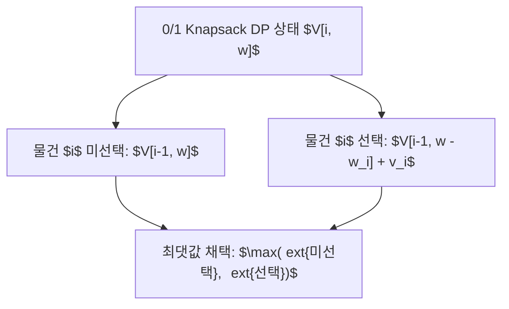

> [!abstract] 핵심 요약
> **동적 계획법(Dynamic Programming)**은 작은 부분 문제의 해를 테이블에 저장(Memoization / Tabulation)하여 동일한 연산의 반복을 원천 차단하는 핵심 최적화 알고리즘이다.
> **0/1 Knapsack**과 **LCS**, **Floyd-Warshall**은 모두 최적성의 원리(Bellman's Principle of Optimality)를 만족하며, 지수 시간 완전 탐색을 다항식/의사 다항식 시간으로 극적으로 압축한다.

---

## 1. 0/1 배낭 문제(Knapsack) 점화식

$$V[i, w] = egin{cases} V[i-1, w], & 	ext{if } w_i > w \ \max(V[i-1, w], \; V[i-1, w - w_i] + v_i), & 	ext{if } w_i \le w \end{cases}$$



---

## 2. Floyd-Warshall 모든 쌍 최단 경로 점화식

$$D^{(k)}[i, j] = \min \left( D^{(k-1)}[i, j], \; D^{(k-1)}[i, k] + D^{(k-1)}[k, j] 
ight) \quad (k=1,\dots,V)$$

시간 복잡도: $\Theta(V^3)$, 공간 복잡도: $\Theta(V^2)$

---

## 3. 실시간 0/1 배낭 DP 테이블 계산기

```html preview
<div style="font-family:system-ui,-apple-system,sans-serif;padding:20px;background:var(--card);color:var(--card-foreground);border:1px solid var(--border);border-radius:var(--radius)">
  <div style="font-size:16px;font-weight:700;margin-bottom:14px;color:var(--primary);display:flex;align-items:center;gap:8px">
    <span>🎒 0/1 Knapsack 최대 가치 DP 계산기</span>
  </div>

  <div style="display:grid;grid-template-columns:1fr 1fr;gap:12px;margin-bottom:14px">
    <div>
      <label style="font-size:11px;color:var(--muted-foreground)">배낭 용량 (W):</label>
      <input id="inCap" type="number" value="10" min="1" max="50" style="width:100%;padding:4px;background:var(--background);color:var(--foreground);border:1px solid var(--border);border-radius:var(--radius);font-weight:700" />
    </div>
    <div>
      <label style="font-size:11px;color:var(--muted-foreground)">아이템 3개 [무게, 가치]:</label>
      <div style="font-size:11px;color:var(--primary);margin-top:6px">[3kg, 12$], [4kg, 16$], [5kg, 22$]</div>
    </div>
  </div>

  <div style="padding:12px;background:var(--background);border:1px solid var(--border);border-radius:var(--radius)">
    <div style="font-size:11px;font-weight:700;color:var(--muted-foreground);margin-bottom:4px">최대 가치 결과</div>
    <div id="knapResultOut" style="font-family:monospace;font-size:16px;font-weight:800;color:var(--primary)">
      용량 10kg 시 최대 가치: 44$ (물건 2, 3 선택)
    </div>
  </div>

  <script>
    function updateKnap() {
      var W = parseInt(document.getElementById('inCap').value) || 10;
      var wt = [3, 4, 5];
      var val = [12, 16, 22];
      var n = 3;
      var dp = Array(W + 1).fill(0);
      for (var i = 0; i < n; i++) {
        for (var w = W; w >= wt[i]; w--) {
          dp[w] = Math.max(dp[w], dp[w - wt[i]] + val[i]);
        }
      }
      document.getElementById('knapResultOut').textContent = "용량 " + W + "kg 시 최대 가치: " + dp[W] + "$";
    }
    document.getElementById('inCap').addEventListener('input', updateKnap);
    updateKnap();
  </script>
</div>
```
