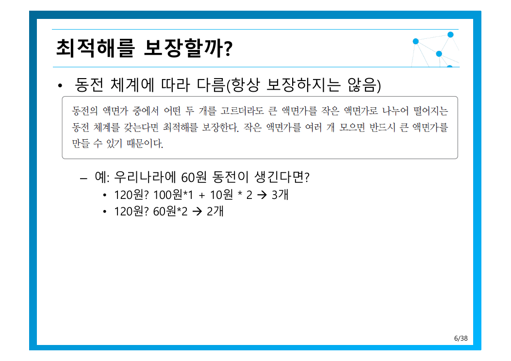
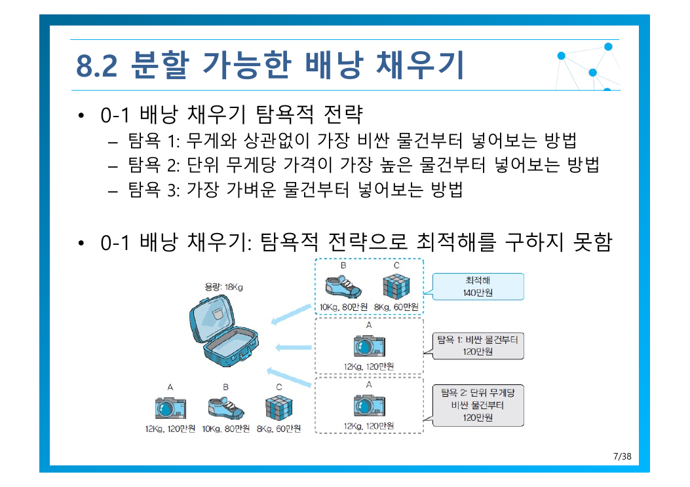
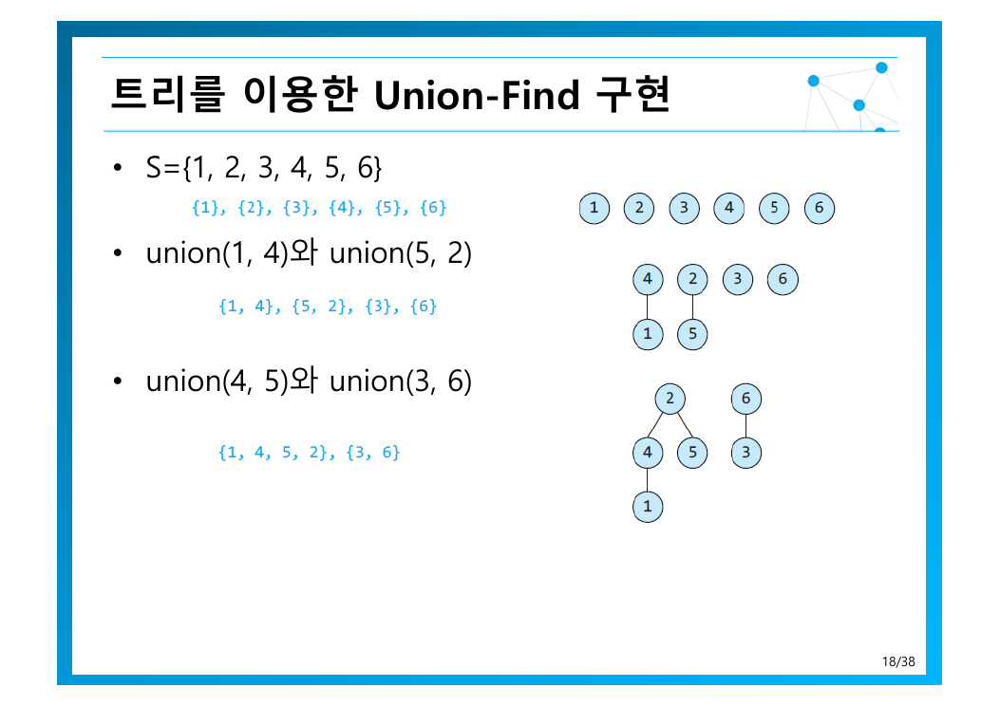

> [!abstract] 이 장은 기법이 아니라 재판이다
> 탐욕적 기법 자체는 한 줄이면 끝난다 — *어떤 결정을 해야 할 때마다 “그 순간에 최적”이라고 생각되는 것을 선택*. 원본은 이를 “**근시안적**” 알고리즘이라 부른다(3쪽).
> 그래서 이 장의 분량 대부분은 기법이 아니라 **검증**에 쓰인다. 원본이 곰바로 붙인 단서가 이 장의 주제다 — ***최적의 해답을 주는지 검증해야 함***.

---

## 1. 탐욕이 통하는 두 상황

원본 3쪽은 탐욕을 쓰는 경우를 둘로 구분한다. 이 구분이 중요하다.

| 상황 | 의미 | 예 |
| --- | --- | --- |
| ① **항상 최적해를 구할 수 있는 문제** | 증명이 있다 — 탐욕이 곳 정답 | MST, Dijkstra, 허프만, 분할 가능 배낭 |
| ② **최적해를 구하는 것이 현실적으로 불가능한 경우** | 타협책으로 쓴다 | [9장 분기 한정](./09.%20%EB%B0%B1%ED%8A%B8%EB%9E%98%ED%82%B9%EA%B3%BC%20%EB%B6%84%EA%B8%B0%20%ED%95%9C%EC%A0%95.md)의 한계값 추정 |

②가 [1장에서 본 “근사 알고리즘의 세 번째 상황”](./01.%20%EC%95%8C%EA%B3%A0%EB%A6%AC%EC%A6%98%EC%9D%98%20%EA%B0%9C%EC%9A%94%EC%99%80%20%EB%AC%B8%EC%A0%9C%20%ED%95%B4%EA%B2%B0%20%ED%94%84%EB%A0%88%EC%9E%84%EC%9B%8C%ED%81%AC.md)과 정확히 연결된다 — 정확한 답을 포기하는 것이 아니라, **정확한 답을 더 빨리 찾기 위한 중간 도구**로 탐욕을 쓴다.

---

## 2. 거스름돈 — 탐욕이 깨지는 지점을 직접 보기

원본 4쪽은 우리나라 동전으로 세 예를 든다.

| 거스름돈 | 탐욕적 지불 | 개수 |
| --- | --- | --- |
| 620원 | 500 + 100 + 10×2 | 4개 |
| 345원 | 100×3 + 10×4 + 5 | 8개 |
| 572원 | 500 + 50 + 10×2 + 1×2 | 6개 |

모두 최적이다. 그런데 원본은 바로 조건을 붙인다 — *현재까지는 최적해. **만약 60원 동전이 생긴다면?***



120원을 거스름하려면:

- 탐욕(큰 것부터): 100 + 10 + 10 → **3개**
- 최적: 60 + 60 → **2개**

동전 하나를 추가했을 뿐인데 전략이 무너졌다. 직접 동전 체계를 바꿔가며 언제 깨지는지 확인해 보라.

```html preview h=500px
<div style="font-family:system-ui,-apple-system,sans-serif;padding:20px;color:var(--foreground)">
  <div style="display:flex;gap:8px;flex-wrap:wrap;margin-bottom:14px">
    <button class="gpre" data-d="500,100,50,10,5,1">현행 한국 동전</button>
    <button class="gpre" data-d="500,100,60,50,10,5,1">+ 60원 동전 (원본 6쪽)</button>
    <button class="gpre" data-d="1,7,15">1, 7, 15</button>
    <button class="gpre" data-d="1,10,12,25">1, 10, 12, 25</button>
  </div>
  <div style="font-size:12.5px;color:var(--muted-foreground);margin-bottom:10px">
    동전 체계: <b id="gden" style="color:var(--foreground)"></b>
  </div>
  <div style="font-size:12.5px;font-weight:600;margin-bottom:6px">1~<span id="gmax">130</span>원에서 탐욕과 최적이 달라지는 금액</div>
  <div id="gcells" style="display:flex;flex-wrap:wrap;gap:2px;margin-bottom:14px"></div>
  <div id="gsum" style="padding:11px 13px;background:var(--card);border:1px solid var(--border);border-radius:var(--radius);font-size:13px;line-height:1.7"></div>

  <style>
    .gpre{padding:7px 12px;font-size:12px;cursor:pointer;background:var(--card);
      color:var(--foreground);border:1px solid var(--border);border-radius:var(--radius)}
    .gpre:hover{border-color:var(--primary);color:var(--primary)}
  </style>

  <script>
    var MAXV = 130;
    function analyse(den) {
      var sorted = den.slice().sort(function (a, b) { return b - a; });
      var INF = 1e9, dp = [0], bad = [], i, j;
      for (i = 1; i <= MAXV; i++) {
        dp[i] = INF;
        for (j = 0; j < den.length; j++) if (den[j] <= i) dp[i] = Math.min(dp[i], dp[i - den[j]] + 1);
      }
      var res = [];
      for (i = 1; i <= MAXV; i++) {
        var g = 0, rem = i;
        sorted.forEach(function (d) { while (rem >= d) { rem -= d; g++; } });
        var ok = (rem === 0 && g === dp[i]);
        res.push([i, ok ? 0 : (rem === 0 ? g - dp[i] : -1), g, dp[i]]);
        if (!ok) bad.push([i, g, dp[i]]);
      }
      return { res: res, bad: bad };
    }
    function render(den) {
      document.getElementById('gden').textContent = den.join(', ') + '원';
      document.getElementById('gmax').textContent = MAXV;
      var a = analyse(den);
      document.getElementById('gcells').innerHTML = a.res.map(function (r) {
        var bg = r[1] === 0 ? 'var(--chart-2)' : 'var(--chart-5)';
        return '<span title="' + r[0] + '원: 탐욕 ' + r[2] + '개 / 최적 ' + r[3] + '개" ' +
          'style="width:9px;height:16px;border-radius:2px;background:' + bg + '"></span>';
      }).join('');
      var b = a.bad;
      document.getElementById('gsum').innerHTML = b.length === 0
        ? '<b style="color:var(--chart-2)">반례 없음</b> — 1~' + MAXV + '원 전구간에서 탐욕이 최적과 일치한다. ' +
          '<span style="color:var(--muted-foreground)">이 동전 체계는 탐욕적 선택이 안전하다(적어도 이 범위에서는).</span>'
        : '<b style="color:var(--chart-5)">반례 ' + b.length + '건 발견</b> — 가장 작은 반례는 <b>' + b[0][0] +
          '원</b>: 탐욕 <b>' + b[0][1] + '개</b> vs 최적 <b style="color:var(--chart-2)">' + b[0][2] + '개</b>.<br>' +
          '<span style="color:var(--muted-foreground)">붉은 칸이 탐욕이 지는 금액이다. 동전 하나를 추가하는 것만으로 전략의 정당성이 사라진다 — ' +
          '그래서 <b>탐욕은 반드시 증명이 필요하다</b>.</span>';
    }
    Array.prototype.forEach.call(document.querySelectorAll('.gpre'), function (b) {
      b.onclick = function () { render(b.getAttribute('data-d').split(',').map(Number)); };
    });
    render([500, 100, 50, 10, 5, 1]);
  </script>
</div>
```

항상 최적해를 구하려면 둘 중 하나다(4쪽) — 완전 탐색(지수함수) 또는 [동적 계획법 $O(nA)$](./07.%20%EB%8F%99%EC%A0%81%20%EA%B3%84%ED%9A%8D%EB%B2%95.md). 반면 탐욕은 $O(n)$ 이다(5쪽). **속도를 얻는 대신 정답 보장을 내준 거래**이며, 그 거래가 성립하는지는 문제마다 따지야 한다.

---

## 3. 배낭 — 분할할 수 있으면 탐욕이 산다

원본 7쪽은 0-1 배낭에 탐욕 세 가지를 시도해 본다.



| 전략 | 기준 |
| --- | --- |
| 탐욕 1 | 무게와 상관없이 **가장 비싼** 물건부터 |
| 탐욕 2 | **단위 무게당 가격이 가장 높은** 물건부터 |
| 탐욕 3 | **가장 가벼운** 물건부터 |

결론은 단호하다 — **0-1 배낭 채우기는 탐욕적 전략으로 최적해를 구하지 못한다**. 세 가지 중 어느 것도 안 된다.

이유는 **쪼개서 넣을 수 없다**는 제약 때문이다. 단위 가격이 가장 높은 물건을 넣었는데 남은 공간이 애매하게 남으면 그 공간이 버려진다. 앞의 선택이 뒤의 선택을 망가뜨리는 것이다.

그런데 제약 하나를 푸는 순간 상황이 바뀐다(8쪽) — ***물건들은 분할해서 일부분만을 넣을 수도 있다***.

이제 탐욕 2가 **항상 최적해를 구한다**(9쪽). 남은 공간이 애매해도 버려지지 않고 그만큼 채우면 되므로, **배낭은 항상 가득 차고 단위 가치가 높은 것만 들어있는** 상태가 보장된다. 복잡도는 정렬에 좌우되어 $O(n\log_2 n)$.

> [!important] 문제를 바꾸면 기법이 바뀜다
> 0-1 배낭과 분할 가능 배낭은 문제 설명이 한 줄 다를 뿐인데 **필요한 기법과 복잡도가 완전히 갈라진다**.
>
> | | 0-1 배낭 | 분할 가능 배낭 |
> | --- | --- | --- |
> | 탐욕 | 실패 | **성공** |
> | 필요 기법 | [DP $O(nW)$](./07.%20%EB%8F%99%EC%A0%81%20%EA%B3%84%ED%9A%8D%EB%B2%95.md) | 정렬 $O(n\log n)$ |

---

## 4. 탐욕이 증명적으로 올바른 네 사례

### 4.1 최소비용 신장트리 — 같은 답을 두 가지 탐욕으로

신장트리는 *그래프 내의 모든 정점을 포함하는 트리*이고, MST는 *간선들의 비용을 최소화*하는 것이다(10쪽). 흥미로운 것은 **서로 다른 두 탐욕이 모두 정답에 도달한다**는 점이다.

| | Prim | Kruskal |
| --- | --- | --- |
| 탐욕 기준 | 현재 트리에 **인접한** 정점 중 가장 싼 것 | 전체 간선 중 가장 싼 것 |
| 자라는 모양 | 하나의 덩어리가 불어난다 | 여러 조각이 생겼다 합쳐진다 |
| 주의할 점 | — | **사이클이 생기면 그 간선을 버린다** |
| 복잡도 | $O(n^2)$ | 인접행렬 $O(n^2 + e\log_2 e)$ · 인접리스트 $O(e\log_2 e)$ |

Kruskal의 사이클 검사가 이 절의 기술적 핵심이다. 원본은 문제를 정확히 규정한다(18쪽) — *이미 다른 경로를 통해 연결된 정점들 사이의 간선인 경우*. 해결책은 **서로소 부분집합과 Union-Find**다.



- `find(x)` — 원소 $x$가 속한 집합, 보통은 **대표원소**를 반환
- `union(x, y)` — 두 집합을 하나로 뭉침

간선 $(u, v)$ 를 넣기 전에 `find(u) == find(v)` 를 확인하면 된다 — 같은 대표원소를 가졌다면 이미 연결된 것이므로 사이클이 생긴다. 자료구조 하나가 알고리즘을 성립시키는 사례다.

### 4.2 Dijkstra — 확정된 것은 다시 보지 않는다

탐욕 기준은 이렇다(22쪽) — *최단거리가 **확정된** 정점들과 간선으로 직접 연결된 정점들 중에서 가장 가까운 정점을 선택*.

핵심은 갱신 규칙이다(23쪽).

$$
\text{dist}[w] \leftarrow \min\bigl(\text{dist}[w],\; \text{dist}[v] + \text{weight}[v][w]\bigr)
$$

원본 24~31쪽은 같은 그래프를 여덟 장에 걸쳐 단계별로 보여준다. 거리 변화를 따라가면 탐욕의 작동 방식이 보인다.

| 단계 | v5 | v4 | v3 | v2 |
| --- | --- | --- | --- | --- |
| 초기 (v1 직결) | **1** | 6 | 4 | 7 |
| v5 확정 후 — v5를 거쳐 v4로 | — | **2** | 4 | 7 |
| v4 확정 후 — v4를 거쳐 v2로 | — | — | **4** | **5** |

v2의 거리가 7 → 5로 줄어든다. 직접 가는 간선(7)보다 **v5→v4를 돌아가는 경로(1+1+3 = 5)가 더 짧기** 때문이다. 탐욕이라고 해서 직선으로만 가는 것이 아니며, **이미 확정된 정보로 다음 후보를 계속 갱신**한다. 복잡도는 $O(n^2)$(33쪽).

> [!note] 플로이드와의 분담
> [7장의 플로이드](./07.%20%EB%8F%99%EC%A0%81%20%EA%B3%84%ED%9A%8D%EB%B2%95.md)는 **모든 정점 쌍**을 $O(n^3)$ 에 구하고, Dijkstra는 **한 정점에서 모든 정점**을 $O(n^2)$ 에 구한다. 모든 정점을 시작점으로 Dijkstra를 $n$번 돌려도 $O(n^3)$ 이므로 같아진다 — 무엇을 원하느냐에 따라 고르면 된다.

### 4.3 허프만 코드 — 자주 쓰는 것을 짧게

고정 길이 코드는 모든 문자에 같은 비트 수를 쓴다. 허프만은 **빈도수가 높은 문자에 짧은 코드**를 준다(34쪽).

가변 길이가 되면 문제가 생긴다 — 어디서 끊어 읽을까? 해답은 **접두어 없는(prefix-free) 코드**다(35쪽). 어느 코드도 다른 코드의 앞부분이 아니면, *비트열을 왼쪽에서 오른쪽으로 조사할 때 정확히 하나의 코드만 일치*한다.

허프만 트리의 탐욕은 단순하다(36쪽) — *트리 중에서 루트의 값이 가장 작은 두 트리를 선택*해 합치는 것을 반복한다. 빈도가 낮은 문자가 먼저 묶여 트리 깊은 곳으로 밀려나고, 그만큼 긴 코드를 받는다.

---

## 정리 — 탐욕 판정 표

| 문제 | 탐욕이 최적인가 | 근거 |
| --- | --- | --- |
| 거스름돈 (한국 동전) | ✅ | 동전 체계가 맞아떨어질 때만 |
| 거스름돈 (60원 추가) | ❌ | 120원 반례 |
| 0-1 배낭 | ❌ | 세 가지 탐욕 모두 실패 → [7장 DP](./07.%20%EB%8F%99%EC%A0%81%20%EA%B3%84%ED%9A%8D%EB%B2%95.md) |
| 분할 가능 배낭 | ✅ | 남은 공간이 버려지지 않음 |
| MST (Prim / Kruskal) | ✅ | 증명 — 원본 심화학습 333~334쪽 |
| Dijkstra | ✅ | 증명 — 원본 심화학습 351쪽 |
| 허프만 코드 | ✅ | 접두어 없는 최적 코드 |

> [!tip] 세 문장 요약
>
> 1. **탐욕은 기법이 아니라 가설이다.** 무조건 증명하거나 반례를 찾아야 한다 — 60원 동전 하나로 전략이 무너졌다.
> 2. **문제의 제약이 탐욕의 성부를 가른다.** 쪼개지만 못하면 실패하고, 쪼개질 수 있으면 성공한다.
> 3. **성공하는 곳에서는 압도적으로 빠르다.** 거스름돈 $O(nA) \to O(n)$, 배낭 $O(nW) \to O(n\log n)$.

다음 장은 탐욕이 실패하고 DP도 안 되는 문제들로 돌아간다 — [백트래킹과 분기 한정](./09.%20%EB%B0%B1%ED%8A%B8%EB%9E%98%ED%82%B9%EA%B3%BC%20%EB%B6%84%EA%B8%B0%20%ED%95%9C%EC%A0%95.md). 거기서 탐욕은 최종 답이 아니라 **가지를 쳐내는 한계값**으로 다시 등장한다 — 3쪽이 예고한 바로 그 용법이다.

---

### 근거 자료

강의 원본 `08장-탐욕적기법-수정판.pdf` (39쪽)에 근거한다. 인용 슬라이드는 6쪽(60원 동전 반례), 7쪽(배낭 세 탐욕), 19쪽(Union-Find)이다. 탐욕 판정기는 원본 4·6쪽의 동전 체계를 프리셋으로 쓰며, 120원에서 탐욕 3개 · 최적 2개라는 원본의 반례를 그대로 재현한다. Dijkstra 거리 표는 24~31쪽의 단계별 값(v5 1, v4 6→2, v3 4, v2 7→5)을 옮긴 것이다.
