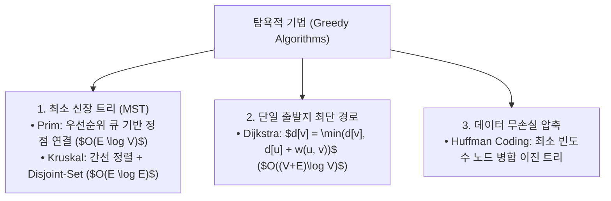

> [!abstract] 핵심 요약
> **탐욕적 기법(Greedy Approach)**이 최적해를 보장하기 위해서는 **탐욕적 선택 속성(Greedy Choice Property)**과 **최적 부분 구조(Optimal Substructure)**를 반드시 만족해야 한다.
> MST 구축에서 **Prim**은 정점 중심 확장을, **Kruskal**은 간선 가중치 정렬과 사이클 검사(Union-Find)를 수행하며, **허프만 코딩**은 접두부 부호(Prefix Code) 트리로 최적의 비트 압축을 달성한다.

---

## 1. 탐욕 알고리즘 패밀리 구조



---

## 2. 크루스칼 vs 프림 MST 알고리즘 비교

| 알고리즘 | 탐욕 기준 | 핵심 자료구조 | 시간 복잡도 | 최적 적용 환경 |
| :-- | :-- | :-- | :--: | :-- |
| **Prim** | 현재 트리에 인접한 간선 중 최소 가중치 정점 추가 | 이진 힙 / 우선순위 큐 | $O(E \log V)$ | 밀집 그래프 (Dense Graph $E pprox V^2$) |
| **Kruskal** | 사이클을 형성하지 않는 최소 가중치 간선 순차 추가 | **Union-Find (서로소 집합)** | $O(E \log E)$ | 희소 그래프 (Sparse Graph $E \ll V^2$) |

---

## 3. 실시간 허프만 압축률 계산기

```html preview
<div style="font-family:system-ui,-apple-system,sans-serif;padding:20px;background:var(--card);color:var(--card-foreground);border:1px solid var(--border);border-radius:var(--radius)">
  <div style="font-size:16px;font-weight:700;margin-bottom:14px;color:var(--primary);display:flex;align-items:center;gap:8px">
    <span>📊 허프만(Huffman) 가변 길이 압축률 계산기</span>
  </div>

  <div style="margin-bottom:14px">
    <label style="font-size:11px;color:var(--muted-foreground)">문자별 출현 빈도수 (A: 45%, B: 13%, C: 12%, D: 16%, E: 9%, F: 5%):</label>
    <div style="font-size:12px;color:var(--foreground);padding:6px;background:var(--background);border:1px solid var(--border);border-radius:var(--radius)">
      고정 길이 (3비트/문자) vs 허프만 가변 부호 (A: 0, B: 101, C: 100, D: 111, E: 1101, F: 1100)
    </div>
  </div>

  <div style="display:grid;grid-template-columns:1fr 1fr;gap:12px;margin-bottom:12px">
    <div style="padding:10px;background:var(--background);border:1px solid var(--border);border-radius:var(--radius);text-align:center">
      <div style="font-size:10px;color:var(--muted-foreground)">평균 비트 수 / 문자</div>
      <div id="huffmanBitOut" style="font-family:monospace;font-size:18px;font-weight:800;color:var(--primary);margin-top:2px">2.24 비트</div>
    </div>
    <div style="padding:10px;background:var(--background);border:1px solid var(--border);border-radius:var(--radius);text-align:center">
      <div style="font-size:10px;color:var(--muted-foreground)">압축 절감률 (vs 3비트)</div>
      <div id="huffmanSaveOut" style="font-family:monospace;font-size:18px;font-weight:800;color:var(--chart-1);margin-top:2px">25.3% 절감</div>
    </div>
  </div>
</div>
```
