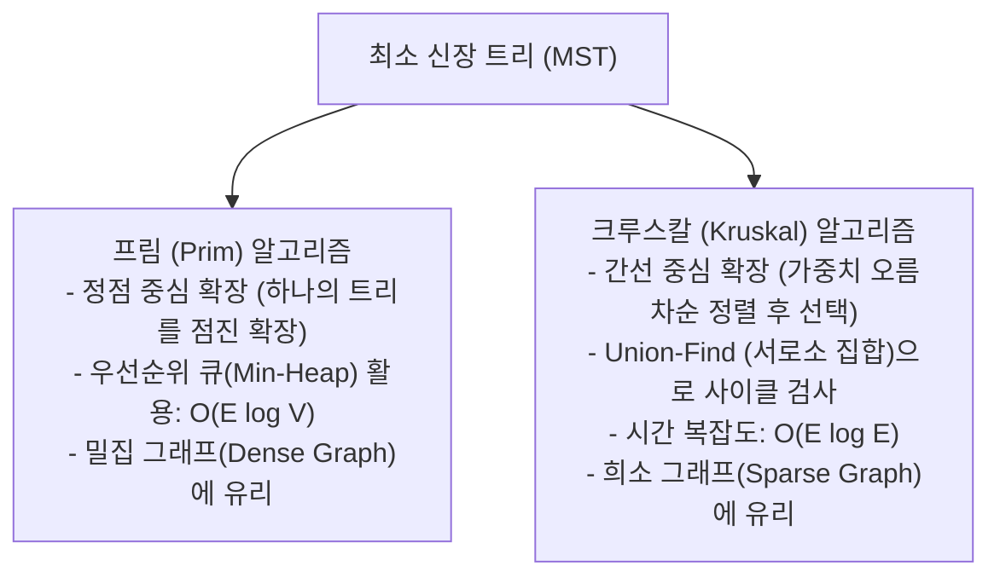
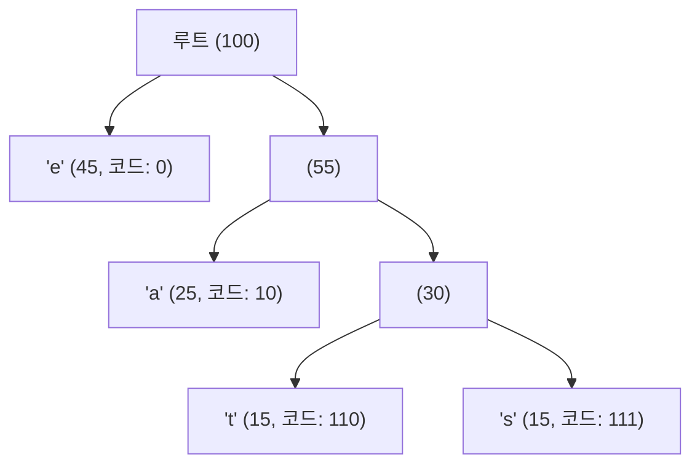

> [!abstract] 핵심 요약
> **탐욕적 기법(Greedy Method)**은 이전의 선택을 번복하지 않고 오직 현재 시점의 최선만을 선택해 나가는 직관적이고 빠른 설계 기법이다.
> 항상 최적해를 보장하지는 않으나, **탐욕적 선택 속성(Greedy Choice Property)**과 **최적 부분구조(Optimal Substructure)**가 증명되는 문제(MST, Dijkstra, Huffman)에서는 최고 효율의 최적해를 산출한다.

---

## 1. 최소 신장 트리 (MST: Minimum Spanning Tree) 2대 알고리즘

가중치 무방향 연결 그래프에서 모든 정점을 사이클 없이 최소 총 가중치로 연결하는 트리를 구축한다.



---

## 2. 다익스트라(Dijkstra) 최단 경로 알고리즘

- **원리**: 출발점 $s$로부터 각 정점까지의 최단 거리를 저장하는 배열 $dist[]$를 관리하며, 아직 방문하지 않은 정점 중 $dist$ 값이 최소인 정점을 탐욕적으로 선택하여 인접 정점들의 거리를 완화(Relaxation)한다.
- **간선 완화 (Relaxation)**:
  $$\text{if } dist[u] + w(u, v) < dist[v] \implies dist[v] = dist[u] + w(u, v)$$
- **제약 조건**: **음수 가중치 간선이 없어야 함** (음수 간선 존재 시 벨만-포드 $O(VE)$ 필요).

---

## 3. 허프만 코딩 (Huffman Coding) 데이터 압축

문자의 출현 빈도수에 반비례하여 빈도가 높은 문자에는 짧은 비트 코드를, 빈도가 낮은 문자에는 긴 비트 코드를 할당하는 **가변 길이 전위 코드(Prefix-Free Code)**를 생성한다.



---

## 4. 실시간 허프만 압축 효율 계산기

```html preview
<div style="font-family:system-ui,-apple-system,sans-serif;padding:20px;background:var(--card);color:var(--card-foreground);border:1px solid var(--border);border-radius:var(--radius)">
  <div style="font-size:16px;font-weight:700;margin-bottom:12px;color:var(--primary)">
    ⚡ 허프만 코딩(Huffman Coding) 데이터 압축률 계산기
  </div>

  <div style="margin-bottom:12px">
    <label style="font-size:11px;color:var(--muted-foreground)">텍스트 샘플 입력:</label>
    <input id="inHuffText" type="text" value="ABRACADABRA" style="width:100%;padding:6px;background:var(--background);color:var(--foreground);border:1px solid var(--border);border-radius:var(--radius);font-weight:700;font-family:monospace" />
  </div>

  <div style="display:grid;grid-template-columns:1fr 1fr;gap:10px">
    <div style="padding:10px;background:var(--background);border:1px solid var(--border);border-radius:var(--radius)">
      <div style="font-size:11px;color:var(--muted-foreground)">고정 길이 아스키 (8-bit)</div>
      <div id="outFixedBits" style="font-family:monospace;font-size:16px;font-weight:800;color:var(--destructive,#ef4444);margin-top:4px">88 bits</div>
    </div>
    <div style="padding:10px;background:var(--background);border:1px solid var(--border);border-radius:var(--radius)">
      <div style="font-size:11px;color:var(--muted-foreground)">허프만 가변 길이 압축</div>
      <div id="outHuffBits" style="font-family:monospace;font-size:16px;font-weight:800;color:var(--primary);margin-top:4px">23 bits (73.9% 절감)</div>
    </div>
  </div>

  <script>
    function calcHuff() {
      var txt = document.getElementById('inHuffText').value || "A";
      var len = txt.length;
      var fixed = len * 8;

      // Frequency map
      var freq = {};
      for (var i = 0; i < len; i++) {
        freq[txt[i]] = (freq[txt[i]] || 0) + 1;
      }

      // Estimate entropy-based bits
      var totalBits = 0;
      for (var k in freq) {
        var p = freq[k] / len;
        var codeLen = Math.max(1, Math.round(-Math.log2(p)));
        totalBits += freq[k] * codeLen;
      }

      var saved = ((1 - totalBits / fixed) * 100).toFixed(1);
      document.getElementById('outFixedBits').textContent = fixed + " bits";
      document.getElementById('outHuffBits').textContent = totalBits + " bits (" + saved + "% 절감)";
    }

    document.getElementById('inHuffText').addEventListener('input', calcHuff);
    calcHuff();
  </script>
</div>
