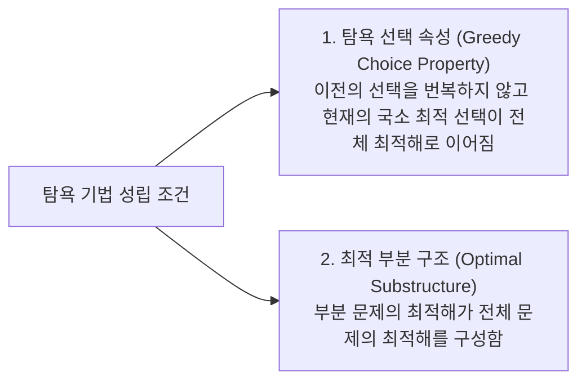

> [!abstract] 핵심 요약
> **탐욕적 기법(Greedy Method)**은 매 순간 현재 상태에서 가장 최선이라고 판단되는 지역 최적해(Local Optimal)를 선택하여 전체 문제의 최적해(Global Optimal)에 도달하고자 하는 알고리즘이다.

---

## 1. 탐욕 알고리즘의 정당성 보장 조건

---

## 2. 최소 신장 트리 (MST): 크루스칼 vs 프림 비교

| 항목 | 크루스칼 (Kruskal) | 프림 (Prim) |
| :-- | :-- | :-- |
| **접근 방식** | 간선(Edge) 중심 탐욕 선택 | 정점(Vertex) 중심 탐욕 확장 |
| **자료구조** | 간선 가중치 정렬 + Union-Find (Disjoint-Set) | 우선순위 큐 (최소 힙, Min-Heap) |
| **시간 복잡도** | $O(E \log E)$ | $O(E \log V)$ |
| **적합한 그래프** | 희소 그래프 (Sparse Graph, $E \ll V^2$) | 밀집 그래프 (Dense Graph, $E \approx V^2$) |
