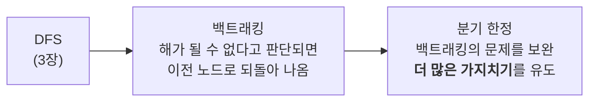
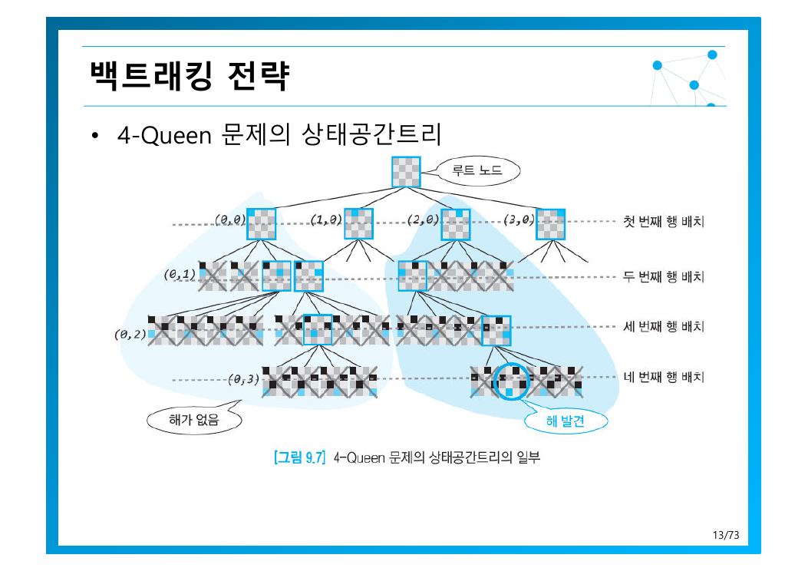
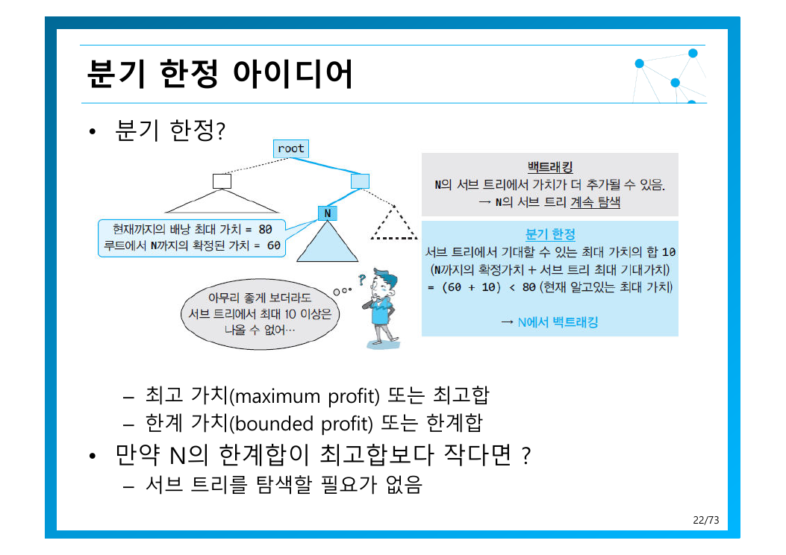
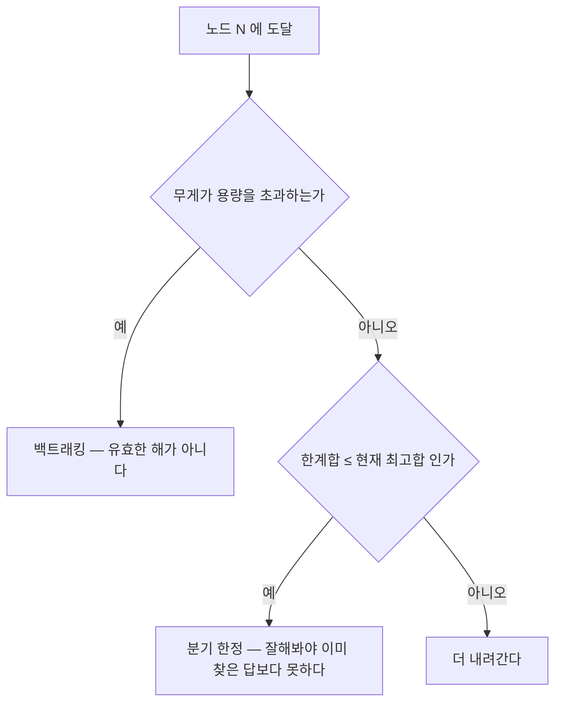

> [!abstract] 끝까지 가지 않기
> [3장의 완전 탐색](./03.%20%EC%96%B5%EC%A7%80%20%EA%B8%B0%EB%B2%95%EA%B3%BC%20%EC%99%84%EC%A0%84%20%ED%83%90%EC%83%89.md)은 상태공간트리의 **모든 단말 노드**를 검사했다. 이 장은 같은 트리를 걸으되, **가망 없는 가지를 만나면 즉시 되돌아온다**.
> 놓치기 쉬운 사실 하나 — **최악 복잡도는 여전히 지수**다. 가지치기는 복잡도 클래스를 바꾸지 못한다. 그럼에도 이 장을 배우는 이유는 **실제 탐색량이 수천 배 줄어들기 때문**이다. 아래에서 직접 재어 본다.

---

## 1. 두 기법의 관계

원본 3쪽은 백트래킹을 1950년대 미국 수학자 **레머(D.H. Lehmer)**에게 돌리며, 모통을 명확히 한다.



차이는 **언제 잘라내느냐**의 기준이다.

| | 백트래킹 | 분기 한정 |
| --- | --- | --- |
| 자르는 기준 | 이 가지는 **유효한 해가 될 수 없다** | 이 가지의 **최선이 현재 최고보다 못하다** |
| 필요한 것 | 제약 검사 | **한계값 추정 함수** |
| 어디 쓰나 | 해를 찾는 문제 (N-Queen, 미로) | 최적화 문제 (배낭, 일 배정) |

분기 한정이 쓰는 한계값은 보통 [8장의 탐욕적 기법](./08.%20%ED%83%90%EC%9A%95%EC%A0%81%20%EA%B8%B0%EB%B2%95.md)으로 빨리 계산한다 — 8장 3쪽이 *최적해를 구하는 것이 현실적으로 불가능한 경우 탐욕을 쓴다*고 한 그 용법이다.

---

## 2. 백트래킹 조건을 세우는 연습

9.1~9.4절은 같은 질문을 문제마다 다시 던진다 — **언제 되돌아갈 것인가?**

| 문제 | 백트래킹 조건 | 탐색 공간 |
| --- | --- | --- |
| 순열 생성 | 이미 쓴 숫자를 또 쓰려 할 때 | $O(n \cdot n!)$ |
| 합이 $M$인 부분집합 | 합이 $M$이 되었거나 **$M$을 초과**했을 때 | $O(2^n)$ |
| 미로 탐색 | 위치가 유효하지 않거나 더 갈 칸이 없을 때 | — |
| N-Queen | 퀵을 놓을 수 있는 칸이 없을 때 | $O(n^n)$ |
| 그래프 색칠 | 인접 정점 중 같은 색이 있을 때 | $m^n$ |

부분집합 문제(7쪽)가 좋은 예다. $S = \{1,2,3,4\}$, $M = 5$ 일 때 답은 $\{1,4\}$ 와 $\{2,3\}$ 이다. 원본은 백트래킹 조건을 둘 주고, **추가 조건**을 하나 더 제안한다 — *남은 원소의 숫자 합 이용 → 더 많은 백트래킹 유도*.

즉 현재합 + 남은 원소의 합 $< M$ 이면, 아무리 더 가도 $M$에 도달할 수 없으므로 즉시 되돌아온다. **이것이 이미 분기 한정의 발상**이다 — 제약 위반이 아니라 *달성 가능성*을 보고 자른다.

---

## 3. N-Queen — 가지치기의 효과를 수치로

$N \times N$ 체스보드에 서로 공격할 수 없는 퀵 $N$개를 놓는 문제다. 원본 12쪽은 해의 개수를 직접 열거한다 — 8-Queen 총 **92개**, 7-Queen 40가지, 6-Queen 4가지, 5-Queen 10가지, 4-Queen 2가지.



직접 돌려 보면 백트래킹이 얼마나 걱러내는지 보인다.

```html preview h=560px
<div style="font-family:system-ui,-apple-system,sans-serif;padding:20px;color:var(--foreground)">
  <div style="display:flex;gap:8px;align-items:center;flex-wrap:wrap;margin-bottom:16px">
    <label for="nq" style="font-size:13px;font-weight:600">N = <span id="nqv" style="color:var(--chart-1);font-size:18px">6</span></label>
    <input id="nq" type="range" min="4" max="10" step="1" value="6" style="flex:1;min-width:180px;accent-color:var(--primary)" />
    <button id="nqnext" class="qbt">다른 해 보기 ▶</button>
  </div>
  <div style="display:flex;gap:20px;flex-wrap:wrap;align-items:flex-start">
    <div id="board"></div>
    <div style="flex:1;min-width:230px">
      <div id="nqstats"></div>
      <div id="nqbar" style="margin-top:14px"></div>
    </div>
  </div>
  <div id="nqnote" style="margin-top:15px;padding:11px 13px;background:var(--card);border:1px solid var(--border);border-radius:var(--radius);font-size:13px;line-height:1.7"></div>

  <style>
    .qbt{padding:7px 12px;font-size:12.5px;cursor:pointer;background:var(--card);
      color:var(--foreground);border:1px solid var(--border);border-radius:var(--radius)}
    .qbt:hover{border-color:var(--primary);color:var(--primary)}
  </style>

  <script>
    var cur = 0, sols = [];
    function solve(n) {
      var out = [], nodes = 0;
      function go(r, pos, cols, d1, d2) {
        nodes++;
        if (r === n) { if (out.length < 200) out.push(pos.slice()); return; }
        for (var c = 0; c < n; c++) {
          if (cols[c] || d1[r - c + n] || d2[r + c]) continue;
          cols[c] = d1[r - c + n] = d2[r + c] = 1;
          pos.push(c);
          go(r + 1, pos, cols, d1, d2);
          pos.pop();
          cols[c] = d1[r - c + n] = d2[r + c] = 0;
        }
      }
      go(0, [], {}, {}, {});
      return { sols: out, nodes: nodes };
    }
    function fmt(x) { return x < 1e9 ? Math.round(x).toLocaleString() : x.toExponential(2); }
    function render() {
      var n = +document.getElementById('nq').value;
      document.getElementById('nqv').textContent = n;
      var r = solve(n);
      sols = r.sols;
      if (cur >= sols.length) cur = 0;
      var s = sols[cur] || [];
      var cell = Math.max(22, Math.min(38, Math.floor(260 / n)));
      var html = '';
      for (var i = 0; i < n; i++) {
        for (var j = 0; j < n; j++) {
          var dark = (i + j) % 2 === 1;
          var q = s[i] === j;
          html += '<div style="width:' + cell + 'px;height:' + cell + 'px;display:inline-flex;' +
            'align-items:center;justify-content:center;font-size:' + Math.floor(cell * 0.6) + 'px;' +
            'background:' + (q ? 'var(--chart-1)' : (dark ? 'var(--border)' : 'var(--card)')) + '">' +
            (q ? '♛' : '') + '</div>';
        }
        html += '<br>';
      }
      document.getElementById('board').innerHTML = '<div style="line-height:0;border:1px solid var(--border);border-radius:var(--radius);overflow:hidden;display:inline-block">' + html + '</div>';
      var full = Math.pow(n, n);
      document.getElementById('nqstats').innerHTML =
        '<div style="font-size:13px;line-height:2">' +
        '해의 개수 &nbsp;<b style="color:var(--chart-2);font-size:16px">' + sols.length + '개</b>' +
        (sols.length ? ' <span style="color:var(--muted-foreground)">(' + (cur + 1) + '번째 표시 중)</span>' : '') + '<br>' +
        '백트래킹 탐색 노드 &nbsp;<b style="color:var(--chart-1)">' + fmt(r.nodes) + '개</b><br>' +
        '완전 탐색 공간 nⁿ &nbsp;<b style="color:var(--chart-5)">' + fmt(full) + '</b>' +
        '</div>';
      var ratio = full / r.nodes;
      document.getElementById('nqbar').innerHTML =
        '<div style="font-size:12.5px;color:var(--muted-foreground);margin-bottom:5px">탐색량 비율</div>' +
        '<div style="height:16px;background:var(--chart-5);border-radius:var(--radius);position:relative">' +
        '<div style="width:' + Math.max(0.4, r.nodes / full * 100) + '%;height:100%;background:var(--chart-1);border-radius:var(--radius)"></div>' +
        '</div>' +
        '<div style="font-size:12.5px;margin-top:6px">백트래킹은 완전 탐색의 <b style="color:var(--chart-1)">1/' + fmt(ratio) + '</b> 만 본다</div>';
      document.getElementById('nqnote').innerHTML =
        'N = ' + n + ' 에서 가지치기로 <b>' + fmt(ratio) + '배</b>의 탐색을 절약했다. ' +
        '<span style="color:var(--muted-foreground)">하지만 슬라이더를 오른쪽으로 밀면 노드 수 자체도 계속 늘어난다 — ' +
        '<b>가지치기는 상수를 줄일 뿐 지수를 다항식으로 바꾸지 못한다.</b> 이것이 10장의 주제다.</span>';
    }
    document.getElementById('nq').addEventListener('input', function () { cur = 0; render(); });
    document.getElementById('nqnext').onclick = function () { cur = (cur + 1) % Math.max(1, sols.length); render(); };
    render();
  </script>
</div>
```

위 수치가 이 장의 핵심을 요약한다.

| N | 해의 개수 (원본 12쪽) | 백트래킹 노드 | 완전 탐색 $n^n$ | 절감비 |
| --- | --- | --- | --- | --- |
| 4 | 2 | 17 | 256 | 15배 |
| 5 | 10 | 54 | 3,125 | 58배 |
| 6 | 4 | 153 | 46,656 | 305배 |
| 7 | 40 | 552 | 823,543 | 1,492배 |
| 8 | 92 | 2,057 | 16,777,216 | **8,156배** |

> [!warning] 절감비는 즐거운데, 그래도 지수다
> N이 늘면 절감비도 커지지만 **백트래킹 노드 수 자체도 지수적으로 증가**한다. 17 → 54 → 153 → 552 → 2,057은 대략 3.7배씩 늘고 있다.
> 가지치기는 **실용성을 크게 바꾸지만 복잡도 클래스를 바꾸지는 못한다**. 이 한계를 정면으로 다루는 것이 [10장](./10.%20NP-%EC%99%84%EC%A0%84%EC%84%B1%EA%B3%BC%20%EA%B7%BC%EC%82%AC%20%EC%95%8C%EA%B3%A0%EB%A6%AC%EC%A6%98.md)이다.

---

## 4. 분기 한정 — “이 가지의 최선이 지금보다 못하다”

[3장에서 완전 탐색으로 $O(2^n)$ 이었고](./03.%20%EC%96%B5%EC%A7%80%20%EA%B8%B0%EB%B2%95%EA%B3%BC%20%EC%99%84%EC%A0%84%20%ED%83%90%EC%83%89.md), [7장에서 DP로 $O(nW)$ 에 풀었던](./07.%20%EB%8F%99%EC%A0%81%20%EA%B3%84%ED%9A%8D%EB%B2%95.md) 0-1 배낭이 세 번째로 등장한다.

먼저 백트래킹 조건은 직관적이다(21쪽) — *노드의 무게 합이 이미 배낭 용량을 초과한 경우*. 더 넣을 수 없으니 되돌아온다.

그런데 이것만으로는 약하다. 용량을 넘지 않는 조합은 여전히 엄청나게 많기 때문이다. 여기서 분기 한정이 들어온다.



원본이 정의하는 두 값이 핵심이다(22쪽).

| 값 | 뜻 |
| --- | --- |
| **최고 가치** (maximum profit) · 최고합 | 지금까지 발견한 실제 해 중 가장 좋은 값 |
| **한계 가치** (bounded profit) · 한계합 | 이 노드에서 내려가면 아무리 잘해도 넘지 못하는 상한 |

가지치기 규칙은 한 줄이다 — ***만약 N의 한계합이 최고합보다 작다면 서브 트리를 탐색할 필요가 없음***.



한계합을 어떻게 계산하느냐가 성능을 결정한다(23쪽). 남은 용량을 **[8장의 분할 가능 배낭](./08.%20%ED%83%90%EC%9A%95%EC%A0%81%20%EA%B8%B0%EB%B2%95.md)처럼 쪼개서 채운다고 가정**하면 빠르게 상한을 얻는다. 실제로는 쪼거서 넣을 수 없으니 진짜 답은 반드시 이보다 작거나 같다 — **안전한 상한**이다.

> [!important] 여기서 탐욕이 다시 나온다
> [8장 3쪽이 예고한 “최적해를 구하는 것이 현실적으로 불가능한 경우”](./08.%20%ED%83%90%EC%9A%95%EC%A0%81%20%EA%B8%B0%EB%B2%95.md)가 바로 이것이다. 탐욕은 최종 답이 아니라 **가지를 쳐낼지 판단할 추정치**로 쓰인다.
> 한계값이 정밀할수록 가지가 많이 잘리지만 계산 비용이 올라간다. 이 균형을 맞추는 것이 분기 한정 설계의 전부다.

9.6절의 **최적우선 분기 한정**은 여기서 한 걸음 더 나간다 — DFS 순서를 버리고 **한계합이 가장 유망한 노드부터** 탐색한다. 좋은 답을 일찍 찾을수록 최고합이 높아지고, 그러면 더 많은 가지가 잘린다 — 선순환적으로 빨라지는 구조다. 이를 위해 [1장에서 본 우선순위 큐](./01.%20%EC%95%8C%EA%B3%A0%EB%A6%AC%EC%A6%98%EC%9D%98%20%EA%B0%9C%EC%9A%94%EC%99%80%20%EB%AC%B8%EC%A0%9C%20%ED%95%B4%EA%B2%B0%20%ED%94%84%EB%A0%88%EC%9E%84%EC%9B%8C%ED%81%AC.md)를 쓴다.

---

## 정리

> [!tip] 세 문장 요약
>
> 1. **백트래킹은 DFS에 “되돌아오기”를 더한 것**이다. 문제마다 할 일은 하나 — **언제 되돌아올지 조건을 정하는 것**.
> 2. **분기 한정은 한계값으로 더 많이 자른다.** 한계합 ≤ 최고합이면 그 가지는 볼 가치가 없다.
> 3. **그래도 최악은 지수다.** N-Queen에서 8,000배를 절약해도 노드 수는 여전히 지수적으로 늘어난다.

마지막 장은 이 모든 장이 피해 다니던 질문을 정면으로 마주한다 — **왜 어떤 문제들은 아무리 영리하게 풀어도 지수를 벗어나지 못하는가?** 그것이 [NP-완전성과 근사 알고리즘](./10.%20NP-%EC%99%84%EC%A0%84%EC%84%B1%EA%B3%BC%20%EA%B7%BC%EC%82%AC%20%EC%95%8C%EA%B3%A0%EB%A6%AC%EC%A6%98.md)이다.

---

### 근거 자료

강의 원본 `09장-백트래킹과분기한정-수정판-v2.pdf` (73쪽)에 근거한다. 인용 슬라이드는 13쪽(4-Queen 상태공간트리), 22쪽(분기 한정 아이디어)이다. N-Queen 인터렉티브의 해 개수는 원본 12쪽에 적힌 값(4:2, 5:10, 6:4, 7:40, 8:92)과 일치하며, 탐색 노드 수는 백트래킹을 직접 실행해 센 값이다.
