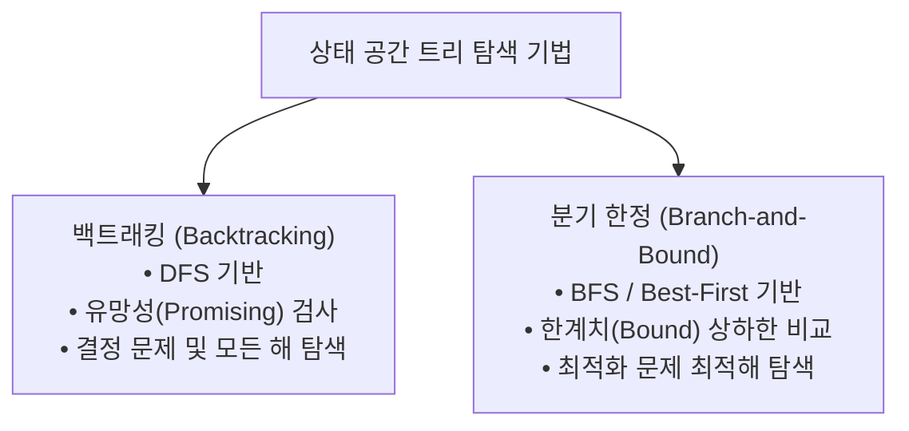

> [!abstract] 핵심 요약
> **백트래킹(Backtracking)**은 상태 공간 트리를 DFS로 탐색하면서 불가능한 경로(Non-promising)를 조기에 **가지치기(Pruning)**하는 기법이다. 
> **분기 한정(Branch-and-Bound)**은 최적화 문제에서 각 노드의 한계치(Bound)를 계산하여 최적해 가능성이 없는 하위 트리를 배제하는 BFS/최고 우선 탐색 기법이다.

---

## 1. 백트래킹 vs 분기 한정 비교

