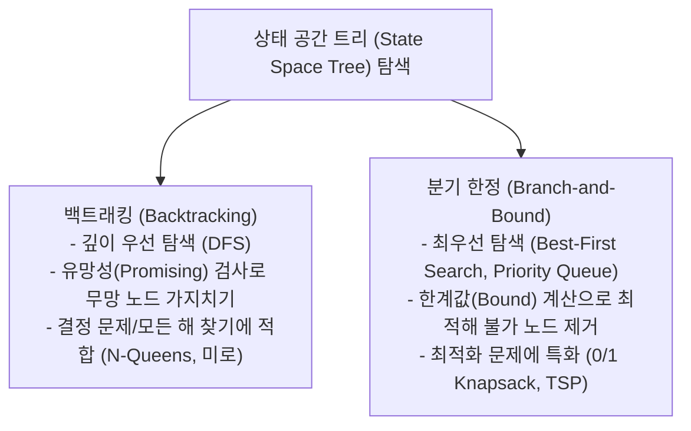

> [!abstract] 핵심 요약
> **백트래킹(Backtracking)**과 **분기 한정(Branch-and-Bound)**은 지수적 크기의 **상태 공간 트리(State Space Tree)**를 전수 조사하지 않고, 유망하지 않은 경로를 조기에 차단하는 **가지치기(Pruning)**를 통해 탐색 효율을 극대화하는 대표적 지능형 탐색 패러다임이다.

---

## 1. 백트래킹 vs 분기 한정 비교



---

## 2. N-Queens 문제와 백트래킹 조건

$N \times N$ 체스판에 $N$개의 퀸을 서로 공격할 수 없도록(같은 행, 같은 열, 같은 대각선 상에 위치하지 않도록) 배치하는 문제이다.

- **1차원 배열 상태 표현**: $col[i] = j$ ($i$번째 행의 퀸이 $j$번째 열에 위치)
- **유망성(Promising) 검사 수식**:
  $$\text{Promising}(k) \iff \forall i < k, \quad (col[i] \ne col[k]) \land (|col[i] - col[k]| \ne k - i)$$

---

## 3. 분기 한정(Branch-and-Bound)과 한계값(Bound) 계산

- **0/1 배낭 문제의 상한(Upper Bound) 계산**:
  현재 노드에서 남은 용량을 단위 무게당 가치($v_i / w_i$)가 높은 순서대로 **부분 배낭 문제(Fractional Knapsack)** 방식으로 가상으로 채워 이론적 최대 상한(Upper Bound)을 도출한다.
- **가지치기 규칙**: $\text{Upper Bound} \le \text{현재까지 발견된 최고 전역 가치(Best Value)}$이면 해당 서브트리 전체를 즉시 폐기($Prune$)한다.

---

## 4. 실시간 4-Queens 백트래킹 시각화 시뮬레이터

```html preview
<div style="font-family:system-ui,-apple-system,sans-serif;padding:20px;background:var(--card);color:var(--card-foreground);border:1px solid var(--border);border-radius:var(--radius)">
  <div style="font-size:16px;font-weight:700;margin-bottom:12px;color:var(--primary)">
    ⚡ 4-Queens 백트래킹 상태 공간 탐색 시뮬레이터
  </div>

  <div style="display:flex;gap:8px;margin-bottom:14px">
    <button onclick="stepNQueens(1)" style="padding:6px 12px;background:var(--primary);color:var(--primary-foreground);border:none;border-radius:var(--radius);font-weight:700;cursor:pointer">해 #1 보기 [1, 3, 0, 2]</button>
    <button onclick="stepNQueens(2)" style="padding:6px 12px;background:var(--secondary);color:var(--secondary-foreground);border:1px solid var(--border);border-radius:var(--radius);font-weight:700;cursor:pointer">해 #2 보기 [2, 0, 3, 1]</button>
  </div>

  <div id="boardGrid" style="display:grid;grid-template-columns:repeat(4, 40px);gap:4px;margin-bottom:12px"></div>

  <div id="nqStatus" style="font-size:13px;color:var(--foreground);padding:8px;background:var(--background);border:1px solid var(--border);border-radius:var(--radius)">
    퀸 배치: (0행 1열), (1행 3열), (2행 0열), (3행 2열) — 충돌 없음!
  </div>

  <script>
    function renderBoard(cols) {
      var grid = document.getElementById('boardGrid');
      grid.innerHTML = '';
      for (var r = 0; r < 4; r++) {
        for (var c = 0; c < 4; c++) {
          var cell = document.createElement('div');
          var isDark = (r + c) % 2 === 1;
          cell.style.cssText = "width:40px;height:40px;display:flex;align-items:center;justify-content:center;font-size:20px;font-weight:800;border-radius:4px;" +
            (isDark ? "background:var(--muted);" : "background:var(--background);border:1px solid var(--border);");
          if (cols[r] === c) {
            cell.innerHTML = "👑";
            cell.style.background = "var(--primary)";
            cell.style.color = "var(--primary-foreground)";
          }
          grid.appendChild(cell);
        }
      }
    }

    function stepNQueens(solIdx) {
      if (solIdx === 1) {
        renderBoard([1, 3, 0, 2]);
        document.getElementById('nqStatus').textContent = "해 #1: [1, 3, 0, 2] -> 4개 퀸이 가로/세로/대각선 충돌 없이 배치됨";
      } else {
        renderBoard([2, 0, 3, 1]);
        document.getElementById('nqStatus').textContent = "해 #2: [2, 0, 3, 1] -> 4개 퀸이 가로/세로/대각선 충돌 없이 배치됨";
      }
    }

    stepNQueens(1);
  </script>
</div>
