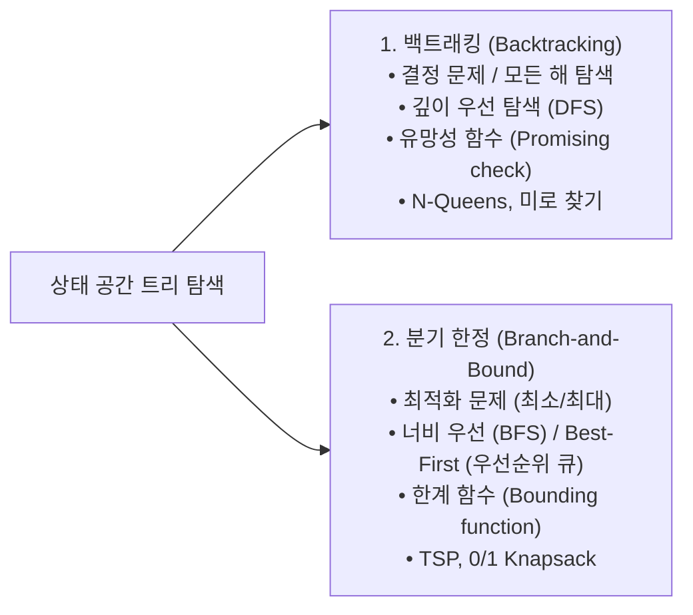

> [!abstract] 핵심 요약
> **백트래킹(Backtracking)**은 상태 공간 트리를 깊이 우선 탐색(DFS)하면서 유망성(Promising) 조건을 검사하여 조건에 위배되는 즉시 부모 노드로 되돌아가(Pruning) 탐색 시간을 획기적으로 줄인다.
> **분기 한정(Branch-and-Bound)**은 최적화 문제에서 각 노드의 가능한 최적치(Upper/Lower Bound)를 계산하여 현재까지 발견된 최선의 해보다 열등한 서브트리를 완전히 잘라낸다.

---

## 1. 백트래킹 vs 분기 한정 비교 매트릭스



---

## 2. N-Queens 대각선 유망성 검사 수식

퀸 $i$가 $(i, 	ext{col}[i])$에 놓여 있을 때, 퀸 $k$와 $(k, 	ext{col}[k])$의 충돌 조건:
$$	ext{col}[i] = 	ext{col}[k] \quad \lor \quad |i - k| = |	ext{col}[i] - 	ext{col}[k]|$$

---

## 3. 실시간 4-Queens 유망성 검사기

```html preview
<div style="font-family:system-ui,-apple-system,sans-serif;padding:20px;background:var(--card);color:var(--card-foreground);border:1px solid var(--border);border-radius:var(--radius)">
  <div style="font-size:16px;font-weight:700;margin-bottom:14px;color:var(--primary);display:flex;align-items:center;gap:8px">
    <span>👑 4-Queens 백트래킹 충돌 검사기</span>
  </div>

  <div style="display:grid;grid-template-columns:1fr 1fr;gap:12px;margin-bottom:14px">
    <div>
      <label style="font-size:11px;color:var(--muted-foreground)">1행 퀸 위치 (열 1~4):</label>
      <input id="q1" type="number" value="2" min="1" max="4" style="width:100%;padding:4px;background:var(--background);color:var(--foreground);border:1px solid var(--border);border-radius:var(--radius);font-weight:700" />
    </div>
    <div>
      <label style="font-size:11px;color:var(--muted-foreground)">2행 퀸 위치 (열 1~4):</label>
      <input id="q2" type="number" value="4" min="1" max="4" style="width:100%;padding:4px;background:var(--background);color:var(--foreground);border:1px solid var(--border);border-radius:var(--radius);font-weight:700" />
    </div>
  </div>

  <div style="padding:12px;background:var(--background);border:1px solid var(--border);border-radius:var(--radius)">
    <div style="font-size:11px;font-weight:700;color:var(--muted-foreground);margin-bottom:4px">유망성(Promising) 판정 결과</div>
    <div id="queensResultOut" style="font-size:13px;line-height:1.6;color:var(--primary)">
      ✅ 유망함 (열/대각선 충돌 없음) -> 3행 탐색 진행
    </div>
  </div>

  <script>
    function checkQueens() {
      var c1 = parseInt(document.getElementById('q1').value) || 1;
      var c2 = parseInt(document.getElementById('q2').value) || 1;
      var out = document.getElementById('queensResultOut');
      if (c1 === c2) {
        out.innerHTML = "<strong style='color:var(--destructive,#ef4444)'>❌ 가지치기 (Pruned):</strong> 같은 열(" + c1 + "열)에 위치하여 충돌";
      } else if (Math.abs(1 - 2) === Math.abs(c1 - c2)) {
        out.innerHTML = "<strong style='color:var(--destructive,#ef4444)'>❌ 가지치기 (Pruned):</strong> 대각선 상에 위치하여 충돌 (|1-2| == |" + c1 + "-" + c2 + "|)";
      } else {
        out.innerHTML = "<strong style='color:var(--primary)'>✅ 유망함 (Promising):</strong> 충돌 없음, 3행 퀸 배치 단계로 재귀 진입";
      }
    }
    document.getElementById('q1').addEventListener('input', checkQueens);
    document.getElementById('q2').addEventListener('input', checkQueens);
  </script>
</div>
```
