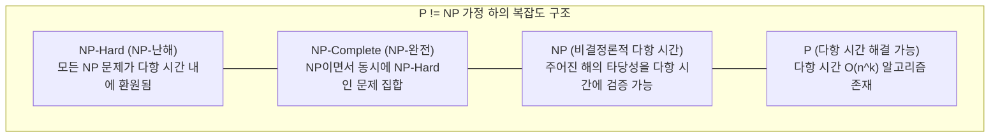

> [!abstract] 핵심 요약
> **NP-완전성(NP-Completeness)**은 다항 시간($O(n^k)$) 내에 해결 가능한 알고리즘이 존재하지 않을 것으로 강력하게 추정되는 가장 어려운 결정 문제들의 클래스이다.
> 어떤 문제가 NP-완전임을 증명하는 **다항 시간 변환($A \le_P B$)** 체계와, 지수 시간의 한계를 극복하기 위해 다항 시간 내에 최적해의 일정 오차 범위 내 해를 보장하는 **근사 알고리즘(Approximation Algorithms)**을 체계적으로 학습한다.

---

## 1. 문제 복잡도 클래스 (Complexity Classes) 체계



| 클래스 | 정의 | 대표 문제 |
| :-- | :-- | :-- |
| **P** | 다항 시간($O(n^k)$) 내에 **해결(Solve)**할 수 있는 결정 문제 집합 | 최단 경로, 최소 신장 트리, 정렬 |
| **NP** | 제안된 해(Certificate)의 정확성을 다항 시간 내에 **검증(Verify)**할 수 있는 결정 문제 집합 | TSP 결정 문제, 0/1 Knapsack, Hamiltonian Cycle |
| **NP-Hard** | 모든 NP 문제가 다항 시간 환원($\le_P$) 가능한 문제 (NP에 속하지 않아도 됨) | 정지 문제(Halting Problem), TSP 최적화 |
| **NP-Complete** | **NP에 속하면서 동시에 NP-Hard인 문제** | 3-SAT, Vertex Cover, Clique, Subset Sum |

---

## 2. NP-완전성 증명 4단계 프레임워크

새로운 문제 $L$이 NP-완전임을 증명하는 표준 절차:
1. **$L \in \text{NP}$ 증명**: 문제 $L$의 후보 해가 주어졌을 때 다항 시간 내에 검증할 수 있음을 보인다.
2. **알려진 NP-완전 문제 $L'$ 선택**: 3-SAT, Vertex Cover 등 공인된 NP-완전 문제를 선정한다.
3. **다항 시간 환원 함수 $f$ 정의**: $L'$의 임의의 인스턴스 $x$를 $L$의 인스턴스 $f(x)$로 변환하는 알고리즘을 설계하고 이것이 다항 시간 $O(n^k)$에 동작함을 입증한다.
4. **동치성 입증**: $x \in L' \iff f(x) \in L$ (양방향 필요충분조건)임을 증명한다.

---

## 3. 근사 알고리즘 (Approximation Algorithm)과 근사 비율

최적해를 구하기 극도로 어려운 NP-난해 최적화 문제에 대해 다항 시간 내에 최적해에 근접한 근사해 $C$를 산출하는 알고리즘이다.

- **근사 비율 (Approximation Ratio) $\rho(n)$**:
  $$\max \left( \frac{C}{C^*}, \; \frac{C^*}{C} \right) \le \rho(n)$$

### 3.1. 버텍스 커버(Vertex Cover) 2-근사 알고리즘
- 아직 덮이지 않은 임의의 간선 $(u, v)$를 선택하여 **두 정점 $u, v$를 모두 커버 집합에 추가**하고 연결된 모든 간선을 제거.
- **성능 보장**: 근사해의 크기 $|C| \le 2 \cdot |C^*|$ (최적해 크기의 최대 2배 이하 보장, $O(V+E)$).

---

## 4. 실시간 P vs NP 문제 분류 및 리덕션 맵

```html preview
<div style="font-family:system-ui,-apple-system,sans-serif;padding:20px;background:var(--card);color:var(--card-foreground);border:1px solid var(--border);border-radius:var(--radius)">
  <div style="font-size:16px;font-weight:700;margin-bottom:12px;color:var(--primary)">
    ⚡ 알고리즘 문제 복잡도 클래스(Complexity Class) 판별기
  </div>

  <div style="margin-bottom:12px">
    <label style="font-size:11px;color:var(--muted-foreground)">알고리즘 문제 선택:</label>
    <select id="selProb" style="width:100%;padding:6px;background:var(--background);color:var(--foreground);border:1px solid var(--border);border-radius:var(--radius);font-weight:700">
      <option value="p_mst">최소 신장 트리 (MST - Prim/Kruskal)</option>
      <option value="p_short">단일 출발 최단 경로 (Dijkstra)</option>
      <option value="npc_sat">불리언 충족 가능성 (3-SAT)</option>
      <option value="npc_vc">정점 커버 (Vertex Cover)</option>
      <option value="npc_tsp">외판원 문제 (Traveling Salesperson - TSP)</option>
      <option value="nph_halt">튜링 기계 정지 문제 (Halting Problem)</option>
    </select>
  </div>

  <div id="outCompInfo" style="padding:12px;background:var(--background);border:1px solid var(--border);border-radius:var(--radius);font-size:13px;line-height:1.6"></div>

  <script>
    var db = {
      p_mst: { cls: "P (Polynomial Time)", time: "O(E log V)", desc: "다항 시간 탐욕적 알고리즘으로 정확한 최적해 도출 가능" },
      p_short: { cls: "P (Polynomial Time)", time: "O((V+E) log V)", desc: "다익스트라 알고리즘을 통해 다항 시간 내에 최적 경로 탐색 완료" },
      npc_sat: { cls: "NP-Complete (NP-완전)", time: "O(2^n) 지수 시간 추정", desc: "Cook-Levin 정리에 의해 증명된 최초의 대표적 NP-완전 문제" },
      npc_vc: { cls: "NP-Complete (NP-완전)", time: "NP-Hard (근사: 2-근사 O(V+E))", desc: "간선 양끝 정점 동시 선택 기법으로 2배수 내 근사해 다항 시간 계산" },
      npc_tsp: { cls: "NP-Complete / NP-Hard", time: "O(n!) 완전 탐색", desc: "삼각 부등식 성립 시 MST 기반 2-근사, 일반적인 경우 근사 불가" },
      nph_halt: { cls: "NP-Hard (판정 불가능 Undecidable)", time: "계산 불가능", desc: "NP에 속하지 않으며 어떤 알고리즘으로도 해결 불가능한 난제" }
    };

    function updateComp() {
      var val = document.getElementById('selProb').value;
      var item = db[val];
      document.getElementById('outCompInfo').innerHTML = 
        "<strong>복잡도 분류:</strong> <span style='color:var(--primary);font-weight:800'>" + item.cls + "</span><br/>" +
        "<strong>해결 시간 복잡도:</strong> <span style='font-family:monospace;color:var(--foreground)'>" + item.time + "</span><br/>" +
        "<strong>설명:</strong> " + item.desc;
    }

    document.getElementById('selProb').addEventListener('change', updateComp);
    updateComp();
  </script>
</div>
