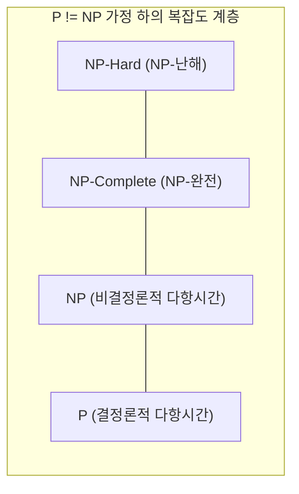

> [!abstract] 핵심 요약
> **P 클래스**는 결정론적 튜링 기계로 다항 시간($O(n^k)$) 내에 풀 수 있는 문제들의 집합이다. 
> **NP 클래스**는 비결정론적 다항 시간, 즉 주어진 해의 정답 여부를 다항 시간 내에 **검증(Verify)**할 수 있는 문제들의 집합이다. 
> NP-완전 문제는 알려진 다항 시간 알고리즘이 없으므로 **근사 알고리즘(Approximation Algorithm)**을 통해 준최적해를 구한다.

---

## 1. 복잡도 클래스 관계도

---

## 2. 근사 비율(Approximation Ratio)의 수학적 정의

최소화 문제에서 최적해를 $C^*$, 근사 알고리즘의 해를 $C$라 할 때, 근사 비율 $\rho(n)$은 다음과 같다:

$$\frac{C}{C^*} \le \rho(n) \quad (\rho(n) \ge 1)$$
