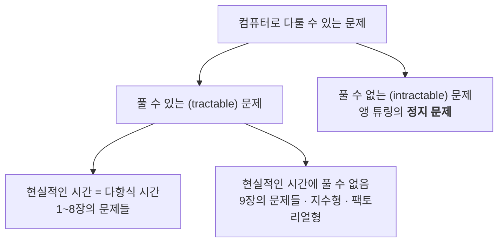
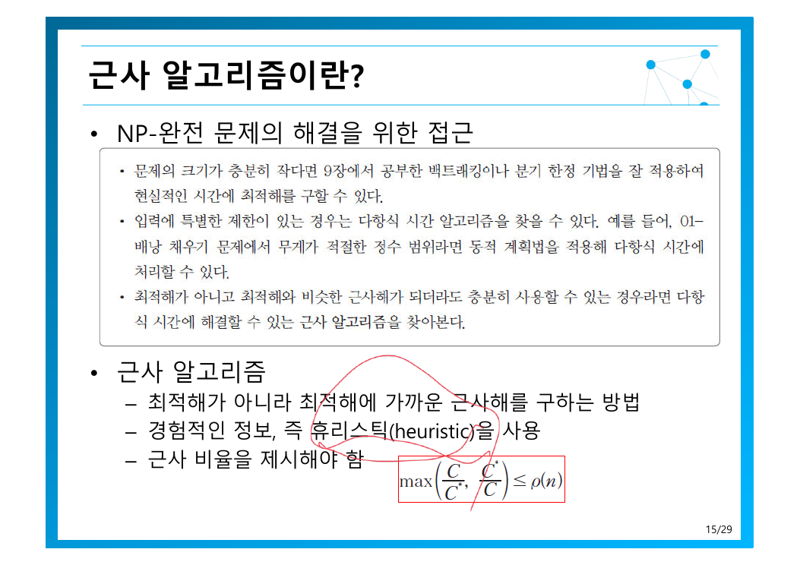

> [!abstract] 지금까지의 장이 피해 다니던 질문
> [3장은 TSP를 $O(n!)$ 으로 내놓고](./03.%20%EC%96%B5%EC%A7%80%20%EA%B8%B0%EB%B2%95%EA%B3%BC%20%EC%99%84%EC%A0%84%20%ED%83%90%EC%83%89.md) “개선은 9·10장”이라 했고, [9장은 8,000배를 절약했지만](./09.%20%EB%B0%B1%ED%8A%B8%EB%9E%98%ED%82%B9%EA%B3%BC%20%EB%B6%84%EA%B8%B0%20%ED%95%9C%EC%A0%95.md) 여전히 지수였다.
> 이 장의 답은 불편하다 — **그 문제들은 아마도 다항식 시간에 풀리지 않는다.** 그래서 전략을 바꾸는다. 정답을 포기하되, **얼마나 틀릴 수 있는지를 수치로 보장**하는 것이 근사 알고리즘이다.

---

## 1. 문제를 세 가지로 나누기

원본 3쪽의 분류가 이 장의 지도다.



세 범주의 성격이 근본적으로 다르다는 점이 중요하다.

| 범주 | 상태 |
| --- | --- |
| 다항식 시간에 풀림 | 알고리즘이 있다 |
| 현실적인 시간에 못 푶 | 알고리즘은 있는데 느리다 |
| **풀 수 없음** | 어떤 알고리즘도 존재하지 않는다 — 정지 문제 |

정지 문제(halting problem)는 자원이 무한해도 풀 수 없다. NP-완전 문제들은 이와 다르다 — **풀 수는 있는데 빠른 방법을 모를 뿐**이다. 원본의 정의를 그대로 옮기면 — *다항식 시간에 해결할 수 없다고 **추정**되면서 서로 강력한 논리적인 연관성을 갖는 특별한 문제들의 그룹*.

“추정”이라는 단어가 정확하다. 증명된 것이 아니다.

---

## 2. 결정 문제로 바꾸기

원본 4쪽은 문제를 두 종류로 나눈다.

| 종류 | 요구 |
| --- | --- |
| **결정 문제** (decision) | 대답으로 **Yes 혹은 No**를 요구 |
| **최적화 문제** (optimization) | 주어진 조건을 만족하는 **최적해**를 요구 |

TSP로 예를 들면(5쪽):

| | 질문 |
| --- | --- |
| 최적화 TSP | 모든 점을 한 번씩 방문하고 돌아오는 **최단 거리를 구하라** |
| 결정 TSP | 그런 경로 중 **거리 $K$ 이하인 것이 있는가?** |

왜 굳이 더 약해 보이는 결정 문제로 바꾸는가? 원본의 논리가 깔끔하다 — ***결정 TSP 문제가 어렵다면 최적화 TSP도 어려운 문제***. 더 쉬운 버전이 어렵다면 어려운 버전은 당연히 어렵다. 어려움을 증명할 때는 **가장 약한 형태를 공략하는 것이 가장 강한 결론**을 준다.

그리고 Yes/No 로 바꾸면 **검증**이 말이 된다. 경로 하나를 주면 그것이 $K$ 이하인지는 더하기만 하면 된다 — **다항식 시간 검증**. 이것이 NP의 정의이다.

### P와 NP, 그리고 100만 달러짜리 질문


원본 7쪽은 두 가능성을 나란히 놓고 덧붙인다 — *아무도 증명하지 못함. 이 문제에는 많은 현상금이 걸려있다*.

| | 뜻 |
| --- | --- |
| **P** | 다항식 시간에 **풀 수 있는** 결정 문제 |
| **NP** | 다항식 시간에 **답을 검증할 수 있는** 결정 문제 |
| **NP-하드** | 모든 NP 문제를 다항식 시간에 이것으로 변환할 수 있음 — 적어도 NP만큼 어렵다 |
| **NP-완전** | NP이면서 동시에 NP-하드 |

여기서 닭과 달걀의 문제가 생긴다 — 최초의 NP-하드 문제는 무엇으로 증명하나? 원본 13쪽의 답 — *다행히 **1971년 Cook**이 일반 부울식 만족 문제(GSAT)가 NP-하드임을 증명*했다. 그 뒤로는 **기존 NP-완전 문제를 새 문제로 변환하기만 하면** 증명이 끝난다.

변환의 예로 원본은 SubsetSum과 Partition을 서로 변환해 보인다(9~11쪽). 중요한 것은 변환 비용도 **다항식 시간이어야 한다**는 점이다(12쪽). 변환이 지수라면 어려움을 옮긴 것이 아니라 새로 만든 셈이 된다.

---

## 3. 근사 알고리즘 — 틀리되 얼마나 틀릴지 약속하기



원본 15쪽은 근사 알고리즘의 요건을 셋으로 정리한다.

1. 최적해가 아니라 **최적해에 가까운 근사해**를 구한다
2. 경험적인 정보, 즉 **휴리스틱**을 사용한다
3. **근사 비율을 제시해야 한다**

세 번째가 근사 알고리즘을 단순한 "대충 푸는 법"과 가른다. 대충 풀고 끝내는 것이 아니라, **최악의 경우에도 최적해의 몇 배를 넘지 않는다는 보장**을 증명해야 한다.

이 장의 근사 알고리즘들은 놀랍도록 한결같다.

| 문제 | 근사 알고리즘 | 복잡도 | 근사 비율 |
| --- | --- | --- | --- |
| 통 채우기 | 다음 적합 (Next Fit) | $O(n)$ | **2-근사** |
| 통 채우기 | 최초 적합 (First Fit) | $O(n^2)$, $O(n\log n)$ 개선 가능 | **2-근사** |
| 정점 커버 | 간선 지향 전략 | 인접행렬 $O(n^2)$, 인접리스트 $O(n+e)$ | **2-근사** |
| TSP (심화) | MST 이용 | MST 알고리즘에 따름 | **2-근사** |

네 개 모두 **2-근사**다. 이것이 이 장의 숨은 주제다 — 지수 시간을 포기하고 다항식 시간을 얻는 대가로, 품질은 최악 2배만 나빠진다.

### 통 채우기 — 직접 비교해 보기

완전 탐색은 $n!$ 가지 조합을 봐야 한다(16쪽). 대신 물건을 순서대로 훑으며 통에 넣는 두 전략을 비교해 보라.

```html preview h=560px
<div style="font-family:system-ui,-apple-system,sans-serif;padding:20px;color:var(--foreground)">
  <div style="display:flex;gap:8px;align-items:center;flex-wrap:wrap;margin-bottom:14px">
    <button id="bpnew" class="bbt">새 물건 생성</button>
    <label style="font-size:12.5px">물건 수 <input id="bpn" type="number" value="14" min="5" max="30"
      style="width:56px;padding:4px 6px;border:1px solid var(--border);border-radius:var(--radius);background:var(--card);color:var(--foreground)" /></label>
    <span style="font-size:12.5px;color:var(--muted-foreground)">통 용량 = 1.0</span>
  </div>
  <div id="bpitems" style="font-size:12.5px;color:var(--muted-foreground);margin-bottom:14px"></div>
  <div id="bpout"></div>
  <div id="bpnote" style="margin-top:14px;padding:11px 13px;background:var(--card);border:1px solid var(--border);border-radius:var(--radius);font-size:13px;line-height:1.7"></div>

  <style>
    .bbt{padding:7px 12px;font-size:12.5px;cursor:pointer;background:var(--card);
      color:var(--foreground);border:1px solid var(--border);border-radius:var(--radius)}
    .bbt:hover{border-color:var(--primary);color:var(--primary)}
  </style>

  <script>
    var items = [];
    function gen() {
      var n = Math.max(5, Math.min(30, +document.getElementById('bpn').value || 14));
      items = [];
      for (var i = 0; i < n; i++) items.push(Math.round((0.15 + Math.random() * 0.65) * 100) / 100);
      draw();
    }
    function nextFit(a) {
      var bins = [[]], rem = 1;
      a.forEach(function (w) {
        if (w <= rem + 1e-9) { bins[bins.length - 1].push(w); rem -= w; }
        else { bins.push([w]); rem = 1 - w; }
      });
      return bins;
    }
    function firstFit(a) {
      var bins = [], rem = [];
      a.forEach(function (w) {
        for (var i = 0; i < bins.length; i++) {
          if (w <= rem[i] + 1e-9) { bins[i].push(w); rem[i] -= w; return; }
        }
        bins.push([w]); rem.push(1 - w);
      });
      return bins;
    }
    function bar(title, bins, color, extra) {
      return '<div style="margin-bottom:16px">' +
        '<div style="display:flex;justify-content:space-between;font-size:13px;margin-bottom:6px">' +
        '<b style="color:' + color + '">' + title + '</b>' +
        '<span><b style="color:' + color + '">' + bins.length + '개</b> 의 통' +
        (extra ? ' <span style="color:var(--muted-foreground)">' + extra + '</span>' : '') + '</span></div>' +
        '<div style="display:flex;gap:4px;flex-wrap:wrap">' +
        bins.map(function (b) {
          var fill = b.reduce(function (s, x) { return s + x; }, 0);
          return '<div style="width:34px;height:56px;border:1px solid var(--border);border-radius:4px;' +
            'display:flex;flex-direction:column-reverse;overflow:hidden;background:var(--card)" ' +
            'title="합 ' + fill.toFixed(2) + '">' +
            b.map(function (x) {
              return '<div style="height:' + (x * 100) + '%;background:' + color + ';opacity:' +
                (0.55 + x * 0.45) + ';border-top:1px solid var(--background)"></div>';
            }).join('') + '</div>';
        }).join('') + '</div></div>';
    }
    function draw() {
      var total = items.reduce(function (s, x) { return s + x; }, 0);
      var lower = Math.ceil(total - 1e-9);
      document.getElementById('bpitems').innerHTML =
        '물건 (' + items.length + '개): ' + items.map(function (x) { return x.toFixed(2); }).join(', ') +
        ' &nbsp;·&nbsp; 총 부피 <b style="color:var(--foreground)">' + total.toFixed(2) + '</b>';
      var nf = nextFit(items), ff = firstFit(items);
      document.getElementById('bpout').innerHTML =
        bar('다음 적합 (Next Fit) — 마지막 통만 본다', nf, 'var(--chart-5)', 'O(n)') +
        bar('최초 적합 (First Fit) — 앞에서부터 들어갈 통을 찾는다', ff, 'var(--chart-2)', 'O(n^2)') +
        '<div style="font-size:13px;margin-top:2px">이론적 하한 = <b style="color:var(--chart-1)">' + lower + '개</b> — 이보다 적게 쓸 수는 없다</div>';
      document.getElementById('bpnote').innerHTML =
        '다음 적합 <b style="color:var(--chart-5)">' + nf.length + '개</b> · 최초 적합 <b style="color:var(--chart-2)">' +
        ff.length + '개</b> · 하한 <b style="color:var(--chart-1)">' + lower + '개</b><br>' +
        '<span style="color:var(--muted-foreground)">둘 다 <b>2-근사</b>이므로 최악에도 하한의 2배(' + (lower * 2) +
        '개)를 넘지 않는다. 다음 적합은 마지막 통만 보므로 빠르지만 앞의 빈 공간을 버리고, ' +
        '최초 적합은 다시 들여다보는 대가로 통을 아낀다 — <b>같은 보장 안에서도 실제 품질은 다르다.</b></span>';
    }
    document.getElementById('bpnew').onclick = gen;
    document.getElementById('bpn').addEventListener('change', gen);
    gen();
  </script>
</div>
```

근사 비율을 계산하려면 기준이 필요한데, 최적해를 모르니 **하한값**을 쓴다(16쪽) — 모든 물건의 부피 합을 올림한 값보다 적게 쓸 수는 없다. 이 하한과 비교해 2배 이내임을 보이면 2-근사가 증명된다.

### 정점 커버와 TSP

정점 커버는 두 전략이 있다(21쪽) — 정점 지향과 **간선 지향**. 직관적으로는 차수가 큰 정점부터 고르는 정점 지향이 좋아 보이지만, **2-근사가 증명되는 것은 간선 지향 전략**이다(22쪽). 임의의 간선을 골라 양쪽 정점을 모두 답에 넣는 단순한 방법인데, 최적해도 그 간선을 덮으려면 둘 중 하나는 반드시 골라야 하므로 적어도 절반은 제대로 고른 것이 된다.

> [!note] 직관이 좋아 보이는 것과 증명되는 것은 다르다
> [8장의 60원 동전](./08.%20%ED%83%90%EC%9A%95%EC%A0%81%20%EA%B8%B0%EB%B2%95.md)과 같은 교훈이다. 차수 기반 휴리스틱은 대개 잘 작동하지만 **최악에서 몇 배 나빠지는지를 증명할 수 없다**. 보장이 붙지 않은 휴리스틱은 근사 알고리즘이 아니라 그냥 휴리스틱이다.

TSP 근사는 아이디어가 우아하다(25쪽) — [8장의 최소비용 신장트리](./08.%20%ED%83%90%EC%9A%95%EC%A0%81%20%EA%B8%B0%EB%B2%95.md)를 만들고 그것을 따라 순회한다. MST는 모든 정점을 가장 싼 값으로 연결하므로 **최적 순회 경로보다 반드시 싸다** — 순회 경로에서 간선 하나를 빼면 신장트리가 되기 때문이다. 이것이 하한을 줌으로써 2-근사 증명이 마무리된다. 단 원본이 붙인 *추가조건*은 삼각부등식이다.

---

## 정리 — 이 과목의 끝

> [!tip] 세 문장 요약
>
> 1. **못 푸는 것과 느린 것은 다르다.** 정지 문제는 알고리즘이 없고, NP-완전 문제는 있는데 빠른 것을 모를 뿐이다 — 그리고 그것은 **증명된 것이 아니라 추정**이다.
> 2. **어려움은 변환으로 전파된다.** 1971년 Cook의 GSAT 이후, 새 문제의 NP-완전성은 기존 문제를 다항식 시간에 변환해 보이면 된다.
> 3. **근사는 포기가 아니라 계약이다.** 대충 푸는 법과 달리 **근사 비율을 증명해야** 하며, 이 장의 네 알고리즘은 모두 2-근사다.

이로써 한 바퀴가 닫힌다. [1장은 gcd 세 알고리즘으로 같은 문제에 속도가 다름을 보였고](./01.%20%EC%95%8C%EA%B3%A0%EB%A6%AC%EC%A6%98%EC%9D%98%20%EA%B0%9C%EC%9A%94%EC%99%80%20%EB%AC%B8%EC%A0%9C%20%ED%95%B4%EA%B2%B0%20%ED%94%84%EB%A0%88%EC%9E%84%EC%9B%8C%ED%81%AC.md), [2장은 그 차이를 재는 자를 만들었으며](./02.%20%EC%95%8C%EA%B3%A0%EB%A6%AC%EC%A6%98%20%ED%9A%A8%EC%9C%A8%EC%84%B1%20%EB%B6%84%EC%84%9D%EA%B3%BC%20%EC%A0%90%EA%B7%BC%EC%A0%81%20%ED%91%9C%EA%B8%B0%EB%B2%95.md), 3~9장은 그 자로 재가며 더 빠른 방법을 찾았다. 10장은 **그 탐색이 어디서 멈추는지**를 말해준다.


---

### 근거 자료

강의 원본 `10장-NP완전과근사알고리즘-파알.pdf` (29쪽)에 근거한다. 인용 슬라이드는 13쪽(P·NP·NP-완전·NP-하드 관계와 Cook 1971), 15쪽(근사 알고리즘 정의)이다. 근사 비율 표는 18·19·22·27쪽에 기재된 값을 모은 것이며, 통 채우기 시뮬레이터는 원본의 다음 적합·최초 적합 절차를 그대로 구현하고 16쪽의 하한값 계산법(부피 합의 올림)을 기준으로 삼았다.
