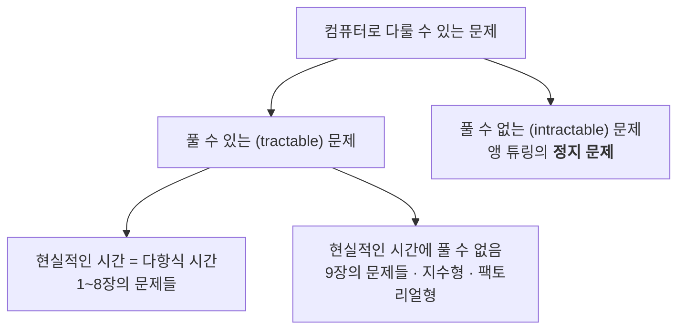
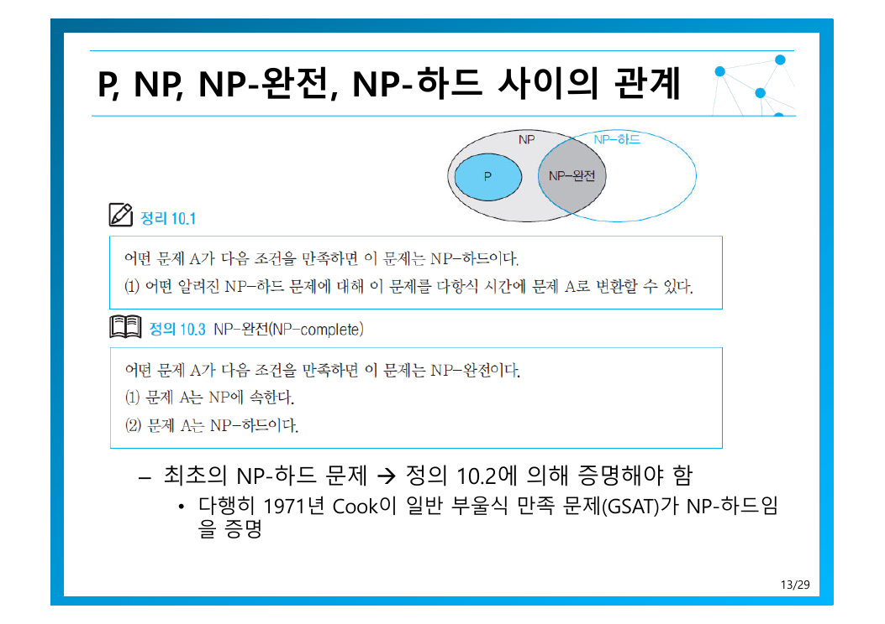

> [!abstract] 지금까지의 장이 피해 다니던 질문
> [3장은 TSP를 $O(n!)$ 으로 내놓고](./03.%20%EC%96%B5%EC%A7%80%20%EA%B8%B0%EB%B2%95%EA%B3%BC%20%EC%99%84%EC%A0%84%20%ED%83%90%EC%83%89.md) “개선은 9·10장”이라 했고, [9장은 8,000배를 절약했지만](./09.%20%EB%B0%B1%ED%8A%B8%EB%9E%98%ED%82%B9%EA%B3%BC%20%EB%B6%84%EA%B8%B0%20%ED%95%9C%EC%A0%95.md) 여전히 지수였다.
> 이 장의 답은 불편하다 — **그 문제들은 아마도 다항식 시간에 풀리지 않는다.** 그래서 전략을 바꾸는다. 정답을 포기하되, **얼마나 틀릴 수 있는지를 수치로 보장**하는 것이 근사 알고리즘이다.

---

## 1. 문제를 세 가지로 나누기

원본 3쪽의 분류가 이 장의 지도다.

세 범주의 성격이 근본적으로 다르다는 점이 중요하다.

| 범주 | 상태 |
| --- | --- |
| 다항식 시간에 풀림 | 알고리즘이 있다 |
| 현실적인 시간에 못 푶 | 알고리즘은 있는데 느리다 |
| **풀 수 없음** | 어떤 알고리즘도 존재하지 않는다 — 정지 문제 |

정지 문제(halting problem)는 자원이 무한해도 풀 수 없다. NP-완전 문제들은 이와 다르다 — **풀 수는 있는데 빠른 방법을 모를 뿐**이다. 원본의 정의를 그대로 옮기면 — *다항식 시간에 해결할 수 없다고 **추정**되면서 서로 강력한 논리적인 연관성을 갖는 특별한 문제들의 그룹*.

“추정”이라는 단어가 정확하다. 증명된 것이 아니다.

---

## 2. 결정 문제로 바꾸기

원본 4쪽은 문제를 두 종류로 나눈다.

| 종류 | 요구 |
| --- | --- |
| **결정 문제** (decision) | 대답으로 **Yes 혹은 No**를 요구 |
| **최적화 문제** (optimization) | 주어진 조건을 만족하는 **최적해**를 요구 |

TSP로 예를 들면(5쪽):

| | 질문 |
| --- | --- |
| 최적화 TSP | 모든 점을 한 번씩 방문하고 돌아오는 **최단 거리를 구하라** |
| 결정 TSP | 그런 경로 중 **거리 $K$ 이하인 것이 있는가?** |

왜 굳이 더 약해 보이는 결정 문제로 바꾸는가? 원본의 논리가 깔끔하다 — ***결정 TSP 문제가 어렵다면 최적화 TSP도 어려운 문제***. 더 쉬운 버전이 어렵다면 어려운 버전은 당연히 어렵다. 어려움을 증명할 때는 **가장 약한 형태를 공략하는 것이 가장 강한 결론**을 준다.

그리고 Yes/No 로 바꾸면 **검증**이 말이 된다. 경로 하나를 주면 그것이 $K$ 이하인지는 더하기만 하면 된다 — **다항식 시간 검증**. 이것이 NP의 정의이다.

### P와 NP, 그리고 100만 달러짜리 질문

원본 7쪽은 두 가능성을 나란히 놓고 덧붙인다 — *아무도 증명하지 못함. 이 문제에는 많은 현상금이 걸려있다*.

| | 뜻 |
| --- | --- |
| **P** | 다항식 시간에 **풀 수 있는** 결정 문제 |
| **NP** | 다항식 시간에 **답을 검증할 수 있는** 결정 문제 |
| **NP-하드** | 모든 NP 문제를 다항식 시간에 이것으로 변환할 수 있음 — 적어도 NP만큼 어렵다 |
| **NP-완전** | NP이면서 동시에 NP-하드 |

여기서 닭과 달걀의 문제가 생긴다 — 최초의 NP-하드 문제는 무엇으로 증명하나? 원본 13쪽의 답 — *다행히 **1971년 Cook**이 일반 부울식 만족 문제(GSAT)가 NP-하드임을 증명*했다. 그 뒤로는 **기존 NP-완전 문제를 새 문제로 변환하기만 하면** 증명이 끝난다.

변환의 예로 원본은 SubsetSum과 Partition을 서로 변환해 보인다(9~11쪽). 중요한 것은 변환 비용도 **다항식 시간이어야 한다**는 점이다(12쪽). 변환이 지수라면 어려움을 옮긴 것이 아니라 새로 만든 셈이 된다.
