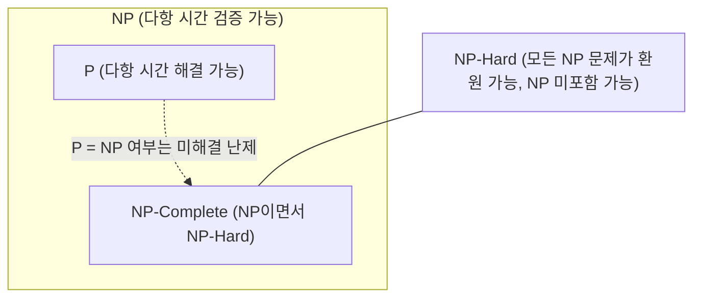

> [!abstract] 핵심 요약
> **P 문제**는 다항 시간 $O(n^k)$에 풀 수 있는 문제이며, **NP 문제**는 주어진 해를 다항 시간에 검증할 수 있는 문제이다.
> 모든 NP 문제가 다항 시간에 어떤 문제 $X$로 환원될 때($Y \le_P X$), $X$는 **NP-Complete**가 되며, 이 난해한 문제들을 실무에서 풀기 위해 성능 보장 비율 $
ho(n)$을 갖는 **근사 알고리즘(Approximation Algorithm)**을 설계한다.

---

## 1. 계산 복잡도 클래스 포함 관계



---

## 2. 삼각 부등식 만족 TSP의 2-근사 알고리즘 수식

삼각 부등식 $c(u, v) \le c(u, w) + c(w, v)$이 성립할 때:
1. 그래프 $G$의 최소 신장 트리(MST) $T$를 구축 ($c(T) \le c(H^*)$)
2. $T$의 전위 순회(Preorder Traversal)로 해밀턴 경로 $H$를 구성
$$c(H) \le 2 \cdot c(T) \le 2 \cdot c(H^*) \implies 	ext{근사비 } 
ho = 2$$

---

## 3. 실시간 P vs NP 복잡도 클래스 판별기

```html preview
<div style="font-family:system-ui,-apple-system,sans-serif;padding:20px;background:var(--card);color:var(--card-foreground);border:1px solid var(--border);border-radius:var(--radius)">
  <div style="font-size:16px;font-weight:700;margin-bottom:14px;color:var(--primary);display:flex;align-items:center;gap:8px">
    <span>🧩 계산 문제별 복잡도 클래스 및 근사 가능성 판별기</span>
  </div>

  <div style="margin-bottom:14px">
    <label style="font-size:11px;color:var(--muted-foreground)">계산 문제 선택:</label>
    <select id="selCompProblem" style="width:100%;padding:6px;background:var(--background);color:var(--foreground);border:1px solid var(--border);border-radius:var(--radius);font-weight:700">
      <option value="mst">1. 최소 신장 트리 (MST) / 최단 경로 (Dijkstra)</option>
      <option value="tsp">2. 외판원 문제 (TSP) / 0-1 배낭 문제 (Knapsack)</option>
      <option value="halting">3. 정지 문제 (Halting Problem)</option>
    </select>
  </div>

  <div style="padding:12px;background:var(--background);border:1px solid var(--border);border-radius:var(--radius)">
    <div style="font-size:11px;font-weight:700;color:var(--muted-foreground);margin-bottom:4px">복잡도 분류 및 최적 해결 전략</div>
    <div id="compClassDescOut" style="font-size:13px;line-height:1.6;color:var(--foreground)">
      <strong style="color:var(--primary)">P 클래스 (다항 시간 해결 가능):</strong> Prim / Kruskal 알고리즘으로 $O(E \log V)$에 완벽한 최적해를 도출합니다.
    </div>
  </div>

  <script>
    document.getElementById('selCompProblem').onchange = function() {
      var val = this.value;
      var out = document.getElementById('compClassDescOut');
      if (val === 'mst') {
        out.innerHTML = "<strong style='color:var(--primary)'>⭐ P (Polynomial-Time Solvable):</strong><br/>• Prim / Kruskal / Dijkstra 알고리즘으로 다항 시간 내에 정확한 최적해 보장";
      } else if (val === 'tsp') {
        out.innerHTML = "<strong style='color:var(--destructive,#ef4444)'>⚠️ NP-Complete / NP-Hard:</strong><br/>• 다항 시간 내 최적해 알고리즘 부재<br/>• 해결책: 동적 계획법 ($O(n^2 2^n)$), 분기 한정 가지치기, 또는 2-근사 알고리즘 적용";
      } else {
        out.innerHTML = "<strong style='color:var(--chart-1)'>🚫 결정 불가능 (Undecidable):</strong><br/>• 튜링 기계로 어떤 알고리즘으로도 유한 시간 내 판정 불가";
      }
    };
  </script>
</div>
```
