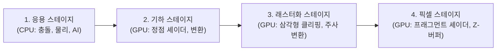

> [!abstract] 핵심 요약
> **그래픽스 파이프라인(Graphics Pipeline)**은 3D 공간 상의 가상 객체를 2D 래스터 화면 디스플레이로 변환하는 연속적인 파이프라인이다.
> 기하 스테이지를 통과한 정점들은 **래스터화(Rasterization)**를 통해 프래그먼트로 변환되며, **브레젠험(Bresenham) 알고리즘**은 나눗셈이나 부동소수점 연산 없이 순수 정수 판별식($p_k$)만으로 최적의 픽셀 좌표를 $O(N)$ 초고속으로 계산한다.

---

## 1. 실시간 렌더링 파이프라인 4단계



---

## 2. 브레젠험(Bresenham) 직선 알고리즘 판별식 유도

기울기 $0 \le m \le 1$인 직선에서 점 $(x_k, y_k)$ 다음 후보: $E(x_k + 1, y_k)$ 또는 $NE(x_k + 1, y_k + 1)$

초기 판별식:
$$p_0 = 2\Delta y - \Delta x$$

점화 갱신식:
$$p_{k+1} = egin{cases} p_k + 2\Delta y, & 	ext{if } p_k < 0 \quad (	ext{선택: } E) \ p_k + 2\Delta y - 2\Delta x, & 	ext{if } p_k \ge 0 \quad (	ext{선택: } NE) \end{cases}$$

---

## 3. 실시간 브레젠험 직선 픽셀 주사 시뮬레이터

```html preview
<div style="font-family:system-ui,-apple-system,sans-serif;padding:20px;background:var(--card);color:var(--card-foreground);border:1px solid var(--border);border-radius:var(--radius)">
  <div style="font-size:16px;font-weight:700;margin-bottom:14px;color:var(--primary);display:flex;align-items:center;gap:8px">
    <span>📐 브레젠험(Bresenham) 정수 판별식 직선 생성기</span>
  </div>

  <div style="display:grid;grid-template-columns:1fr 1fr;gap:12px;margin-bottom:14px">
    <div>
      <label style="font-size:11px;color:var(--muted-foreground)">끝점 X2:</label>
      <input id="inBresX" type="number" value="8" min="1" max="20" style="width:100%;padding:4px;background:var(--background);color:var(--foreground);border:1px solid var(--border);border-radius:var(--radius);font-weight:700" />
    </div>
    <div>
      <label style="font-size:11px;color:var(--muted-foreground)">끝점 Y2:</label>
      <input id="inBresY" type="number" value="5" min="1" max="20" style="width:100%;padding:4px;background:var(--background);color:var(--foreground);border:1px solid var(--border);border-radius:var(--radius);font-weight:700" />
    </div>
  </div>

  <div style="padding:12px;background:var(--background);border:1px solid var(--border);border-radius:var(--radius)">
    <div style="font-size:11px;font-weight:700;color:var(--muted-foreground);margin-bottom:4px">선택된 픽셀 좌표 경로 ($(0,0) 	o (X2, Y2)$)</div>
    <div id="bresPathOut" style="font-family:monospace;font-size:12px;line-height:1.6;color:var(--primary)">
      (0,0) -> (1,1) -> (2,1) -> (3,2) -> (4,3) -> (5,3) -> (6,4) -> (7,4) -> (8,5)
    </div>
  </div>

  <script>
    function updateBres() {
      var x1 = 0, y1 = 0;
      var x2 = parseInt(document.getElementById('inBresX').value) || 8;
      var y2 = parseInt(document.getElementById('inBresY').value) || 5;
      var dx = Math.abs(x2 - x1);
      var dy = Math.abs(y2 - y1);
      var p = 2 * dy - dx;
      var x = x1, y = y1;
      var pts = ["(" + x + "," + y + ")"];
      while (x < x2) {
        x++;
        if (p < 0) {
          p += 2 * dy;
        } else {
          y++;
          p += 2 * dy - 2 * dx;
        }
        pts.push("(" + x + "," + y + ")");
      }
      document.getElementById('bresPathOut').textContent = pts.join(" -> ");
    }
    document.getElementById('inBresX').addEventListener('input', updateBres);
    document.getElementById('inBresY').addEventListener('input', updateBres);
  </script>
</div>
```
