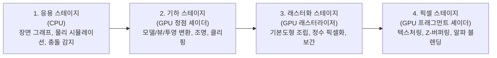
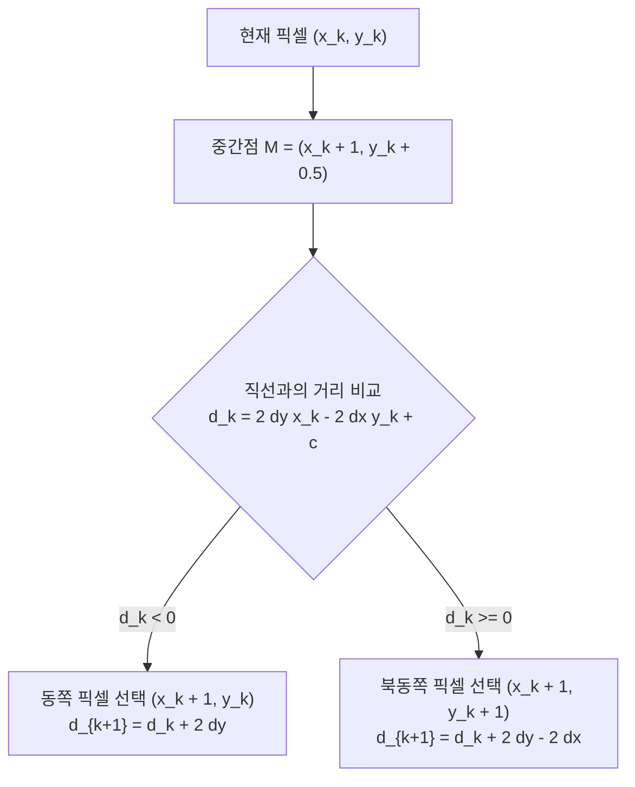

> [!abstract] 핵심 요약
> **그래픽스 파이프라인(Graphics Pipeline)**은 3차원 가상 공간의 기하 객체(정점, 메쉬)를 2차원 디스플레이의 픽셀 색상으로 변환하는 일련의 고속 병렬 처리 파이프라인이다.
> 부동소수점 연산을 완전히 제거하고 순수 정수 덧셈과 시프트 연산만으로 픽셀 좌표를 결정하는 **브레젠험(Bresenham) 래스터화 알고리즘**의 수학적 유도 원리를 마스터한다.

---

## 1. 3D 그래픽스 렌더링 파이프라인 4대 스테이지



---

## 2. 브레젠험(Bresenham) 직선 래스터화 알고리즘의 수학적 유도

직선의 방정식 $y = mx + b$ ($0 \le m \le 1$)에서, 현재 픽셀 $(x_k, y_k)$에서 다음 픽셀로 $(x_k + 1, y_k)$(동쪽 $E$) 또는 $(x_k + 1, y_k + 1)$(북동쪽 $NE$) 중 하나를 선택해야 한다.



- **초기 판별식**: $d_0 = 2\Delta y - \Delta x$
- **연산 특성**: 오직 정수의 덧셈, 뺄셈, 2배 곱셈($\ll 1$ 비트 시프트)만으로 구성되어 하드웨어 칩셋에 직접 내장된다.

---

## 3. 실시간 브레젠험 직선 래스터화 시뮬레이터

```html preview
<div style="font-family:system-ui,-apple-system,sans-serif;padding:20px;background:var(--card);color:var(--card-foreground);border:1px solid var(--border);border-radius:var(--radius)">
  <div style="font-size:16px;font-weight:700;margin-bottom:12px;color:var(--primary)">
    ⚡ 브레젠험(Bresenham) 정수 픽셀 격자 래스터화 계산기
  </div>

  <div style="display:grid;grid-template-columns:1fr 1fr;gap:10px;margin-bottom:12px">
    <div>
      <label style="font-size:11px;color:var(--muted-foreground)">끝점 X2 (1 ~ 15):</label>
      <input id="inBresX" type="number" value="10" min="1" max="15" style="width:100%;padding:6px;background:var(--background);color:var(--foreground);border:1px solid var(--border);border-radius:var(--radius);font-weight:700" />
    </div>
    <div>
      <label style="font-size:11px;color:var(--muted-foreground)">끝점 Y2 (0 ~ 15):</label>
      <input id="inBresY" type="number" value="4" min="0" max="15" style="width:100%;padding:6px;background:var(--background);color:var(--foreground);border:1px solid var(--border);border-radius:var(--radius);font-weight:700" />
    </div>
  </div>

  <div style="padding:10px;background:var(--background);border:1px solid var(--border);border-radius:var(--radius)">
    <div style="font-size:12px;font-weight:700;margin-bottom:6px">선택된 래스터화 픽셀 좌표열:</div>
    <div id="outBresPixels" style="font-family:monospace;font-size:12px;line-height:1.5;color:var(--primary)"></div>
  </div>

  <script>
    function calcBres() {
      var x1 = 0, y1 = 0;
      var x2 = parseInt(document.getElementById('inBresX').value) || 10;
      var y2 = parseInt(document.getElementById('inBresY').value) || 4;

      var dx = Math.abs(x2 - x1);
      var dy = Math.abs(y2 - y1);
      var sx = (x1 < x2) ? 1 : -1;
      var sy = (y1 < y2) ? 1 : -1;
      var err = dx - dy;

      var pts = [];
      var cx = x1, cy = y1;
      while (true) {
        pts.push("(" + cx + "," + cy + ")");
        if (cx === x2 && cy === y2) break;
        var e2 = 2 * err;
        if (e2 > -dy) { err -= dy; cx += sx; }
        if (e2 < dx) { err += dx; cy += sy; }
      }

      document.getElementById('outBresPixels').textContent = pts.join(" → ");
    }

    document.getElementById('inBresX').addEventListener('input', calcBres);
    document.getElementById('inBresY').addEventListener('input', calcBres);
    calcBres();
  </script>
</div>
