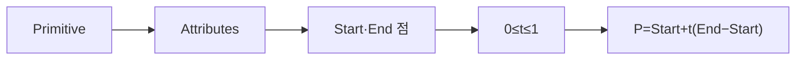

> [!abstract] 한 줄 요약
> 그래픽스 기본 프리미티브와 속성을 정의하고 선형 보간으로 화면 좌표를 계산하는 절차를 점검한다.

## 강의 흐름 지도



---

## 개념을 연결하는 순서

원본 기말 대비 자료는 프리미티브와 속성을 구분한 뒤 선형 보간 코드를 통해 두 점 사이 좌표를 만든다.

- 선분의 시작점과 끝점을 정한다.
- t를 0에서 1 사이로 바꾸며 중간 위치를 계산한다.
- P = Start + t × (End − Start) 형태로 좌표를 얻는다.
- 얻은 좌표를 선·점 렌더링에 사용한다.

<Tabs>
  <Tab label="개념">프리미티브와 속성을 먼저 분리한다.</Tab>
  <Tab label="계산">보간 매개변수와 좌표 식을 따라간다.</Tab>
  <Tab label="검증">끝점·반복 범위를 대입해 결과를 확인한다.</Tab>
</Tabs>

---

## 원본에서 읽는 적용 장면

| 코드 단서 | 의미 | 경계 |
| :-- | :-- | :-- |
| t = i / 20.0f | 0부터 1까지의 보간 매개변수 | 정수 나눗셈 방지 |
| Start, End | 선분 양 끝점 | 좌표계 확인 |
| P | 중간 보간점 | 렌더링 입력 |

자료의 코드 주석과 문제 문장을 기준으로 계산 순서를 확인하고, 화면 API나 색상 설정은 원본에 없는 경우 추가하지 않는다.

```html preview
<div style="font-family:system-ui,sans-serif;padding:20px;color:var(--foreground)">
  <label for="flow538628" style="font-size:14px;font-weight:600">원본 강의 단계</label>
  <div id="flow538628-out" style="font-size:30px;font-weight:700;color:var(--chart-1);margin:6px 0">프리미티브와 속성</div>
  <input id="flow538628" type="range" min="1" max="3" step="1" value="1"
    style="width:100%;accent-color:var(--primary)" />
  <p style="font-size:13px;color:var(--muted-foreground)">슬라이더로 PDF에서 정리한 강의 단계를 순서대로 확인합니다.</p>
  <script>
    var flow538628 = document.getElementById('flow538628');
    var flow538628Out = document.getElementById('flow538628-out');
    var flow538628Steps = ["프리미티브와 속성","선형 보간 매개변수 t","좌표 계산과 렌더링"];
    flow538628.addEventListener('input', function () {
      flow538628Out.textContent = flow538628Steps[Number(flow538628.value) - 1] || '';
    });
  </script>
</div>
```

---

## 점검과 경계

<details>
<summary>스스로 점검하기</summary>

1. 프리미티브와 속성의 역할을 구분한다.
2. t=0, t=1일 때 보간점이 어느 끝점과 일치하는지 설명한다.
3. 부동소수점 나눗셈이 필요한 이유를 말한다.

</details>

> [!note] 희소 원본
> 이 PDF는 시험 대비 코드와 키워드 중심이라 일반 그래픽스 이론을 외부 자료로 확장하지 않았다.
>
> [!warning] 출처 경계
> 이 노트는 현재 폴더의 `sources/*.pdf`에서 추출·대조한 강의 내용을 묶었습니다. 동일 장의 '2'·'update' 파일은 별도 새 이론으로 세지 않고 보충·개정 관계로 확인합니다. 원본 PDF 전체나 원본 슬라이드 이미지는 삽입하지 않습니다.
