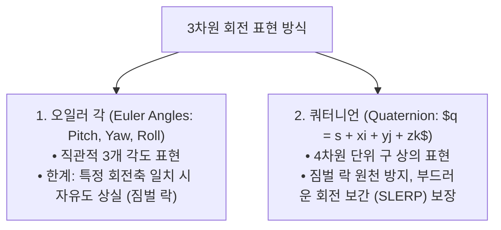

> [!abstract] 핵심 요약
> **동차 좌표계(Homogeneous Coordinates)**는 3D 점 $(x, y, z)$를 4차원 벡터 $(x, y, z, 1)^T$로 확장하여 이동, 회전, 신축을 모두 **$4 	imes 4$ 행렬 곱셈**으로 일원화한다.
> 변환 행렬의 곱은 결합법칙은 성립하지만 교환법칙이 성립하지 않으며($T \cdot R 
e R \cdot T$), 3D 회전에서 발생하는 **짐벌 락(Gimbal Lock)** 현상은 **쿼터니언(Quaternion)**을 통해 완벽하게 해결된다.

---

## 1. 3D 아핀 변환 행렬 3대 기본형 (동차 좌표계)

### (1) 이동 행렬 (Translation $T$)
$$T(t_x, t_y, t_z) = egin{bmatrix} 1 & 0 & 0 & t_x \ 0 & 1 & 0 & t_y \ 0 & 0 & 1 & t_z \ 0 & 0 & 0 & 1 \end{bmatrix}$$

### (2) Z축 기준 회전 행렬 (Rotation $R_z$)
$$R_z(	heta) = egin{bmatrix} \cos	heta & -\sin	heta & 0 & 0 \ \sin	heta & \cos	heta & 0 & 0 \ 0 & 0 & 1 & 0 \ 0 & 0 & 0 & 1 \end{bmatrix}$$

---

## 2. 오일러 각 vs 쿼터니언(사원수) 비교



---

## 3. 실시간 2D 아핀 변환 및 합성 행렬 계산기

```html preview
<div style="font-family:system-ui,-apple-system,sans-serif;padding:20px;background:var(--card);color:var(--card-foreground);border:1px solid var(--border);border-radius:var(--radius)">
  <div style="font-size:16px;font-weight:700;margin-bottom:14px;color:var(--primary);display:flex;align-items:center;gap:8px">
    <span>🔄 2D 점 변환: 이동(T) 후 회전(R) vs 회전 후 이동</span>
  </div>

  <div style="display:grid;grid-template-columns:1fr 1fr;gap:12px;margin-bottom:14px">
    <div>
      <label style="font-size:11px;color:var(--muted-foreground)">이동량 (tx, ty):</label>
      <input id="inTx" type="number" value="3" style="width:100%;padding:4px;background:var(--background);color:var(--foreground);border:1px solid var(--border);border-radius:var(--radius);font-weight:700" />
    </div>
    <div>
      <label style="font-size:11px;color:var(--muted-foreground)">회전 각도 (도):</label>
      <input id="inDeg" type="number" value="90" style="width:100%;padding:4px;background:var(--background);color:var(--foreground);border:1px solid var(--border);border-radius:var(--radius);font-weight:700" />
    </div>
  </div>

  <div style="padding:12px;background:var(--background);border:1px solid var(--border);border-radius:var(--radius)">
    <div style="font-size:11px;font-weight:700;color:var(--muted-foreground);margin-bottom:4px">원점 점 $(1, 0)$ 변환 결과 비교</div>
    <div id="affineOut" style="font-family:monospace;font-size:13px;line-height:1.6;color:var(--primary)">
      • 이동 후 회전 $R \cdot T \cdot p$: (0, 4)<br/>• 회전 후 이동 $T \cdot R \cdot p$: (3, 1)
    </div>
  </div>

  <script>
    function updateAffine() {
      var tx = parseFloat(document.getElementById('inTx').value) || 0;
      var deg = parseFloat(document.getElementById('inDeg').value) || 0;
      var rad = deg * Math.PI / 180;
      var p = [1, 0];
      // 1. T then R: p1 = [p[0]+tx, p[1]] -> p2 = [p1[0]*cos - p1[1]*sin, p1[0]*sin + p1[1]*cos]
      var p1 = [p[0] + tx, p[1]];
      var tr_x = p1[0] * Math.cos(rad) - p1[1] * Math.sin(rad);
      var tr_y = p1[0] * Math.sin(rad) + p1[1] * Math.cos(rad);
      // 2. R then T: p1 = [p[0]*cos - p[1]*sin, p[0]*sin + p[1]*cos] -> p2 = [p1[0]+tx, p1[1]]
      var rt_x = (p[0] * Math.cos(rad) - p[1] * Math.sin(rad)) + tx;
      var rt_y = (p[0] * Math.sin(rad) + p[1] * Math.cos(rad));
      document.getElementById('affineOut').innerHTML = "• 이동 후 회전 ($R \cdot T \cdot p$): (" + tr_x.toFixed(2) + ", " + tr_y.toFixed(2) + ")<br/>• 회전 후 이동 ($T \cdot R \cdot p$): (" + rt_x.toFixed(2) + ", " + rt_y.toFixed(2) + ")<br/><span style='color:var(--muted-foreground);font-size:11px'>* 변환 순서에 따라 최종 위치가 완전히 달라집니다.</span>";
    }
    document.getElementById('inTx').addEventListener('input', updateAffine);
    document.getElementById('inDeg').addEventListener('input', updateAffine);
  </script>
</div>
```
