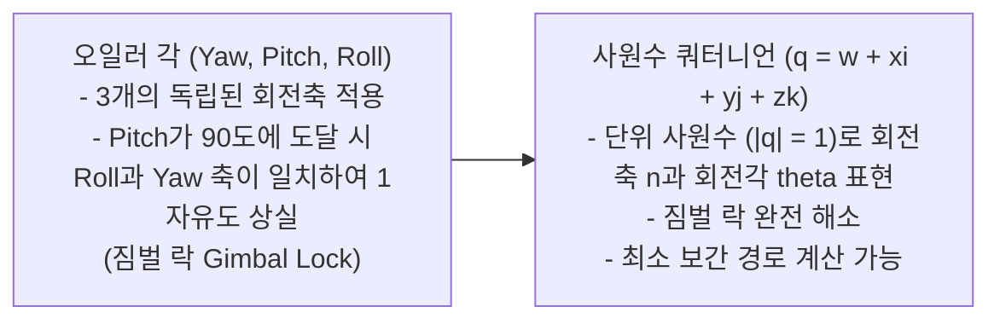

> [!abstract] 핵심 요약
> 3차원 그래픽스에서 모든 기하학적 변환은 **동차 좌표계(Homogeneous Coordinates)**를 도입함으로써 단 하나의 **$4 \times 4$ 행렬 곱셈**으로 합성된다.
> 3차원 회전에서 발생하는 **짐벌 락(Gimbal Lock)** 결함을 사원수(Quaternion)의 4차원 초구면 표현으로 극복하고, **구면 선형 보간(SLERP)**을 통해 일정한 각속도의 카메라 궤적을 생성하는 수학적 원리를 완성한다.

---

## 1. 동차 좌표계와 3D 아핀 변환 4x4 행렬

$$P = \begin{pmatrix} x \\ y \\ z \\ 1 \end{pmatrix}, \quad T(t_x, t_y, t_z) = \begin{pmatrix} 1 & 0 & 0 & t_x \\ 0 & 1 & 0 & t_y \\ 0 & 0 & 1 & t_z \\ 0 & 0 & 0 & 1 \end{pmatrix}, \quad S(s_x, s_y, s_z) = \begin{pmatrix} s_x & 0 & 0 & 0 \\ 0 & s_y & 0 & 0 \\ 0 & 0 & s_z & 0 \\ 0 & 0 & 0 & 1 \end{pmatrix}$$

### 1.1. Z축 기준 3차원 회전 행렬 $R_z(\theta)$
$$R_z(\theta) = \begin{pmatrix} \cos\theta & -\sin\theta & 0 & 0 \\ \sin\theta & \cos\theta & 0 & 0 \\ 0 & 0 & 1 & 0 \\ 0 & 0 & 0 & 1 \end{pmatrix}$$

---

## 2. 오일러 각의 짐벌 락 vs 쿼터니언 (Quaternion)



### 2.1. 쿼터니언 구면 선형 보간 (SLERP: Spherical Linear Interpolation)
$$\text{SLERP}(q_1, q_2, t) = \frac{\sin((1-t)\Omega)}{\sin\Omega} q_1 + \frac{\sin(t\Omega)}{\sin\Omega} q_2 \quad (\cos\Omega = q_1 \cdot q_2)$$

---

## 3. 실시간 쿼터니언 SLERP 회전 보간 시뮬레이터

```html preview
<div style="font-family:system-ui,-apple-system,sans-serif;padding:20px;background:var(--card);color:var(--card-foreground);border:1px solid var(--border);border-radius:var(--radius)">
  <div style="font-size:16px;font-weight:700;margin-bottom:12px;color:var(--primary)">
    ⚡ 쿼터니언 구면 선형 보간(SLERP) 각도 계산기
  </div>

  <div style="margin-bottom:14px">
    <label style="font-size:11px;color:var(--muted-foreground)">보간 가중치 t (0.0: 시작 자세 ~ 1.0: 목표 자세):</label>
    <input id="inSlerpT" type="range" min="0" max="1" step="0.01" value="0.5" style="width:100%" />
    <div style="display:flex;justify-content:space-between;font-size:12px;font-weight:700;margin-top:2px">
      <span>t = 0.0 (0°)</span>
      <span id="outSlerpTVal" style="color:var(--primary);font-size:15px">t = 0.50</span>
      <span>t = 1.0 (90°)</span>
    </div>
  </div>

  <div style="padding:12px;background:var(--background);border:1px solid var(--border);border-radius:var(--radius)">
    <div style="font-size:12px;color:var(--muted-foreground)">현재 보간된 카메라 회전각:</div>
    <div id="outSlerpDeg" style="font-family:monospace;font-size:22px;font-weight:800;color:var(--primary);margin-top:4px">45.0°</div>
  </div>

  <script>
    function calcSlerp() {
      var t = parseFloat(document.getElementById('inSlerpT').value);
      document.getElementById('outSlerpTVal').textContent = "t = " + t.toFixed(2);
      var deg = t * 90;
      document.getElementById('outSlerpDeg').textContent = deg.toFixed(1) + "° (등속 구면 보간)";
    }

    document.getElementById('inSlerpT').addEventListener('input', calcSlerp);
    calcSlerp();
  </script>
</div>
