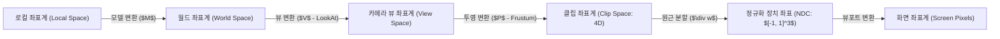

> [!abstract] 핵심 요약
> **뷰잉 및 투영 변환(Viewing and Projection)**은 월드 좌표계(World Space)를 카메라 시점(Camera/Eye Space)으로 회전/이동한 뒤, 가시 절두체 내부의 객체를 정규화된 큐브 **NDC(Normalized Device Coordinates: $[-1, 1]^3$)**로 압축 투영하는 과정이다.
> 원근 투영에서는 동차 좌표계의 네 번째 성분 $w$에 깊이 정보 $-z$가 저장되며, 이후 하드웨어의 **원근 분할($(x/w, y/w, z/w)$)**을 통해 원근감(Perspective foreshortening)이 형성된다.

---

## 1. 정점 변환 파이프라인 (MVP 매트릭스)



---

## 2. 직교 투영 vs 원근 투영 수식 비교

| 투영 방식 | 가시 영역 형태 | 광선 특성 | 주 용도 |
| :-- | :-- | :-- | :-- |
| **직교 투영 (Orthographic)** | 직육면체 (Box) | 평행 광선 (거리 무관 크기 불변) | CAD, 설계 도면, 2D UI |
| **원근 투영 (Perspective)** | 사각뿔대 절두체 (Frustum) | 카메라 초점으로 수렴하는 광선 (원근감) | 3D 게임, 영화 실시간 렌더링 |

---

## 3. 실시간 시야각(FOV)과 절두체 원근감 계산기

```html preview
<div style="font-family:system-ui,-apple-system,sans-serif;padding:20px;background:var(--card);color:var(--card-foreground);border:1px solid var(--border);border-radius:var(--radius)">
  <div style="font-size:16px;font-weight:700;margin-bottom:14px;color:var(--primary);display:flex;align-items:center;gap:8px">
    <span>📷 카메라 시야각(FOV) 및 초점 거리 계산기</span>
  </div>

  <div style="margin-bottom:14px">
    <label style="font-size:11px;color:var(--muted-foreground)">수직 시야각 FOV (Field of View: 30° ~ 120°): <span id="fovVal">60°</span></label>
    <input id="inFov" type="range" min="30" max="120" value="60" style="width:100%" />
  </div>

  <div style="display:grid;grid-template-columns:1fr 1fr;gap:12px;margin-bottom:12px">
    <div style="padding:10px;background:var(--background);border:1px solid var(--border);border-radius:var(--radius);text-align:center">
      <div style="font-size:10px;color:var(--muted-foreground)">투영 스케일 인자 ($1 / 	an(	ext{FOV}/2)$)</div>
      <div id="scaleOut" style="font-family:monospace;font-size:18px;font-weight:800;color:var(--primary);margin-top:2px">1.73</div>
    </div>
    <div style="padding:10px;background:var(--background);border:1px solid var(--border);border-radius:var(--radius);text-align:center">
      <div style="font-size:10px;color:var(--muted-foreground)">렌즈 왜곡감 및 화각 특성</div>
      <div id="fovDescOut" style="font-family:monospace;font-size:14px;font-weight:800;color:var(--primary);margin-top:4px">표준 렌즈 시야각</div>
    </div>
  </div>

  <script>
    function updateFov() {
      var fov = parseFloat(document.getElementById('inFov').value);
      document.getElementById('fovVal').textContent = fov + "°";
      var rad = (fov / 2) * Math.PI / 180;
      var scale = 1 / Math.tan(rad);
      document.getElementById('scaleOut').textContent = scale.toFixed(2);
      var desc = document.getElementById('fovDescOut');
      if (fov < 45) {
        desc.textContent = "망원 렌즈 (원근감 압축)";
      } else if (fov > 80) {
        desc.textContent = "초광각 렌즈 (원근감 극대화/어안 왜곡)";
      } else {
        desc.textContent = "표준 렌즈 (인간 시야 유사)";
      }
    }
    document.getElementById('inFov').addEventListener('input', updateFov);
  </script>
</div>
```
