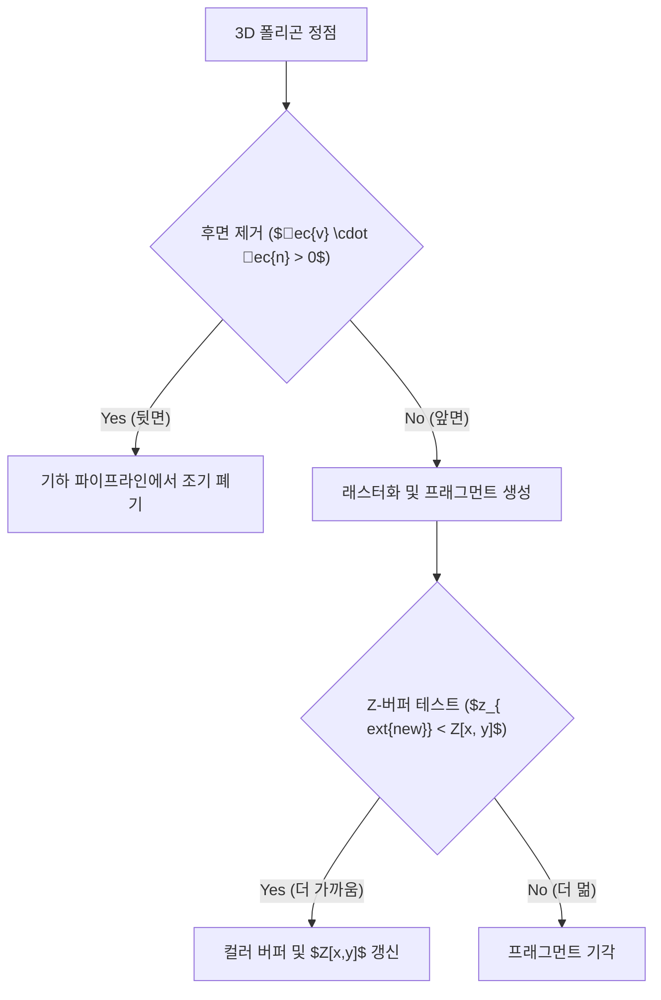

> [!abstract] 핵심 요약
> 3D 실시간 렌더링에서 불필요한 연산을 줄이는 2대 축은 **기하 단계의 후면 제거(Back-Face Culling)**와 **픽셀 단계의 깊이 테스트(Z-Buffer)**이다.
> **Z-버퍼 알고리즘**은 다각형의 정렬 없이도 픽셀 단위 깊이 버퍼 $Z[x, y]$와의 $O(1)$ 대소 비교만으로 정확한 폐색(Occlusion)을 처리하는 현대 GPU 렌더링의 표준이다.

---

## 1. 후면 제거 (Back-Face Culling) 판별 조건

카메라 시선 벡터 $ec{v}$와 다각형의 외향 단위 법선 벡터 $ec{n}$:
$$ec{v} \cdot ec{n} > 0 \implies 	ext{후면(Back-Face)으로 판정되어 즉시 파기(Discard)}$$



---

## 2. 코헨-서덜랜드 4비트 아웃코드 (Outcode) 체계

점 $(x, y)$에 대한 아웃코드 $[T, B, R, L]$:
- $T = 1 \iff y > y_{\max}$ (위쪽)
- $B = 1 \iff y < y_{\min}$ (아래쪽)
- $R = 1 \iff x > x_{\max}$ (오른쪽)
- $L = 1 \iff x < x_{\min}$ (왼쪽)

판별:
1. $P_1 	ext{ Code} = 0000 \land P_2 	ext{ Code} = 0000 \implies$ **완전 수용 (Trivial Accept)**
2. $P_1 	ext{ Code} \ \& \ P_2 	ext{ Code} 
e 0000 \implies$ **완전 기각 (Trivial Reject)**

---

## 3. 실시간 Z-버퍼(Depth Buffer) 갱신 시뮬레이터

```html preview
<div style="font-family:system-ui,-apple-system,sans-serif;padding:20px;background:var(--card);color:var(--card-foreground);border:1px solid var(--border);border-radius:var(--radius)">
  <div style="font-size:16px;font-weight:700;margin-bottom:14px;color:var(--primary);display:flex;align-items:center;gap:8px">
    <span>🛡️ Z-버퍼 픽셀 폐색 및 깊이 테스트 계산기</span>
  </div>

  <div style="display:grid;grid-template-columns:1fr 1fr;gap:12px;margin-bottom:14px">
    <div>
      <label style="font-size:11px;color:var(--muted-foreground)">기존 픽셀 Z 깊이 (0.0 ~ 1.0):</label>
      <input id="inExistZ" type="number" value="0.65" step="0.05" style="width:100%;padding:4px;background:var(--background);color:var(--foreground);border:1px solid var(--border);border-radius:var(--radius);font-weight:700" />
    </div>
    <div>
      <label style="font-size:11px;color:var(--muted-foreground)">신규 도형 Z 깊이 (0.0 ~ 1.0):</label>
      <input id="inNewZ" type="number" value="0.40" step="0.05" style="width:100%;padding:4px;background:var(--background);color:var(--foreground);border:1px solid var(--border);border-radius:var(--radius);font-weight:700" />
    </div>
  </div>

  <div style="padding:12px;background:var(--background);border:1px solid var(--border);border-radius:var(--radius)">
    <div style="font-size:11px;font-weight:700;color:var(--muted-foreground);margin-bottom:4px">Z-테스트 결과 (LESS 판정)</div>
    <div id="zTestOut" style="font-size:13px;line-height:1.6;color:var(--primary)">
      ✅ 신규 도형이 더 카메라에 가까움 (0.40 < 0.65) -> 색상 갱신 및 Z-버퍼 값 0.40으로 업데이트
    </div>
  </div>

  <script>
    function updateZTest() {
      var existZ = parseFloat(document.getElementById('inExistZ').value) || 1.0;
      var newZ = parseFloat(document.getElementById('inNewZ').value) || 1.0;
      var out = document.getElementById('zTestOut');
      if (newZ < existZ) {
        out.innerHTML = "<strong style='color:var(--primary)'>✅ Z-테스트 통과 (Depth Test Passed):</strong><br/>• 신규 도형이 더 전면에 위치 ($" + newZ.toFixed(2) + " < " + existZ.toFixed(2) + "$)<br/>• 컬러 버퍼 색상 교체 및 Z-버퍼 값을 " + newZ.toFixed(2) + "로 갱신";
      } else {
        out.innerHTML = "<strong style='color:var(--destructive,#ef4444)'>❌ Z-테스트 실패 (Occluded):</strong><br/>• 신규 도형이 기존 물체 뒤에 가려짐 ($" + newZ.toFixed(2) + " \ge " + existZ.toFixed(2) + "$)<br/>• 프래그먼트 즉시 기각(Discard), 화면 색상 유지";
      }
    }
    document.getElementById('inExistZ').addEventListener('input', updateZTest);
    document.getElementById('inNewZ').addEventListener('input', updateZTest);
  </script>
</div>
```
