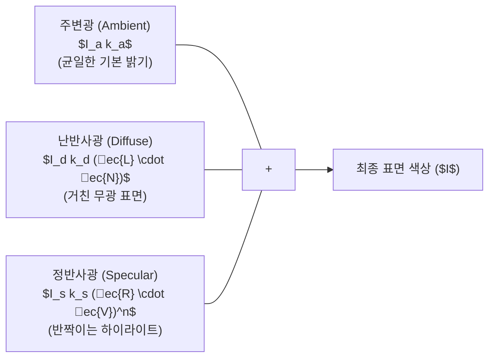

> [!abstract] 핵심 요약
> **퐁 반사 모델(Phong Reflection Model)**은 표면 조명을 **주변광(Ambient)**, 람베르트 코사인 법칙의 **난반사광(Diffuse)**, 시선 방향 반사 하이라이트인 **정반사광(Specular)**의 합으로 근사한다.
> **고로 셰이딩(Gouraud)**은 정점에서 계산된 색상을 픽셀로 선형 보간하여 하이라이트가 누락될 수 있는 반면, **퐁 셰이딩(Phong Shading)**은 정점 법선 벡터를 픽셀 단위로 보간하여 매끄러운 정반사 하이라이트를 완벽히 재현한다.

---

## 1. 퐁 반사 모델 (Phong Reflection Model) 수학 공식

$$I = I_a k_a + I_d k_d (ec{L} \cdot ec{N}) + I_s k_s (ec{R} \cdot ec{V})^n$$

- $I_a, I_d, I_s$: 광원의 주변광, 난반사광, 정반사광 강도
- $k_a, k_d, k_s$: 재질의 반사 계수
- $ec{L}$: 광원 방향 단위 벡터, $ec{N}$: 표면 법선 단위 벡터
- $ec{R} = 2(ec{L} \cdot ec{N})ec{N} - ec{L}$: 반사 광선 벡터, $ec{V}$: 카메라 시선 벡터
- $n$: 표면 광택도 지수 (Shininess)



---

## 2. 셰이딩 모델 3대 방식 비교

| 셰이딩 방식 | 법선 계산 시점 | 색상 계산 주기 | 장점 | 단점 |
| :-- | :-- | :-- | :-- | :-- |
| **플랫 셰이딩 (Flat)** | 다각형 평면당 1개 | 다각형(삼각형)당 1회 | 연산 비용 극소 | 각진 마하 밴드(Mach Band) 현상 발생 |
| **고로 셰이딩 (Gouraud)** | 각 정점(Vertex) | 정점에서 계산 후 픽셀 선형 보간 | 적절한 속도와 부드러움 | 폴리곤 내부 정반사 하이라이트 소실 위험 |
| **퐁 셰이딩 (Phong)** | 각 정점 | **픽셀(프래그먼트) 단위로 법선 보간 후 매 픽셀 계산** | 최고 품질, 정밀한 하이라이트 | 프래그먼트 연산 비용 증가 |

---

## 3. 실시간 퐁 조명 반사광 요소별 강도 시뮬레이터

```html preview
<div style="font-family:system-ui,-apple-system,sans-serif;padding:20px;background:var(--card);color:var(--card-foreground);border:1px solid var(--border);border-radius:var(--radius)">
  <div style="font-size:16px;font-weight:700;margin-bottom:14px;color:var(--primary);display:flex;align-items:center;gap:8px">
    <span>💡 퐁(Phong) 반사 모델 조명 요소 분석기</span>
  </div>

  <div style="display:grid;grid-template-columns:1fr 1fr;gap:12px;margin-bottom:14px">
    <div>
      <label style="font-size:11px;color:var(--muted-foreground)">빛과 법선의 각도 ($ec{L} \cdot ec{N}$): <span id="dotVal">0.80</span></label>
      <input id="inDot" type="range" min="0" max="1" step="0.05" value="0.80" style="width:100%" />
    </div>
    <div>
      <label style="font-size:11px;color:var(--muted-foreground)">광택도 지수 (Shininess $n$): <span id="shinVal">32</span></label>
      <input id="inShin" type="range" min="4" max="128" step="4" value="32" style="width:100%" />
    </div>
  </div>

  <div style="display:grid;grid-template-columns:repeat(3, 1fr);gap:8px;margin-bottom:12px">
    <div style="padding:8px;background:var(--background);border:1px solid var(--border);border-radius:var(--radius);text-align:center">
      <div style="font-size:10px;color:var(--muted-foreground)">Ambient (0.2)</div>
      <div style="font-family:monospace;font-size:14px;font-weight:800;color:var(--muted-foreground)">0.20</div>
    </div>
    <div style="padding:8px;background:var(--background);border:1px solid var(--border);border-radius:var(--radius);text-align:center">
      <div style="font-size:10px;color:var(--muted-foreground)">Diffuse ($k_d \cos	heta$)</div>
      <div id="diffOut" style="font-family:monospace;font-size:14px;font-weight:800;color:var(--primary)">0.64</div>
    </div>
    <div style="padding:8px;background:var(--background);border:1px solid var(--border);border-radius:var(--radius);text-align:center">
      <div style="font-size:10px;color:var(--muted-foreground)">Specular ($(\coslpha)^n$)</div>
      <div id="specOut" style="font-family:monospace;font-size:14px;font-weight:800;color:var(--chart-1)">0.42</div>
    </div>
  </div>

  <script>
    function updatePhong() {
      var dot = parseFloat(document.getElementById('inDot').value);
      var shin = parseInt(document.getElementById('inShin').value);
      document.getElementById('dotVal').textContent = dot.toFixed(2);
      document.getElementById('shinVal').textContent = shin;
      var diff = 0.8 * dot;
      var spec = 0.7 * Math.pow(dot, shin / 10);
      document.getElementById('diffOut').textContent = diff.toFixed(2);
      document.getElementById('specOut').textContent = spec.toFixed(2);
    }
    document.getElementById('inDot').addEventListener('input', updatePhong);
    document.getElementById('inShin').addEventListener('input', updatePhong);
  </script>
</div>
```
