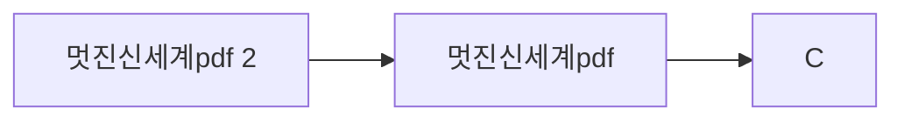

> [!abstract] 사용법
> 이 문서는 **원본 파일명 순서 → 핵심 단서 → 학습 점검**으로 읽는 입문 지도입니다. 세부 내용은 같은 폴더의 주제 노트와 원본 PDF를 함께 대조하세요.

## 강의 흐름



<Tabs>
  <Tab label="파일 순서">
    원본 PDF를 파일명 순서로 배열했습니다. 번호가 붙은 주차·장 제목은 수업의 진행 신호로 사용합니다.
  </Tab>
  <Tab label="읽기 전략">
    먼저 제목과 첫 페이지 단서를 훑고, 실습·이론·평가 자료를 짝지어 읽습니다. 동일한 내용의 사본은 한 주제의 보조 자료로 취급합니다.
  </Tab>
  <Tab label="검증">
    텍스트 추출이 빈약한 자료는 표의 경고를 확인하고 원본의 시각 요소를 직접 대조합니다. 추출되지 않은 수치나 그림은 임의로 보완하지 않습니다.
  </Tab>
</Tabs>

## 원본 PDF 목록

| 파일 | 쪽수 | 첫 페이지 단서 |
| :-- | --: | :-- |
| 멋진신세계pdf 2.pdf | — | (Brave New World)
        :                         (Aldous Huxley)


"                "           26                                      |
| 멋진신세계pdf.pdf | — | (Brave New World)
        :                         (Aldous Huxley)


"                "           26                                      |

## 원본 단계 인터랙티브

```html preview
<div style="font-family:system-ui,sans-serif;padding:20px;color:var(--foreground)">
  <label for="flowiesclassicsreading" style="font-size:14px;font-weight:600">원본 자료 단계</label>
  <div id="flowiesclassicsreading-out" style="font-size:24px;font-weight:700;color:var(--chart-1);margin:6px 0">멋진신세계pdf 2</div>
  <input id="flowiesclassicsreading" type="range" min="1" max="2" step="1" value="1" style="width:100%;accent-color:var(--primary)" />
  <p style="font-size:13px;color:var(--muted-foreground)">슬라이더를 움직이면 파일명 순서대로 자료의 역할을 확인합니다.</p>
  <script>
    var flowiesclassicsreading = document.getElementById('flowiesclassicsreading');
    var flowiesclassicsreadingOut = document.getElementById('flowiesclassicsreading-out');
    var flowiesclassicsreadingSteps = ["멋진신세계pdf 2","멋진신세계pdf"];
    flowiesclassicsreading.addEventListener('input', function () {
      flowiesclassicsreadingOut.textContent = flowiesclassicsreadingSteps[Number(flowiesclassicsreading.value) - 1];
    });
  </script>
</div>
```

## 점검 포인트

- **범위:** 2개 PDF, 총 0쪽.
- **텍스트 근거:** 첫 페이지 추출 단서를 표에 남겨 제목·주제의 근거로 삼았습니다.
- **시각 자료:** 0개 파일은 첫 페이지 텍스트가 빈약하므로, HTML/SVG로 옮길 수 없는 도식은 승인된 크롭 후보로만 별도 검토합니다.

> [!warning] 과해석 방지
> 이 지도는 파일명·쪽수·추출된 첫 페이지 단서만 요약합니다. PDF에 없는 구현 세부, 성능 수치, 평가 결과는 추가하지 않습니다.

<details>
<summary>다음 읽기</summary>

이 문서에서 현재 단계의 파일을 선택한 뒤, 같은 폴더의 주제 노트에서 정의·절차·실습 결과를 확인하세요.

</details>
