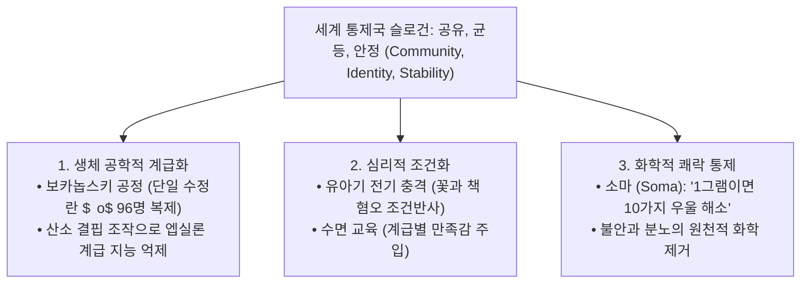

> [!abstract] 핵심 요약
> 『멋진 신세계』는 물리적 폭력이나 공포가 아닌, **생명공학적 계급 분화**, **수면 학습을 통한 욕망의 표준화**, 그리고 부작용 없는 쾌락 마약 **소마(Soma)**를 통해 구성원 스스로가 자신의 노예 상태를 사랑하도록 만드는 **기술 관료적 전체주의(Technological Totalitarianism)**를 고발한다.

---

## 1. 멋진 신세계 문명 사회의 3대 통제 기둥



---

## 2. 5대 계급 구조 및 생체 제어 매트릭스

| 계급 | 태아기 처리 조건 | 수면 교육 내용 | 사회적 역할 |
| :-- | :-- | :-- | :-- |
| **알파 ($lpha$)** | 최고 영양, 정상 산소 공급 | 지적 우월성, 리더십 조건화 | 통제관, 과학자, 최고 관리자 |
| **베타 ($eta$)** | 양호한 환경 유지 | 알파에 복종, 하위 계급 기피 | 기술자, 행정 보조원 |
| **감마 ($\gamma$)** | 보카놉스키 복제 분열 | 복잡한 사고 기피 | 생산 라인 감독, 숙련 노동 |
| **델타 ($\delta$)** | 복제 및 감각 둔화 처리 | 단순 반복 작업 선호 | 단순 조립 및 유통 |
| **엡실론 ($\epsilon$)** | 알코올 투여, 산소 결핍 조작 | 문해력 완전 박탈, 열등감 무감 | 오물 수거, 광산, 초단순 육체노동 |

---

## 3. 실시간 문명 통제 파라미터 시뮬레이터

```html preview
<div style="font-family:system-ui,-apple-system,sans-serif;padding:20px;background:var(--card);color:var(--card-foreground);border:1px solid var(--border);border-radius:var(--radius)">
  <div style="font-size:16px;font-weight:700;margin-bottom:14px;color:var(--primary);display:flex;align-items:center;gap:8px">
    <span>🧬 『멋진 신세계』 계급별 생체 조건화 및 사회 안정도 분석기</span>
  </div>

  <div style="margin-bottom:14px">
    <label style="font-size:11px;color:var(--muted-foreground)">사회 구성원 계급 선택:</label>
    <select id="selCaste" style="width:100%;padding:6px;background:var(--background);color:var(--foreground);border:1px solid var(--border);border-radius:var(--radius);font-weight:700">
      <option value="alpha">알파 계급 (최고 지성 / 통제 계층)</option>
      <option value="gamma">감마 계급 (보카놉스키 72쌍 복제 노동자)</option>
      <option value="epsilon">엡실론 계급 (산소 결핍 처리 초단순 노동자)</option>
    </select>
  </div>

  <div style="padding:12px;background:var(--background);border:1px solid var(--border);border-radius:var(--radius)">
    <div style="font-size:11px;font-weight:700;color:var(--muted-foreground);margin-bottom:4px">조건화 세뇌 및 사회적 반역 가능성</div>
    <div id="casteDescOut" style="font-size:13px;line-height:1.6;color:var(--primary)">
      지적 탐구와 자율성이 허용되나, 체제 유지의 핵심 관료로 기능함 (반역 확률 1.2%)
    </div>
  </div>

  <script>
    document.getElementById('selCaste').onchange = function() {
      var val = this.value;
      var out = document.getElementById('casteDescOut');
      if (val === 'alpha') {
        out.innerHTML = "<strong style='color:var(--primary)'>알파 계급 (지배층):</strong><br/>• 높은 지능과 분석력 보유<br/>• 버나드 마르크스처럼 개체성 자각 시 고립/추방 위험 존재 (반역 가능성 보통)";
      } else if (val === 'gamma') {
        out.innerHTML = "<strong style='color:var(--chart-1)'>감마 계급 (중간 노동층):</strong><br/>• 보카놉스키 복제 기술로 대량 생산<br/>• 소마 공급과 수면 교육으로 완전한 순종 달성 (반역 가능성 0%)";
      } else {
        out.innerHTML = "<strong style='color:var(--destructive,#ef4444)'>엡실론 계급 (하층 노동자):</strong><br/>• 태아기 산소 결핍 조작으로 지능을 침팬지 수준으로 억제<br/>• 텍스트 독해 불가능, 완전한 기계 부품화";
      }
    };
  </script>
</div>
```
