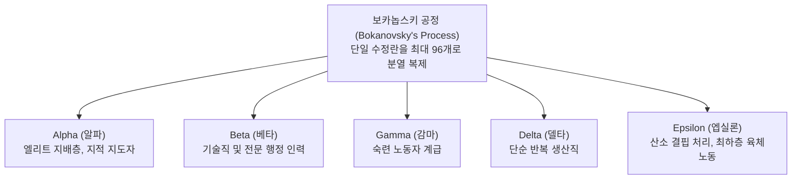

> [!abstract] 핵심 요약
> 조지 오웰의 <1984>가 '공포와 폭력에 의한 억압'을 묘사했다면, 헉슬리의 <멋진 신세계>는 **'완벽한 안락과 통제된 쾌락에 의한 자발적 복종'**이라는 더욱 교묘하고 치명적인 디스토피아를 경고한다.
> 기술과 생명공학이 인간의 존엄성과 자유의지를 박탈하고 완전한 체제 순응 도구로 전락하는 사회공학 메커니즘을 심층 분석한다.

---

## 1. 런던 부화·조건반사 연구소와 5대 계급 분화



---

## 2. 체제 유지를 위한 3대 통제 기술

1. **파블로프식 영유아 조건반사 훈련 (Neo-Pavlovian Conditioning)**:
   - 델타/엡실론 아기들에게 꽃과 책을 보여준 후 전기 충격과 사이렌 소음을 가하여, 자연에 대한 탐미와 지적 호기심을 영구히 파괴.
2. **수면 학습법 (Hypnopaedia)**:
   - 수면 중 수천 번 반복되는 음성 세뇌를 통해 계급적 만족감 주입 ("알파는 일을 많이 해서 힘들어, 난 베타라서 정말 좋아").
3. **소마 (Soma)**:
   - "반 그램이면 반나절 휴가, 1그램이면 주말 휴가." 부작용 없이 불안과 분노를 마비시키고 거짓 행복을 제공하는 국가 배급 신경안정제.

---

## 3. 실시간 <멋진 신세계> 디스토피아 통제 요소 분석기

```html preview
<div style="font-family:system-ui,-apple-system,sans-serif;padding:20px;background:var(--card);color:var(--card-foreground);border:1px solid var(--border);border-radius:var(--radius)">
  <div style="font-size:16px;font-weight:700;margin-bottom:12px;color:var(--primary)">
    ⚡ <멋진 신세계> 통제 기제 vs 현대 사회 대응 맵
  </div>

  <div style="margin-bottom:12px">
    <label style="font-size:11px;color:var(--muted-foreground)">소설 속 디스토피아 요소 선택:</label>
    <select id="selDystopia" style="width:100%;padding:6px;background:var(--background);color:var(--foreground);border:1px solid var(--border);border-radius:var(--radius);font-weight:700">
      <option value="bokan">보카놉스키 유전자 조작 및 계급 분화</option>
      <option value="hypno">수면 세뇌 및 유아기 조건반사 훈련</option>
      <option value="soma">국가 배급 마약 소마(Soma)를 통한 고통 소거</option>
      <option value="feely">촉각 영화(Feelies)와 극단적 소비 유도</option>
    </select>
  </div>

  <div id="outDystopiaDesc" style="padding:12px;background:var(--background);border:1px solid var(--border);border-radius:var(--radius);font-size:13px;line-height:1.6"></div>

  <script>
    var dData = {
      bokan: { name: "보카놉스키 공정", modern: "CRISPR 맞춤아기 & 생물학적 계급 고착화 우려", desc: "인간을 공산품처럼 대량 복제하고 태아 단계에서 산소 공급량을 조절하여 지능과 신체 능력을 인위적으로 제한함." },
      hypno: { name: "수면 학습 세뇌", modern: "SNS 추천 알고리즘에 의한 확증 편향 및 필터 버블", desc: "비판적 사고력을 거세하고 기존 사회 계급 구조에 완벽히 순응하도록 무의식적 가치관을 반복 주입함." },
      soma: { name: "소마 (Soma)", modern: "도파민 중독, 숏폼 콘텐츠 및 디지털 진통 사회", desc: "모든 실존적 고뇌, 비판 의식, 슬픔을 즉각적인 화학적 쾌락으로 덮어버림으로써 혁명의 동력을 원천 봉쇄함." },
      feely: { name: "촉각 영화와 과소비", modern: "알고리즘 기반 초개인화 소비 사회와 쾌락 산업", desc: "수리하거나 아껴 쓰는 것을 금기시하고('끝까지 쓰기보다는 버리는 것이 낫다'), 끝없는 감각적 자극을 소비하게 만듦." }
    };

    function updateDys() {
      var k = document.getElementById('selDystopia').value;
      var it = dData[k];
      document.getElementById('outDystopiaDesc').innerHTML =
        "<strong>작중 기제:</strong> <span style='color:var(--primary);font-weight:800'>" + it.name + "</span><br/>" +
        "<strong>현대적 함의:</strong> <span style='color:var(--foreground);font-weight:700'>" + it.modern + "</span><br/>" +
        "<strong>비판적 분석:</strong> " + it.desc;
    }

    document.getElementById('selDystopia').addEventListener('change', updateDys);
    updateDys();
  </script>
</div>
