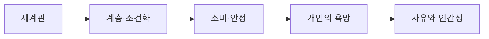

> [!abstract] 한 줄 요약
> 멋진 신세계의 사회 통제 장치를 따라가며 편리함·안정·자유의 긴장을 읽고 질문으로 되돌린다.

## 강의 흐름 지도



---
## 개념을 연결하는 순서

독서 자료는 Aldous Huxley의 Brave New World를 바탕으로, 개인의 선택이 사회 시스템의 안정과 어떻게 맞물리는지 읽게 한다.

- 세계관의 규칙과 계층 구조를 먼저 확인한다.
- 조건화와 소비가 질서를 유지하는 장치로 작동하는지 살핀다.
- 안정과 행복이 자율성·기억·관계와 어떤 긴장을 만드는지 질문한다.
- 인물의 반응을 통해 “불편함이 제거된 사회에서도 인간적인 판단이 가능한가”를 토론한다.

<Tabs>
  <Tab label="세계">사회 규칙과 계층 조건을 먼저 지도화한다.</Tab>
  <Tab label="장치">조건화·소비·안정이 행동을 이끄는 과정을 읽는다.</Tab>
  <Tab label="질문">자유·인간성·불편함의 의미를 토론으로 확장한다.</Tab>
</Tabs>

---
## 원본에서 읽는 적용 장면

| 읽기 초점 | 기록할 질문 | 메모 방식 |
| :-- | :-- | :-- |
| 제도 | 누가 규칙을 설계하는가 | 제도와 개인 행동 분리 |
| 감정 | 불편한 감정은 어떻게 다뤄지는가 | 장면과 해석 구분 |
| 소비 | 소비가 안정과 연결되는가 | 원인·결과 표시 |
| 자유 | 선택의 범위는 무엇인가 | 반례 질문 남기기 |

원문 문장 전체를 옮기기보다, 장면·제도·인물의 반응을 각각 구분해 기록한다.

```html preview
<div style="font-family:system-ui,sans-serif;padding:20px;color:var(--foreground)">
  <label for="flow229883" style="font-size:14px;font-weight:600">원본 강의 단계</label>
  <div id="flow229883-out" style="font-size:30px;font-weight:700;color:var(--chart-1);margin:6px 0">세계관과 사회 질서</div>
  <input id="flow229883" type="range" min="1" max="3" step="1" value="1"
    style="width:100%;accent-color:var(--primary)" />
  <p style="font-size:13px;color:var(--muted-foreground)">슬라이더로 PDF에서 정리한 강의 단계를 순서대로 확인합니다.</p>
  <script>
    var flow229883 = document.getElementById('flow229883');
    var flow229883Out = document.getElementById('flow229883-out');
    var flow229883Steps = ["세계관과 사회 질서","조건화·소비·안정","자유·인간성 질문"];
    flow229883.addEventListener('input', function () {
      flow229883Out.textContent = flow229883Steps[Number(flow229883.value) - 1] || '';
    });
  </script>
</div>
```

---
## 점검과 경계

<details>
<summary>토론 전 점검</summary>

1. 안정과 자유를 단순히 선악으로 나누지 않고 제도적 교환으로 설명한다.
2. 인물의 말과 독자의 해석을 구분한다.
3. 현재 사회의 사례를 연결할 때 원문에서 직접 확인한 장면과 별도로 표시한다.

</details>

> [!warning] 독서 경계
> 이 노트는 제공된 독서 PDF의 질문 틀만 정리하며, 작품의 전체 줄거리나 외부 비평을 대신하지 않는다.

> [!warning] 출처 경계
> 이 노트는 현재 폴더의 `sources/*.pdf`에서 추출·대조한 강의 내용을 묶었습니다. 동일 장의 '2'·'update' 파일은 별도 새 이론으로 세지 않고 보충·개정 관계로 확인합니다. 원본 PDF 전체나 원본 슬라이드 이미지는 삽입하지 않습니다.
